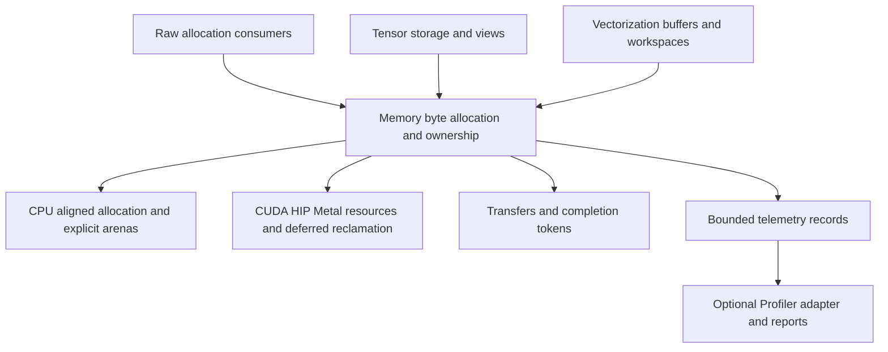

# CPU/GPU memory foundation: review and implementation plan

Review date: 2026-09-22. Scope: this repository's allocation, ownership,
copy, profiling, build, and test code. Downstream Tensor/Vectorization source
was not inspected; integration requirements below are proposals.

**Recommendation.** Evolve the existing CPU dispatch and GPU segment caches.
First establish checked allocation and asynchronous lifetime contracts, then
add bounded, selectable profiling and tune against realistic workloads.
Keep tensor shapes, expression evaluation, and SIMD kernels in their respective
repositories. Memory should own storage, alignment, placement, transfers,
reclamation, and allocation telemetry.

**What already works as a foundation**

- CPU uses aligned mimalloc, TBB, or platform allocation with little wrapper
  machinery. Preserve that inexpensive default path.
- GPU caches already implement size rounding, segment splitting/coalescing,
  per-device registration, memory limits, cache trimming, and OOM retry.
- CUDA/HIP have stream-scoped reuse, deferred frees, and event recycling.
- Unique `data_ptr` and borrowed `data_view` already express distinct ownership.
- GPU segment/block snapshots and bounded allocation history already exist.
  Extend these rather than implementing a second tracking system.
- CPU profiler events and backend statistics exist, with different coverage
  and activation rules. Make those differences visible to consumers.

**Findings to fix before expanding the API**

| Priority | Evidence | Consequence and proposed correction |
|---|---|---|
| P0 | `include/allocator.h:146`, `:160`, `:330`; `include/gpu/caching_allocator_config.h:40` | Element multiplication and rounding are unchecked. Oversized requests can wrap to small byte counts. Check multiplication/addition before allocation, copy, and rounding; validate alignment in release builds. A compiled probe against the actual rounding header returned zero for both `round_request_size(SIZE_MAX)` and `segment_size_for(SIZE_MAX)`. |
| P0 | `include/common/data_view.h:46`, `:73`; `include/gpu/cuda_caching_allocator.cpp:466` | A slice records its interior pointer, but CUDA/HIP tracking looks up only exact allocation bases. Carry allocation identity/base separately from the view's address and offset. Test nested slices and workspace suballocations on another stream. |
| P0 | `include/allocator.h:297`; `include/gpu/cuda_caching_allocator.cpp:459` | A null stream is ignored even though it denotes a valid default GPU stream. A block allocated on a nonblocking stream and used on the default stream can miss lifetime tracking. Distinguish absent context from default stream; preserve legacy/per-thread default-stream semantics. |
| P0 | `include/gpu/cuda_caching_allocator.cpp:371`, `:741` | The memory limit is checked before unlocking for driver allocation, without accounting for concurrent requests in flight. Concurrent misses can exceed the limit. Reserve budget under the lock and roll it back on every failure. Snapshot `expandable_segments_` before unlocking; it is currently read without synchronization against its setter. |
| P1 | `include/common/data_ptr.h:131`; `include/allocator.h:312`; CUDA event insertion at `include/gpu/cuda_caching_allocator.cpp:891` | Destruction can reach throwing GPU operations, while async copies return no completion object and do not register source/destination uses themselves. Specify explicit sync/async copy contracts, retain participating storage until completion, and provide a nonthrowing destruction path. Event-recording failure must quarantine affected storage rather than make unproven-safe storage reusable. |
| P1 | `include/gpu/metal/metal_caching_allocator.mm:522`, `:553`, `:593` | Metal creates and retains 16/64 MiB heaps but increments reserved bytes by buffer-segment size. Buffer accounting does not describe retained heap capacity, and the fraction limit uses that narrower accounting. Report heap capacity/usage separately, budget backing growth, and retire empty heaps individually. Do not equate capacity with physical residency. |
| P1 | `include/gpu/cuda_caching_allocator.cpp:816`; `include/gpu/metal/metal_caching_allocator.mm:644` | `free_completed` uses the block address after coalescing; merging with a previous free block changes that address. Preserve the original allocation address and ID before merging so alloc/free events can be paired correctly. |
| P1 | `include/allocator.h:56`, `:157`; `include/common/data_ptr.h:167` | CUDA and HIP device labels are both accepted in either compiled runtime. Requested over-alignment is not passed to GPU caches, and owners assume alignment is satisfied. Validate exact backend/device identity and either honor or explicitly reject unsupported alignments. Restrict typed buffers to their supported element lifetime model or implement construction/destruction. |

Other material design limits:

- Borrowed views intentionally do not retain storage. Keep that low-cost API,
  but give tensors and asynchronous jobs an explicit retained-storage option.
- Metal `record_stream` is a no-op based on a synchronous-dispatch assumption
  (`metal_caching_allocator.mm:232`). External callers must obey that contract
  until command-buffer completion tracking is implemented.
- `stats()` walks free blocks under the allocator mutex. Even simple
  `memory_allocated()` queries request this full scan. Maintain inexpensive
  counters separately from detailed snapshots.
- GPU registry lookup takes a global mutex on every request. Cache stable
  per-device resource handles after initialization, with defined shutdown order.
- CPU profiling maintains one mutex-protected pointer/size table. It covers
  allocations observed while profiling, not all process memory. Backend-specific
  `allocate_mi`/`allocate_tbb` entry points intentionally bypass it.
- GPU history uses `std::deque` under the allocator lock and lacks timestamps,
  stable allocation IDs, attribution, and loss counters. A bounded entry count
  does not prevent metadata allocations during recording.
- With NUMA enabled, ordinary CPU allocation calls `NUMAMove`, which applies
  page-level migration/binding. Small allocator blocks can share those pages.
  Replace unconditional migration with explicit placement policies and dedicated
  page-backed allocations where page ownership is required.
- README/CLAUDE status is stale: history/snapshots exist, and the experimental
  CUDA/HIP VM path is not a true growing virtual-address arena, as its public
  header itself explains. Correct documentation alongside implementation.

**Target interfaces and dependency direction**

Use a byte-oriented core with typed adapters. An allocation request should
specify bytes, alignment, device, memory kind, execution context, optional pool,
and optional attribution tag. Memory kinds distinguish pageable host, pinned
host, device-local, managed memory where supported, and Metal shared/private.
Expose a capability query; unsupported combinations should fail explicitly.

An allocation handle should retain resource/deleter identity, allocation base,
capacity, requested bytes, alignment, and device. Use compact representations
for ordinary CPU owners; expensive diagnostic metadata is optional. Storage
identity must survive views and address reuse. A view carries offset and extent
separately; host dereference is only valid for host-accessible memory.

Preserve existing deep-copy `data_ptr` behavior for compatibility. Add explicit
`clone`, `borrow`, and retained-storage operations for new clients. Retained
tensor views share one allocation control block, not the whole tensor object.
Offer explicit external-memory adoption with a deleter/context and lifetime
contract. Add CPU STL/PMR adapters; the current static facade is not itself a
complete standard allocator. Keep device-only storage out of ordinary
host-dereferencing STL containers.

Execution context should contain backend, device, and an explicit stream or
queue representation. Separate `copy_sync` from `copy_async`; async returns a
completion token and protects both endpoints, including pinned staging memory.
Registering a use prevents premature reclamation; producer/consumer ordering
still needs explicit dependencies. Foreign borrowed memory requires caller
lifetime guarantees or an adoption/retention hook.

Keep the CPU fast path statically dispatched. Add a small resource handle or
function table only where runtime selection/adoption requires it; measure the
cost before generalizing. All consuming repositories should link one compatible
Memory runtime; validate that shared-library/plugin boundaries do not create
duplicate registries. Export namespaced public headers such as
`memory/common/device.h` to avoid the existing generic-header collision risk.

**Performance work, in order**

1. CPU: retain mimalloc as the default candidate and benchmark against TBB and
   platform allocation. Add scoped bump arenas for expression temporaries and
   reusable workspaces; reset only after their consumers complete. Make NUMA,
   page policy, initialization, and large-allocation behavior explicit.
2. GPU native cache: remove repeated registry locking through stable handles;
   maintain cheap counters incrementally; reuse metadata; bound event polling
   per call. Preserve event recycling and stream-safe reuse. Introduce finer
   locking only after contention measurements justify the complexity.
3. Transfers: add a bounded pinned-host cache with deferred reclamation and
   transfer telemetry. Test pageable versus pinned transfers and overlap with
   computation; keep pinned memory budgets separate from device budgets.
4. Metal: model command-buffer completion before enabling asynchronous reuse.
   Carry native buffer handle plus offset so kernel binding avoids the current
   linear search over live allocations for interior pointers. Add private
   storage and explicit staging as capability-based choices. Apple documents
   the relevant storage modes in [Metal resource fundamentals](https://developer.apple.com/documentation/metal/resource-fundamentals).
5. CUDA: benchmark an optional driver-pool backend against the native cache.
   `cudaMallocAsync` requires ordered allocation/use/free across participating
   streams; it is not a drop-in call substitution. Define graph capture,
   pool ownership, peer access, and reporting semantics first, following
   [NVIDIA's stream-ordered allocator contract](https://docs.nvidia.com/cuda/cuda-programming-guide/04-special-topics/stream-ordered-memory-allocation.html).
   Validate HIP capabilities independently before exposing equivalent options.
6. Implement genuinely expandable virtual-memory segments only if changing-size
   workloads show a benefit. Keep their mapping/residency accounting distinct.
   Capture-safe pools and planned tensor workspace reuse follow the same
   dependency and lifetime contracts.

**Profiling with explicit cost and coverage**

| Level | Information | Implementation constraint |
|---|---|---|
| Off | Required allocator bookkeeping only | No stack capture, formatting, history allocation, or CPU tracking table. |
| Counters | Allocated/requested/capacity bytes, peaks, hits/misses, failures, retries, pending bytes | Opt-in CPU bookkeeping; shard as appropriate. State whether counters are exact or periodically aggregated. GPU reads should be O(1). |
| Trace | Allocation/free lifecycle, transfers, IDs, times, streams, tags, pool and thread | Preallocated bounded rings, deferred export, explicit dropped/overwritten counts. |
| Diagnostic | Sampled stacks, lifetimes, segment maps, fragmentation and OOM evidence | Explicitly higher overhead; symbolize/export away from allocation paths. |

Extend `gpu_memory_trace_entry` with schema version, monotonic timestamp,
sequence number, allocation ID, requested and capacity bytes, backend/device,
pool, context, thread, and compact attribution IDs. Preserve allocation address
through both free stages. Keep stack strings and tensor descriptors in interned
side tables. Capture stack addresses only when enabled and supported; do not
defer stack collection itself and expect to recover the allocating call stack.

Tensor/Vectorization should supply repository, operator, tensor/storage,
workspace, shape/dtype/layout tags when requested. Memory should not depend on
those libraries to collect them. Store enough allocation lineage to distinguish
live bytes, retained aliases, pending GPU work, cached blocks, and leaks.

Report requested bytes, block capacity, pending bytes, reusable cached bytes,
inactive split bytes, largest usable free block per relevant pool/stream, and
driver backing separately. Internal waste is capacity minus requested bytes;
reserved minus allocated includes cache and pending work and is not by itself
a fragmentation metric. Add peaks, allocation latency histograms, lock wait,
driver call time, reuse delay, copy bytes/bandwidth, and synchronization counts.

At the native segment level, enforce the accounting invariant:

`reserved segment bytes = live block capacity + pending block capacity + free block capacity`

Report heap capacity, virtual reservation, mapped/committed backing, and actual
residency separately where available. CPU RSS is process-wide and cannot be
attributed solely to Memory; shared CPU/GPU backing must not be double-counted.
Unavailable hardware metrics are marked unavailable, not zero. Hardware kernel
and bandwidth counters require backend profiling support and correlation.

Use one bounded collection mechanism that feeds the optional Profiler adapter
and offline reports. Telemetry must not recursively allocate through itself or
turn a successful allocation/free into a failure. Assign sequence IDs under
the state lock; export outside it. Handle thread exit and cross-thread frees.
Preallocate emergency OOM evidence so reporting does not depend on another
large allocation. Record whether a failure came from a policy budget or driver.
Make start/stop coverage and ring truncation explicit in every snapshot.

**Fine-tuning interface**

Provide validated configuration per device/pool for byte/fraction budgets,
cache limits, size rounding, split thresholds, garbage-collection thresholds,
segment sizes, pinned-host capacity, event-polling budget, and backend choice.
Profiling controls include level, sample rate, stack depth, filters, ring byte
budget, and export cadence. CPU policies include alignment, initialization,
NUMA node, and arena sizing. Support programmatic configuration and reproducible
environment/file configuration with documented precedence.

Classify each option as initialization-only or safe to update live. Reject
NaN/invalid limits and unsupported backend options. Include effective options,
library/driver versions, hardware, and build mode in reports. Start with offline
trace replay and recommendations; avoid silently changing policies mid-job.

**Delivery sequence and acceptance gates**

| Phase | Deliverable | Gate before proceeding |
|---|---|---|
| 1 | Arithmetic, alignment/backend validation, slice/default-stream tracking, concurrent budget accounting, safe error/destruction paths, trace identity | Focused regression tests, backend fault injection, CPU sanitizers, and real CUDA/HIP stream tests. |
| 2 | Byte request/handle, explicit contexts, retained storage, sync/async copy contracts, external adoption, CPU adapters | A downstream tensor slice and temporary workspace remain valid through asynchronous completion; existing deep-copy behavior remains compatible. |
| 3 | Counter semantics, trace schema, preallocated collection, OOM records, Metal heap accounting, Profiler adapter | Accounting invariants, replayable allocation lifecycles, bounded memory, coverage/loss reporting, no telemetry-caused allocation failure. |
| 4 | CPU arenas/NUMA policy, pinned cache, Metal completion handling, measured native-cache optimizations | Real tensor/vectorization workloads show an improvement with bounded memory growth and no lifetime regressions. |
| 5 | Validated tuning, optional CUDA driver pool, graph-aware pools, evidence-based expandable segments | Repeatable workload wins against native cache; unsupported capabilities rejected; capture/replay and multi-device tests pass. |

Establish baseline measurements before changing hot paths. Cover cold and warm
allocations, 1/2/8/32 CPU threads, cross-thread frees, mixed sizes/lifetimes,
long-lived buffers mixed with temporaries, changing tensor shapes, multiple
streams/devices, delayed completion, memory pressure, and all profiling levels.
Include real writes/reads and transfers separately from allocation-only loops.
Do not present allocated-byte rate as achieved memory bandwidth.

Measure p50/p95/p99 allocation/free latency, throughput, end-to-end operation
time, driver calls, peak backing, fragmentation, synchronization, and profiling
cost. Use identical alignment/initialization and exclude benchmark-harness
allocation where it would distort results. Compare raw allocator APIs at one
level and owning buffer/tensor objects at another.

Initial engineering budgets, to confirm against baseline hardware: profiling
off within 5% of the uninstrumented path, counters within 5%, and sampled trace
within 10% on agreed workloads. Report absolute latency as well as percentages;
these are proposed acceptance targets, not measured performance claims.
Full diagnostic collection has an explicit separate budget.

**Validation performed for this review**

Source review and inspection of existing tests/benchmarks; a standalone C++20
probe compiled against the actual size-rounding header reproduced overflow to
zero. No full test suite, performance benchmark, CUDA/HIP execution, or Metal
runtime validation was run. Other findings are derived from source paths and
need regression tests in phase 1. This change adds a plan only.
