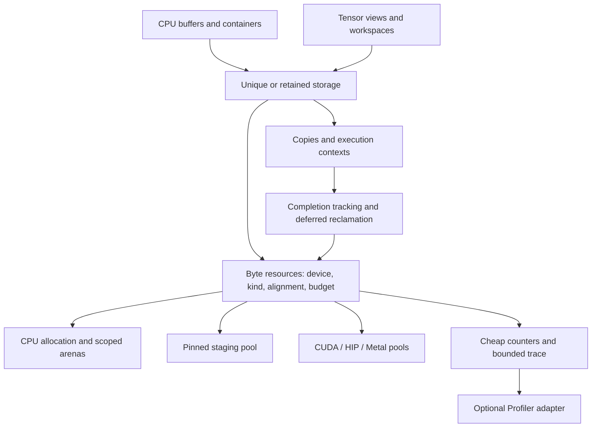

# CPU/GPU memory design review and delivery path

Reviewed 2026-09-28. Scope: this repository's current allocation, ownership,
transfer, cache, NUMA, profiling, and test code. Downstream Tensor/Vectorization
implementations were not inspected. This updates the priorities in the
[September 22 plan](cpu_gpu_memory_plan.md).

**Recommendation: retain the CPU dispatch and GPU segment caches; first make
reclamation safe and budgets accurate, then reduce allocation and transfer
frequency through reusable storage.** Optimize end-to-end workload time and
peak backing at an agreed concurrency level. No performance gains are claimed
without hardware measurements.

**What is already in place**

| Area | Current foundation | Next gap |
|---|---|---|
| CPU | Aligned mimalloc/TBB/platform allocation, optional NUMA/profiling | Scoped arenas, explicit placement, release-build alignment checks |
| CUDA/HIP | Segment caches, splitting/coalescing, stream pools, event reuse, OOM retry | Failure-safe reuse and complete budget transactions |
| Ownership | Unique deep-copy `data_ptr`; borrowed views preserve base through slices | Retained async storage and completion contracts |
| Pinned host | Per-device size-class pool, deferred reuse, quarantine, transfer helpers | Immediate-trim bug, total backing budget, GPU endpoint retention |
| Metal | Shared buffers/heaps and segment cache | Completion-driven reuse and heap capacity accounting |
| Telemetry | GPU snapshots/history; CPU profiler integration | Cheap counters and preallocated trace collection |

The earlier element-count overflow, rounding-to-zero, slice-base tracking,
default-stream tracking, and free-trace address bugs have source fixes and
regression tests. Initial GPU allocation attempts now reserve in-flight bytes.
`data_ptr` catches destruction errors. Pinned staging already exists and should
be extended, not implemented again. These fixes leave the following gaps.

**Current findings, in priority order**

1. **P0 — pinned deallocation reads freed metadata: fixed 2026-09-28.**
   [`pinned_memory_allocator.cpp:352`](../include/helper/pinned_memory_allocator.cpp#L352)
   retained `auto& b`, called `process_pending()` and `trim(limit_)`, then read
   `b.quarantined` after `trim()` could erase its map entry. Fix: save the raw
   pointer before any potential erase; after `trim()` re-look up by key in
   `blocks_` — if the entry is gone the driver free succeeded and the block was
   clean; if it is present read the (possibly newly-quarantined) flag directly.
   The catch block returns early with `false` so trim never runs on exception.
   Regression tests: `ZeroCacheLimitWithImmediateCompletionDoesNotReadFreedBlock`
   and `ZeroCacheLimitWithJustCompletedStreamDoesNotReadFreedBlock` in
   `Testing/PinnedRuntime/TestPinnedRuntime.cpp`.  All 17 shim tests pass.

2. **P0 — failure recording the first GPU event allows unsafe reuse: fixed 2026-09-28.**
   [`cuda_caching_allocator.cpp:930`](../include/gpu/cuda_caching_allocator.cpp#L930)
   swapped out stream uses into a local `streams` set, then called
   `free_block_locked` when `event_count == 0` — but `streams` was non-empty
   (real in-flight work existed), so those streams had no proven completion.
   Fix: the catch block now calls `free_block_locked` only when
   `event_count == 0 && streams.empty()` (no stream uses were ever registered);
   any non-empty `streams` set with `event_count == 0` quarantines the block.
   Since `insert_events_locked` is only called when `stream_uses` is non-empty,
   `streams` is never empty at the catch site: the free path is now effectively
   unreachable through the normal flow, which is the correct invariant.
   Fault-injection coverage requires a CudaRuntime shim analogous to
   `Testing/PinnedRuntime/fake_runtime.h` (does not exist yet); the note is
   recorded in `TestCudaCachingAllocator.cpp` near the stream-safety tests.

3. **P1 — GPU budget accounting is not a complete transaction.**
   [`cuda_caching_allocator.cpp:378`](../include/gpu/cuda_caching_allocator.cpp#L378)
   checks the initial attempt, but the retry at line 393 does not recheck after
   concurrent requests may consume headroom. Lines 769–775 lack reservation
   rollback if the unlocked driver helper's `device_guard` throws. The predicate
   at line 584 can wrap unsigned addition. VM granularity rounding at lines
   91/150 is unchecked, and actual mapped size may exceed the reserved request.
   Use checked reserve/commit/rollback on every attempt, account actual backing,
   and define limit changes during in-flight allocation. Reject nonfinite
   fractions. Test retry interleavings and injected errors, not only success.

4. **P1 — copy lifetime protection is partial and follows submission.**
   [`allocator.h:417`](../include/allocator.h#L417) submits async work before
   recording GPU endpoints at lines 436–445. Interior pointers still reach
   exact-base cache lookup, foreign allocations lack cache identity, and a
   registration failure can leave submitted work untracked. Pageable CPU
   endpoints are not retained. Pinned helpers register the host side first,
   but deliberately leave GPU lifetime to callers. Add handle-based
   `copy_async` with both endpoints retained and a completion token. Preflight
   identity, bounds, and tracking before submission. Keep raw-pointer APIs
   explicitly caller-managed. Separate `copy_sync` from default-stream async.

5. **P1 — Metal budgets omit retained heap capacity.**
   [`metal_caching_allocator.mm:518`](../include/gpu/metal/metal_caching_allocator.mm#L518)
   creates 16/64 MiB heaps; line 593 accounts only buffer-segment bytes.
   `empty_cache()` clears heaps only when all allocations are gone (line 253).
   Account heap capacity, used resource space, and standalone buffers separately;
   budget new backing and retire empty heaps individually. Capacity is not
   physical residency. `record_stream` remains a no-op at line 232, so async
   clients need command-buffer completion tracking before deferred reuse.

6. **P1 — backend, alignment, and typed-storage contracts need validation.**
   [`allocator.h:57`](../include/allocator.h#L57) accepts both CUDA/HIP labels in
   either compiled runtime; GPU allocation at line 181 omits template alignment.
   CPU alignment checking is debug-only in
   [`memory_allocator.cpp:105`](../include/helper/memory_allocator.cpp#L105).
   Reject backend mismatches and unsupported alignments; satisfy `alignof(T)`
   or reject the request. Define the supported typed-object lifetime model, as
   `pinned_buffer` already does.

7. **P2 — frequent operations incur avoidable work.** GPU registry lookup takes
   a global mutex; basic stats scan free blocks under the device lock
   (`cuda_caching_allocator.cpp:696,1392`). Event polling has no per-call work
   bound. Trace recording uses a dynamically allocating deque under that lock
   (`gpu_memory_snapshot.h:127`), which can throw after allocator state changes.
   Pinned allocation holds its lock through driver allocation and pending scans;
   CPU profiling has a mutex-protected allocation table. Measure each cost and
   make optional telemetry unable to fail allocation/free.

**Target architecture**



An allocation handle carries resource/deleter identity, base, requested bytes,
capacity, alignment, device, and memory kind. Views carry offset and extent.
Retained views/tasks share a storage control block; preserve low-cost unique
owners, borrowed views, and existing deep-copy semantics. Add explicit clone,
retention, and foreign-memory adoption. Keep CPU allocation statically dispatched;
use runtime resource handles where selection/adoption requires them. Add CPU
PMR/STL adapters without placing device-only storage in host-dereferencing
containers. Consumers own tensor shape/layout/operator semantics. Consumers
should share one Memory runtime to avoid duplicate process-wide device pools.

Execution contexts identify backend, device, and stream/queue. Default streams
are valid; per-thread defaults need thread-aware identity or normalization.
Register uses before submission can become untracked. Dropping an async token
must leave a reclamation service holding outstanding storage. Define stream
destruction and allocator shutdown ordering. Lifetime protection does not create
producer/consumer dependencies: those must be explicit. Destructors stay
nonthrowing, with a separate error-returning cleanup operation.

For each native segment pool, maintain disjoint states and verify:

`segment backing = live capacity + pending capacity + reusable capacity + quarantined capacity`

Admission includes committed backing plus reservations in flight. Track requested
bytes separately from live capacity; add pinned alignment padding and Metal
unused heap capacity/standalone buffers at their appropriate accounting layers.
Do not double-count shared CPU/GPU backing. CPU RSS is process-wide, and reserved
minus allocated is not by itself a fragmentation metric.

**Delivery sequence**

| Order | Work package | Acceptance gate |
|---|---|---|
| 0 | Baseline representative workloads and effective configuration | Reproducible latency, end-to-end time, peak backing, copies, synchronization |
| 1 | **[In progress]** Pinned UAF and GPU event-failure fixes; exception-safe state transitions | ASan regression passes; first/partial event failures never recycle unsafe memory; errors observable — *both P0 source fixes landed 2026-09-28; pinned shim suite (17/17); GPU fault-injection shim pending* |
| 2 | Complete budget transactions and allocation validation | Retry/concurrency/fault tests respect budget; rollback on every failure; overflow/NaN/backend/alignment validation |
| 3 | Storage identity, retained views, explicit contexts and copy API | Sliced/adopted/multi-stream endpoints survive completion; dependencies explicit; compatibility preserved |
| 4 | Cheap counters, bounded diagnostics, Metal backing accounting | O(1) basic stats; accounting invariants; no telemetry-caused allocation failure; stable IDs and trace loss counts |
| 5 | CPU arenas, GPU workspaces, bounded staging, Metal completion tracking | End-to-end benefit with bounded memory and no premature reset/reuse |
| 6 | Native-cache tuning, optional driver pools and graph-aware extensions | Repeatable improvement over baseline; peer/multi-device/capture semantics validated before advertising support |

Orders 0–2 form the first milestone. Add baseline counters as needed without
waiting for the full telemetry interface. Deliver backend capabilities
independently, and require real-runtime validation separately from shim tests.

**Where the performance gains should come from**

- **CPU:** keep mimalloc as the baseline candidate; compare TBB/platform fairly.
  Use scoped bump arenas for temporaries sharing a lifetime and reuse large
  workspaces. Make initialization explicit. Replace ordinary allocation's
  unconditional `NUMAMove` with opt-in placement/first-touch policy and dedicated
  page-backed NUMA arenas. Current `mbind` rounds to pages that may contain other
  small allocations (`common/numa.cpp:79`).
- **GPU:** keep long-lived data resident, reuse scratch slabs, and avoid
  intermediate round trips. Separate persistent/scratch pools only where traces
  justify it. Preserve same-stream reuse; cross-stream reuse requires a dependency
  or completion proof. Prefer a bounded set of persistent streams to avoid
  stranding caches in many stream-specific pools.
- **Transfers:** extend the existing pinned pool with a total backing budget and
  bounded in-flight slots. Its 64 MiB reusable-cache cap excludes live/pending
  bytes. Specify try/fail versus completion-based backpressure. Start with two
  staging slots and measure additional overlap before adding more. Track both
  endpoints and batch small copies.
- **Allocator overhead:** cache stable per-device handles, update counters
  incrementally, reuse block/event metadata, and bound completion polling.
  Export diagnostics outside allocation locks. Change lock granularity only
  when contention measurements justify it.
- **Metal:** retain shared storage where sharing helps; evaluate private storage
  with staging for GPU-only data. Carry native buffer plus offset to avoid the
  linear interior-pointer search (`metal_caching_allocator.mm:470`). Reclaim on
  command-buffer completion. Apple distinguishes resource/heap memory measures
  in [Analyzing memory usage](https://developer.apple.com/documentation/xcode/analyzing-memory-usage).
- **Driver pools:** benchmark optional `cudaMallocAsync` behind the same lifetime
  contract. Cross-stream access/free must be ordered, and peer access uses pool
  configuration; see [NVIDIA's allocator contract](https://docs.nvidia.com/cuda/cuda-programming-guide/04-special-topics/stream-ordered-memory-allocation.html).
  Query and test HIP support independently against
  [AMD's documentation](https://rocm.docs.amd.com/projects/HIP/en/latest/how-to/hip_runtime_api/memory_management/stream_ordered_allocator.html).
  Add genuinely growing VM segments only if changing-size workloads justify
  them; today's opt-in VM path reserves separately for each segment. Keep managed
  memory an explicit, benchmarked capability.

Expose validated per-device/pool budgets, cache caps, rounding/split policy,
polling limits, pinned backing limits, and telemetry level. Classify options as
initialization-only or live-updateable; report effective configuration. Start
with offline trace replay rather than automatic policy changes. Keep
`empty_cache()` away from normal allocation/free loops.

**Measurement and acceptance**

CPU coverage: 1/2/8/32 threads, cross-thread frees, mixed sizes/lifetimes,
real reads/writes, and optional NUMA placement. GPU coverage: fixed/changing
shapes, long-lived buffers plus scratch, 1/4/16 streams, multiple devices where
available, delayed completion, and pressure. Measure pageable/pinned transfers
and overlap separately from allocation loops. Compare raw allocator primitives
separately from owning buffers/tensor workloads.

Record p50/p95/p99 allocation/free latency, lock wait, driver calls,
synchronizations, end-to-end time, peak backing, pending/quarantine bytes,
requested-versus-capacity waste, inactive splits, and largest reusable blocks
per relevant pool. Allocated-byte throughput is not achieved memory bandwidth.
Report warmup, sample counts, variation, hardware/compiler/driver, and identical
alignment/initialization policies.

Telemetry levels: off, counters, sampled trace, diagnostic snapshots/stacks.
Use a preallocated ring with timestamps, allocation/sequence IDs, requested and
capacity bytes, device/context/pool, consumer attribution IDs, and loss counts.
Export/symbolize away from allocation. Publish coverage, especially CPU blocks
predating a profiling session. Preallocate emergency OOM evidence.

Proposed gates, subject to baseline: no correctness failures or unbounded backing
for bounded work; no steady-state driver allocations for a warmed fixed-shape
workspace; no avoidable device-wide synchronization on cache hits. Target counters
within 5% and sampled trace within 10% of profiling-off on agreed workloads.
These are engineering budgets, not measured results. Accept tuning only when
end-to-end benefit exceeds noise within the agreed memory budget.

**Validation performed**

- Reviewed the source and relevant tests/benchmarks, and consulted the linked
  primary backend documentation.
- Compiled the actual pinned implementation and existing runtime-shim suite
  directly with Clang, `-O1 -g -fsanitize=address -fno-omit-frame-pointer`.
  All 15 CUDA-shim and all 15 HIP-shim tests passed. These simulate the runtime;
  they do not execute GPU work.
- A separate probe against the CUDA shim reproduced `heap-use-after-free` in
  `Impl::deallocate`, with `Impl::trim` on the freeing stack:

  ```cpp
  #include "fake_runtime.h"
  #include "helper/pinned_memory_allocator.h"
  int main() {
      fake_runtime::reset();
      memory::cpu::pinned_memory_allocator pool(0, 0);
      void* ptr = pool.allocate(100);
      return pool.deallocate(ptr) ? 0 : 1;
  }
  ```

  Compile with `Testing/PinnedRuntime` and `include` on the include path,
  `MEMORY_STATIC_DEFINE`, `MEMORY_HAS_CUDA=1`, `MEMORY_HAS_HIP=0`,
  `MEMORY_HAS_METAL=0`, and `include/helper/pinned_memory_allocator.cpp`.
- No full build, real CUDA/HIP/Metal run, or performance benchmark was performed.
  Other findings are source-derived with explicit regression gates above.
  This change documents the review; allocator implementation is unchanged.
