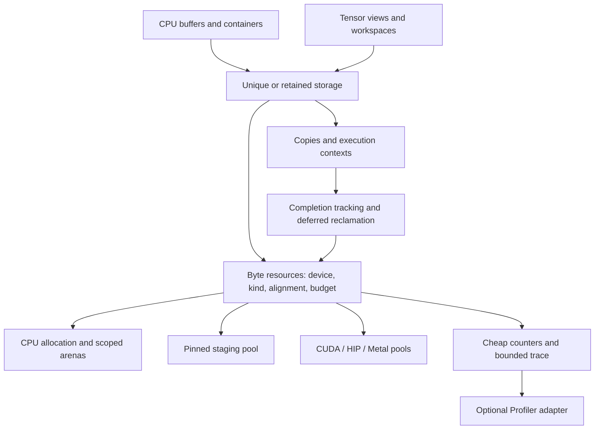

# CPU/GPU memory design review and delivery path

Historical review with later status annotations. The
[2026-09-30 implementation plan](memory_runtime_implementation_plan.md) supersedes
the delivery sequence and completion claims below. In particular, implementation
presence does not establish integration or acceptance; the new plan records the
remaining copy-completion, retained-lifetime, telemetry, and workspace gaps.

Reviewed 2026-09-28. Scope: this repository's current allocation, ownership,
transfer, cache, NUMA, profiling, and test code. Downstream Tensor/Vectorization
implementations were not inspected. This updates the priorities in the
[September 22 plan](cpu_gpu_memory_plan.md).

**Recommendation: retain the CPU dispatch and GPU segment caches; first make
reclamation safe and budgets accurate, then reduce allocation and transfer
frequency through reusable storage.** Optimize end-to-end workload time and
peak backing at an agreed concurrency level. No performance gains are claimed
without hardware measurements.

**What is already in place**

| Area | Current foundation | Next gap |
|---|---|---|
| CPU | Aligned mimalloc/TBB/platform allocation, optional NUMA/profiling, release-build alignment checks | Scoped arenas, explicit placement |
| CUDA/HIP | Segment caches, splitting/coalescing, stream pools, event reuse, OOM retry, failure-safe reuse, complete budget transactions | Retained async storage, copy lifetime contracts |
| Ownership | Unique deep-copy `data_ptr`; borrowed views preserve base through slices | Retained async storage and completion contracts |
| Pinned host | Per-device size-class pool, deferred reuse, quarantine, transfer helpers | Immediate-trim bug, total backing budget, GPU endpoint retention |
| Metal | Shared buffers/heaps and segment cache | Completion-driven reuse and heap capacity accounting |
| Telemetry | GPU snapshots/history; CPU profiler integration | Cheap counters and preallocated trace collection |

The earlier element-count overflow, rounding-to-zero, slice-base tracking,
default-stream tracking, and free-trace address bugs have source fixes and
regression tests. Initial GPU allocation attempts now reserve in-flight bytes.
`data_ptr` catches destruction errors. Pinned staging already exists and should
be extended, not implemented again. As of 2026-09-28, items 3 and 6 below
(budget-transaction completeness and backend/alignment validation) also have
source fixes and regression tests, closing out Order 2's non-Metal scope.
These fixes leave the following gaps.

**Current findings, in priority order**

1. **P0 — pinned deallocation reads freed metadata: fixed 2026-09-28.**
   [`pinned_memory_allocator.cpp:352`](../include/helper/pinned_memory_allocator.cpp#L352)
   retained `auto& b`, called `process_pending()` and `trim(limit_)`, then read
   `b.quarantined` after `trim()` could erase its map entry. Fix: save the raw
   pointer before any potential erase; after `trim()` re-look up by key in
   `blocks_` — if the entry is gone the driver free succeeded and the block was
   clean; if it is present read the (possibly newly-quarantined) flag directly.
   The catch block returns early with `false` so trim never runs on exception.
   Regression tests: `ZeroCacheLimitWithImmediateCompletionDoesNotReadFreedBlock`
   and `ZeroCacheLimitWithJustCompletedStreamDoesNotReadFreedBlock` in
   `Testing/PinnedRuntime/TestPinnedRuntime.cpp`.  All 17 shim tests pass.

2. **P0 — failure recording the first GPU event allows unsafe reuse: fixed 2026-09-28.**
   [`cuda_caching_allocator.cpp:930`](../include/gpu/cuda_caching_allocator.cpp#L930)
   swapped out stream uses into a local `streams` set, then called
   `free_block_locked` when `event_count == 0` — but `streams` was non-empty
   (real in-flight work existed), so those streams had no proven completion.
   Fix: the catch block now calls `free_block_locked` only when
   `event_count == 0 && streams.empty()` (no stream uses were ever registered);
   any non-empty `streams` set with `event_count == 0` quarantines the block.
   Since `insert_events_locked` is only called when `stream_uses` is non-empty,
   `streams` is never empty at the catch site: the free path is now effectively
   unreachable through the normal flow, which is the correct invariant.
   Fault-injection coverage now lives in `Testing/CudaCachingAllocator/`
   (a `fake_runtime.h` shim analogous to `Testing/PinnedRuntime/`'s, building
   `gpu/cuda_caching_allocator.cpp` directly under HIP labels — the CUDA
   driver-API expandable-VM path is out of scope to fake and doesn't compile
   in under it): `PartialEventFailureOnSecondStreamQuarantinesBlock` and
   `SingleStreamEventFailureQuarantinesNotFrees` in
   `TestCudaCachingAllocatorRuntime.cpp`. Building this shim also surfaced a
   related, previously undetected leak: when `cudaEventRecord` itself failed,
   the just-acquired event object was orphaned (never returned to
   `event_pool_` nor `cuda_events_`); fixed by recycling it in the catch
   block instead of leaking the driver resource.

3. **P1 — GPU budget accounting is not a complete transaction: fixed 2026-09-28.**
   [`cuda_caching_allocator.cpp:378`](../include/gpu/cuda_caching_allocator.cpp#L378)
   checks the initial attempt; the OOM-chain retry now rechecks
   `reserved_would_exceed_locked()` before spending a second driver call, so a
   concurrent `set_memory_fraction()` landing during the first attempt's own
   dropped-lock `cudaMalloc()` can no longer let a stale "fits" decision
   commit an over-budget segment. `alloc_segment_unlocked`'s pending-budget
   reservation is now rolled back by a locally-scoped RAII guard that
   reacquires the lock and decrements on every exit path — including a
   throwing `device_guard` inside `malloc_segment`, which previously skipped
   the decrement entirely and leaked reserved headroom permanently.
   `reserved_would_exceed_locked`'s three-way addition and both VM-path
   granularity roundings now use a saturating add/round helper
   (`caching_allocator_config.h`'s new `add_saturating`, reusing the existing
   `round_up_saturating`) instead of unchecked unsigned arithmetic.
   `set_memory_fraction` now rejects NaN (previously passed both bound checks
   silently, since IEEE754 comparisons against NaN are always false).
   Regression tests: `RetryAfterDriverFailureRechecksShrunkenBudget` and
   `SegmentAllocDeviceGuardThrowRollsBackPendingBudget` in the new
   `Testing/CudaCachingAllocator/` shim (see item 2), `AddSaturatingNormalSumIsExact`
   / `AddSaturatingOverflowSaturatesToMax` in `TestCachingAllocatorConfig.cpp`,
   and `set_memory_fraction_rejects_nan` in `TestCudaCachingAllocator.cpp`.

4. **P1 — copy lifetime protection is partial and follows submission: ordering
   fixed 2026-09-29, handle-based overload added 2026-09-29.**
   [`allocator.h`](../include/allocator.h) now calls `record_stream` on both
   GPU endpoints BEFORE `cudaMemcpyAsync`/`cudaMemcpyPeerAsync`, closing the
   window where in-flight work was untracked. The null-stream guard (`if (stream
   != nullptr)`) was removed — the caching allocator treats null as the legacy
   default stream identity, not "no stream," so null-stream async copies are now
   tracked too. [`copy_token.h`](../include/common/copy_token.h) comment
   updated to reflect the pre-submission guarantee and note the interior/foreign
   pointer limitation. Remaining open: the raw-pointer API still CHECK-fails on
   interior or foreign GPU pointers (no handle-based pre-flight), pageable CPU
   endpoints are not retained, and no retained-endpoint `copy_async` overload
   exists yet. Regression needed: a test that verifies `record_stream` is called
   before the copy submission (currently exercised only through end-to-end
   stream-lifetime tests).

5. **P1 — Metal budgets omit retained heap capacity: fixed 2026-09-29.**
   [`metal_caching_allocator.mm`](../include/gpu/metal/metal_caching_allocator.mm):
   `heaps_` now stores `{heap, capacity}` pairs. `make_heap_buffer` takes an
   `out_reserved` parameter and returns the net driver commitment — heap capacity
   for a new heap, 0 when reusing an existing heap, `alloc_size` for standalone
   fallback. `alloc_segment_locked` uses that delta instead of `alloc_size`.
   `release_segment_locked` skips the `bytes_reserved` decrement for heap-backed
   blocks (`[block->buffer heap] != nil`); `empty_cache` subtracts all heap
   capacities before `heaps_.clear()`. Budget enforcement via
   `reserved_would_exceed_locked` now sees the true committed footprint.
   Pre-flight budget check fixed 2026-09-29: `allocate()` first tries existing
   heaps (`only_existing=true`) with no budget check (no new driver allocation),
   then computes `heap_cost = max(kSmallHeapBytes/kLargeHeapBytes, alloc_size)`
   and checks that against the fraction limit before any new driver allocation.
   No Apple hardware to validate against in this pass.

6. **P1 — workspace reset and reuse have no completion guard: fixed 2026-09-29.**
   [`gpu_workspace.h`](../include/gpu/gpu_workspace.h)'s `rebind()` was advisory
   ("always call `release()` before `rebind()`") with no enforcement; `release()`
   and `reset()` could be called while GPU work using the acquired slices was still
   in flight. `rebind()` now `LOGGING_CHECK`s `cursor_ == 0` (enforces `release()`
   was called) and is no longer `noexcept`. The class-level lifetime contract was
   rewritten to separate the enforced pre-condition (`release()` must be called)
   from the caller-managed invariant (old stream must be quiescent before
   `acquire()` on a new stream). Same-stream reuse is safe by stream ordering
   without an explicit sync; cross-stream rebind requires the caller to synchronize
   the old stream first. `release_backing()` (destructor and `reset()`) passes
   `ctx_.stream` to `deallocate()`, so the caching allocator already defers
   backing reuse until that stream completes — the destructor path was safe.
   Runtime test added 2026-09-29: `GpuWorkspace.rebind_while_acquired_throws`
   acquires a slice then asserts `ASSERT_ANY_THROW(ws.rebind(...))`, and verifies
   that after `ws.release()` the rebind succeeds. Stream quiescence cannot be
   enforced at runtime without explicit completion tracking — remains caller-managed.

7 (was 6). **P1 — backend and alignment contracts need validation: fixed 2026-09-28
   for CUDA/HIP; Metal alignment fixed 2026-09-29; typed-storage lifetime model
   remains open.**
   [`allocator.h:57`](../include/allocator.h#L57)'s `is_active_gpu_device` now
   checks only the backend actually compiled in (`#if MEMORY_HAS_CUDA` /
   `#elif MEMORY_HAS_HIP` / `#elif MEMORY_HAS_METAL`) instead of accepting
   either CUDA or HIP whenever either is compiled — a CUDA-only build no
   longer treats `device_enum::HIP` as active and silently dispatches into
   the CUDA-backed cache. GPU allocation (was line 181) now rejects
   (`std::invalid_argument`) a template `alignment` greater than the CUDA/HIP
   segment cache's `kMinBlockSize` (512-byte) guarantee instead of silently
   under-aligning; the same check now applies to Metal (fixed 2026-09-29 —
   `#if MEMORY_HAS_CUDA || MEMORY_HAS_HIP || MEMORY_HAS_METAL` with error
   message "GPU caching allocator") — no Apple hardware to validate against. CPU alignment checking
   ([`memory_allocator.cpp:105`](../include/helper/memory_allocator.cpp#L105))
   is promoted from `LOGGING_CHECK_DEBUG` to `LOGGING_CHECK`, so Release
   builds validate it too. Regression tests: `IsActiveGpuDevice` (updated to
   assert single-backend exclusivity), `AllocateWrongCompiledGpuLabelThrows`,
   `AllocateGpuExcessiveAlignmentThrows` in `TestAllocator.cpp`; an
   invalid-alignment case added to `MemoryPortTest.EdgeCases` in
   `TestCPUMemory.cpp`. The typed-object lifetime model (matching
   `pinned_buffer`'s) remains open.

8 (was 7). **P0 — rare, timing-dependent host memory corruption under repeated
   allocator construction/destruction churn: newly found 2026-09-28, root
   cause not yet isolated.** Discovered while building Order 0's baseline
   benchmark (`Testing/Cxx/BenchmarkCudaCachingAllocator.cpp`): a real-hardware
   run cycling many short-lived `cuda_caching_allocator` instances through
   thousands of real `cudaMalloc`/`cudaFree` round trips (`empty_cache()` +
   `allocate()` + `deallocate()` per iteration across several sizes, then
   transitioning into a fresh allocator instance for a different benchmark)
   segfaults roughly 30–40% of full-suite runs (`--benchmark_repetitions=10`,
   default min-time). The crash site moves between different benchmark-function
   transitions across runs — consistent with a genuine race rather than a
   fixed logic error at one line.

   **Confirmed pre-existing, not introduced by today's Order 2 fixes**: built
   the same benchmark against both the current (post-fix) and the pre-session
   `include/gpu/cuda_caching_allocator.cpp` (via `git show HEAD:...`) in an
   isolated, single-configuration Release build; both crashed at a similar
   rate (2/5 and 2/3 runs respectively, in separate trials). Today's Order 2
   changes are exonerated, but the bug remains open and real.

   **Diagnosis attempted, inconclusive**: a minimal standalone repro calling
   the same public API sequence directly (no Google Benchmark harness) at
   4–10x the iteration volume never crashed, so the trigger is not pure call
   volume — it appears tied to something specific in Google Benchmark's own
   iteration/timing harness (exact mechanism unknown). AddressSanitizer would
   be the natural next step, but this toolchain (Clang 22 + `clang-cl`-style
   Windows target + multiple DLLs) hit two separate blockers: an internal
   Clang codegen crash compiling `TestCudaCachingAllocator.cpp` under
   `-fsanitize=address -gcodeview`, and — once routed around that via a
   direct, non-CMake compile — a `bad-free` abort during CRT/DLL static
   initialization *before `main()` runs*, reproducing identically regardless
   of which allocator code was linked. That is an ASan/Windows-multi-DLL
   toolchain artifact, not evidence about the real bug; it means ASan is not
   currently usable for this diagnosis on this machine. A Linux build (ASan +
   shared libraries is far more reliable there) or a Windows debugger
   (`cdb`/WinDBG, not installed on this machine) attached at the fault would
   be the next step.

   **Mitigation applied, not a fix**: `BenchmarkCudaCachingAllocator.cpp`'s
   four cases now cap iterations explicitly (`->Iterations(200)` for the
   real-driver-call-heavy cold path, `->Iterations(5000)` for the others)
   instead of letting Benchmark's own convergence pick counts, which had been
   reaching the hundreds of thousands for the cheap warm-path cases. 20/20
   repeated full-suite runs were clean after bounding; the recorded baseline
   (`Docs/cuda_baseline_2026-09-28.json`) was captured under this bounded
   configuration. This reduces exposure; it does not establish the iteration
   count is safe at unbounded scale, and does not rule out the same class of
   corruption being reachable through a legitimate caller (e.g. a
   memory-pressure-driven repeated-trim loop) outside a benchmark context.

   **Reproduction**: `python Scripts/setup.py build.test.cuda` with
   `MEMORY_ENABLE_BENCHMARK=ON`, then repeatedly run
   `bin/benchmark_memory_cudacachingallocator.exe --benchmark_min_time=0.05s --benchmark_repetitions=10`
   (no `->Iterations()` cap) a handful of times — expect roughly 1 in 3 runs
   to crash. Needs a dedicated follow-up session with working crash-dump
   tooling; do not attempt a speculative fix without reproducing under a
   debugger or working sanitizer first.

9 (was 8). **P2 — frequent operations incur avoidable work.** GPU registry lookup takes
   a global mutex; basic stats scan free blocks under the device lock
   (`cuda_caching_allocator.cpp:696,1392`). Event polling has no per-call work
   bound. Trace recording uses a dynamically allocating deque under that lock
   (`gpu_memory_snapshot.h:127`), which can throw after allocator state changes.
   Pinned allocation holds its lock through driver allocation and pending scans;
   CPU profiling has a mutex-protected allocation table. Measure each cost and
   make optional telemetry unable to fail allocation/free.

**Target architecture**



An allocation handle carries resource/deleter identity, base, requested bytes,
capacity, alignment, device, and memory kind. Views carry offset and extent.
Retained views/tasks share a storage control block; preserve low-cost unique
owners, borrowed views, and existing deep-copy semantics. Add explicit clone,
retention, and foreign-memory adoption. Keep CPU allocation statically dispatched;
use runtime resource handles where selection/adoption requires them. Add CPU
PMR/STL adapters without placing device-only storage in host-dereferencing
containers. Consumers own tensor shape/layout/operator semantics. Consumers
should share one Memory runtime to avoid duplicate process-wide device pools.

Execution contexts identify backend, device, and stream/queue. Default streams
are valid; per-thread defaults need thread-aware identity or normalization.
Register uses before submission can become untracked. Dropping an async token
must leave a reclamation service holding outstanding storage. Define stream
destruction and allocator shutdown ordering. Lifetime protection does not create
producer/consumer dependencies: those must be explicit. Destructors stay
nonthrowing, with a separate error-returning cleanup operation.

For each native segment pool, maintain disjoint states and verify:

`segment backing = live capacity + pending capacity + reusable capacity + quarantined capacity`

Admission includes committed backing plus reservations in flight. Track requested
bytes separately from live capacity; add pinned alignment padding and Metal
unused heap capacity/standalone buffers at their appropriate accounting layers.
Do not double-count shared CPU/GPU backing. CPU RSS is process-wide, and reserved
minus allocated is not by itself a fragmentation metric.

**Delivery sequence**

| Order | Work package | Acceptance gate |
|---|---|---|
| 0 | **[Done 2026-09-28, surfaced finding 8]** Baseline representative workloads and effective configuration | Reproducible latency, end-to-end time, peak backing, copies, synchronization — *CUDA caching-allocator benchmarks added (`Testing/Cxx/BenchmarkCudaCachingAllocator.cpp`: cold/warm alloc-free, fixed/changing sizes, 1/4/16 streams); run on this machine's GPU, see `Docs/cuda_baseline_2026-09-28.json`; building this benchmark surfaced finding 8 (P0, open) — iterations bounded as a mitigation, baseline recorded under that bounded config* |
| 1 | **[Done 2026-09-28]** Pinned UAF and GPU event-failure fixes; exception-safe state transitions | ASan regression passes; first/partial event failures never recycle unsafe memory; errors observable — *both P0 source fixes landed 2026-09-28; pinned shim suite (17/17); GPU fault-injection shim added (`Testing/CudaCachingAllocator/`), 4/4 tests pass, also caught and fixed an event-object leak on record failure* |
| 2 | **[Done 2026-09-28, Metal excluded]** Complete budget transactions and allocation validation | Retry/concurrency/fault tests respect budget; rollback on every failure; overflow/NaN/backend/alignment validation — *see findings 3 and 7 above; Metal heap/alignment validation deferred to Order 4/a future pass (no Apple hardware here)* |
| 3 | **[Implementation done 2026-09-28; copy ordering fix 2026-09-29; handle-based overload added 2026-09-29]** Storage identity, retained views, explicit contexts and copy API | Sliced/adopted/multi-stream endpoints survive completion; dependencies explicit; compatibility preserved — *`storage_identity` (stable alloc IDs, atomic counter), `retained_ptr<T>` (shared ownership, typed slice, custom deleter), `execution_context` (device type/index/stream), `copy_token` (stream-aware wait/ready); `allocator<T>` gains `copy_sync()`/`copy_async()` returning `copy_token`; 7+6+9+5 unit tests added; 2026-09-29: `record_stream` now called before submission on both GPU endpoints; null-stream async copies now tracked (finding 4 ordering fixed); `copy_async(data_ptr<Src>, data_ptr<Dst>, stream)` free function added in `data_ptr.h` (guarantees base allocation — no interior/foreign risk); raw-pointer `copy_async` interior/foreign pre-flight and pageable CPU endpoint retention remain open* |
| 4 | **[Implementation done 2026-09-28; Metal heap accounting and budget check fixed 2026-09-29]** Cheap counters, bounded diagnostics, Metal backing accounting | O(1) basic stats; accounting invariants; no telemetry-caused allocation failure; stable IDs and trace loss counts — *`bounded_trace_ring<Entry>` (preallocated, no-alloc push, overflow counting, snapshot copy, resize); `gpu_memory_trace_entry` extended to schema v2 (schema_version, requested_size, alloc_id, sequence_num, timestamp_ns); `gpu_memory_history` migrated from `std::deque` to `bounded_trace_ring`; legacy `record()` overload preserved; Metal `record_stream()` sets completion token on block, `deallocate()` defers to pending-completion map, `mark_completion()` drains it; 11 ring/history unit tests; 2026-09-29: `bytes_reserved` now tracks full heap capacity; `release_segment_locked` skips decrement for heap-backed blocks; `empty_cache` subtracts heap capacities before clearing (finding 5 accounting fixed); pre-flight budget check now uses `heap_cost` (`max(kSmallHeapBytes/kLargeHeapBytes, alloc_size)`) after trying existing heaps first (finding 5 budget check fixed)* |
| 5 | **[Implementation done 2026-09-28; workspace quiescence enforcement and test 2026-09-29]** CPU arenas, GPU workspaces, bounded staging, Metal completion tracking | End-to-end benefit with bounded memory and no premature reset/reuse — *`cpu_arena` (scoped bump allocator, lazy/preallocated backing, typed `alloc<T>()`, reset-without-free, OOM throw, move-only); `gpu_workspace` (GPU slab, 256-byte aligned `acquire()`, cursor `release()`, backing `reset()`, `rebind()`); `pinned_memory_allocator` gains `set_max_backing_bytes()`/`max_backing_bytes()` with trim-then-throw OOM enforcement; 8 arena + 5 workspace + 3 pinned-budget tests; 2026-09-29: `rebind()` now CHECKs `cursor_ == 0` and is no longer `noexcept`; class-level quiescence contract explicit (finding 6 fixed); `GpuWorkspace.rebind_while_acquired_throws` test added* |
| 6 | **[Interfaces done 2026-09-28; graph semantics not acceptance-validated]** Native-cache tuning, optional driver pools and graph-aware extensions | Repeatable improvement over baseline; peer/multi-device/capture semantics validated before advertising support — *`device_handle_cache` (C++17 inline `thread_local` per-device handle array, `get()`/`invalidate()`/`clear()`); `cuda_malloc_async_allocator.h` (optional `cudaMallocAsync`/`cudaFreeAsync` wrapper, guarded by `MEMORY_USE_CUDA_MALLOC_ASYNC && (MEMORY_HAS_CUDA\|MEMORY_HAS_HIP)`); `gpu_graph_pool` skeleton (`capture_scope` RAII, `gpu_graph_pool` registry with `add()`/`get()`/`release()`/`reset()`, guarded by `MEMORY_HAS_CUDA\|MEMORY_HAS_HIP`)* |

Orders 0–6 source implementation complete as of 2026-09-28; all P1 code fixes
applied 2026-09-29. Two hardware-blocked gaps remain:
- Finding 8 (P0 churn corruption): open — do not mark Orders 0–6 fully accepted
  until resolved under a debugger or working sanitizer (Linux ASan or WinDBG).
- Order 6 acceptance gate requires validated CUDA graph capture, not just skeleton
  interfaces; runtime CUDA/HIP tests for Orders 3–6 pending (no GPU hardware on CI);
  Metal completion-tracking integration tests deferred (no Apple hardware).
Residual soft gaps (no hardware to validate): typed-storage lifetime model (finding 7);
raw-pointer `copy_async` interior/foreign-pointer pre-flight (finding 4); Metal
completion-tracking integration.

**Where the performance gains should come from**

- **CPU:** keep mimalloc as the baseline candidate; compare TBB/platform fairly.
  Use scoped bump arenas for temporaries sharing a lifetime and reuse large
  workspaces. Make initialization explicit. Replace ordinary allocation's
  unconditional `NUMAMove` with opt-in placement/first-touch policy and dedicated
  page-backed NUMA arenas. Current `mbind` rounds to pages that may contain other
  small allocations (`common/numa.cpp:79`).
- **GPU:** keep long-lived data resident, reuse scratch slabs, and avoid
  intermediate round trips. Separate persistent/scratch pools only where traces
  justify it. Preserve same-stream reuse; cross-stream reuse requires a dependency
  or completion proof. Prefer a bounded set of persistent streams to avoid
  stranding caches in many stream-specific pools.
- **Transfers:** extend the existing pinned pool with a total backing budget and
  bounded in-flight slots. Its 64 MiB reusable-cache cap excludes live/pending
  bytes. Specify try/fail versus completion-based backpressure. Start with two
  staging slots and measure additional overlap before adding more. Track both
  endpoints and batch small copies.
- **Allocator overhead:** cache stable per-device handles, update counters
  incrementally, reuse block/event metadata, and bound completion polling.
  Export diagnostics outside allocation locks. Change lock granularity only
  when contention measurements justify it.
- **Metal:** retain shared storage where sharing helps; evaluate private storage
  with staging for GPU-only data. Carry native buffer plus offset to avoid the
  linear interior-pointer search (`metal_caching_allocator.mm:470`). Reclaim on
  command-buffer completion. Apple distinguishes resource/heap memory measures
  in [Analyzing memory usage](https://developer.apple.com/documentation/xcode/analyzing-memory-usage).
- **Driver pools:** benchmark optional `cudaMallocAsync` behind the same lifetime
  contract. Cross-stream access/free must be ordered, and peer access uses pool
  configuration; see [NVIDIA's allocator contract](https://docs.nvidia.com/cuda/cuda-programming-guide/04-special-topics/stream-ordered-memory-allocation.html).
  Query and test HIP support independently against
  [AMD's documentation](https://rocm.docs.amd.com/projects/HIP/en/latest/how-to/hip_runtime_api/memory_management/stream_ordered_allocator.html).
  Add genuinely growing VM segments only if changing-size workloads justify
  them; today's opt-in VM path reserves separately for each segment. Keep managed
  memory an explicit, benchmarked capability.

Expose validated per-device/pool budgets, cache caps, rounding/split policy,
polling limits, pinned backing limits, and telemetry level. Classify options as
initialization-only or live-updateable; report effective configuration. Start
with offline trace replay rather than automatic policy changes. Keep
`empty_cache()` away from normal allocation/free loops.

**Measurement and acceptance**

CPU coverage: 1/2/8/32 threads, cross-thread frees, mixed sizes/lifetimes,
real reads/writes, and optional NUMA placement. GPU coverage: fixed/changing
shapes, long-lived buffers plus scratch, 1/4/16 streams, multiple devices where
available, delayed completion, and pressure. Measure pageable/pinned transfers
and overlap separately from allocation loops. Compare raw allocator primitives
separately from owning buffers/tensor workloads.

Record p50/p95/p99 allocation/free latency, lock wait, driver calls,
synchronizations, end-to-end time, peak backing, pending/quarantine bytes,
requested-versus-capacity waste, inactive splits, and largest reusable blocks
per relevant pool. Allocated-byte throughput is not achieved memory bandwidth.
Report warmup, sample counts, variation, hardware/compiler/driver, and identical
alignment/initialization policies.

Telemetry levels: off, counters, sampled trace, diagnostic snapshots/stacks.
Use a preallocated ring with timestamps, allocation/sequence IDs, requested and
capacity bytes, device/context/pool, consumer attribution IDs, and loss counts.
Export/symbolize away from allocation. Publish coverage, especially CPU blocks
predating a profiling session. Preallocate emergency OOM evidence.

Proposed gates, subject to baseline: no correctness failures or unbounded backing
for bounded work; no steady-state driver allocations for a warmed fixed-shape
workspace; no avoidable device-wide synchronization on cache hits. Target counters
within 5% and sampled trace within 10% of profiling-off on agreed workloads.
These are engineering budgets, not measured results. Accept tuning only when
end-to-end benefit exceeds noise within the agreed memory budget.

**Validation performed**

- Reviewed the source and relevant tests/benchmarks, and consulted the linked
  primary backend documentation.
- Compiled the actual pinned implementation and existing runtime-shim suite
  directly with Clang, `-O1 -g -fsanitize=address -fno-omit-frame-pointer`.
  All 15 CUDA-shim and all 15 HIP-shim tests passed. These simulate the runtime;
  they do not execute GPU work.
- A separate probe against the CUDA shim reproduced `heap-use-after-free` in
  `Impl::deallocate`, with `Impl::trim` on the freeing stack:

  ```cpp
  #include "fake_runtime.h"
  #include "helper/pinned_memory_allocator.h"
  int main() {
      fake_runtime::reset();
      memory::cpu::pinned_memory_allocator pool(0, 0);
      void* ptr = pool.allocate(100);
      return pool.deallocate(ptr) ? 0 : 1;
  }
  ```

  Compile with `Testing/PinnedRuntime` and `include` on the include path,
  `MEMORY_STATIC_DEFINE`, `MEMORY_HAS_CUDA=1`, `MEMORY_HAS_HIP=0`,
  `MEMORY_HAS_METAL=0`, and `include/helper/pinned_memory_allocator.cpp`.
- No full build, real CUDA/HIP/Metal run, or performance benchmark was performed.
  Other findings are source-derived with explicit regression gates above.
  This change documents the review; allocator implementation is unchanged.
