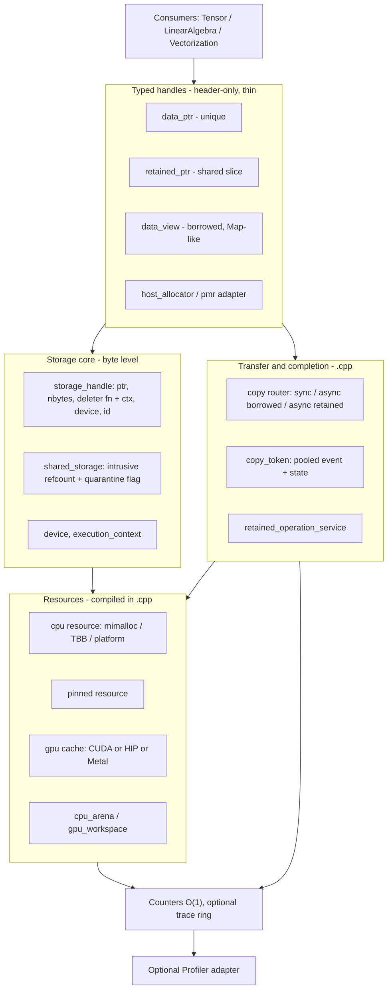
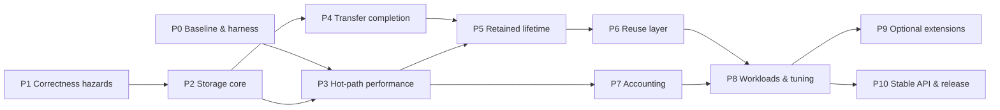

# Memory — design and implementation plan

Updated: 2026-10-02. Source baseline: `27e5f38` (`main`). §3 inventory and
problem evidence were taken at `becf3f2`; the status column in §3.3 and §6.1 and
the review findings R1–R7 (§3.5) are at `27e5f38`.

This is the only design document for Memory. It replaces the September plan, the
Phase 0–3 summary, the token/error, copy-completion and storage-identity
specifications, the validation-manifest template, the September design review, the
churn diagnosis report, and the CUDA benchmark analysis. Their substance is merged
here; the evidence they recorded is condensed in the appendices. Earlier text
remains in Git history.

`README.md` is the usage guide and `CLAUDE.md` is repository engineering guidance.
Neither keeps a roadmap or status table. Update this file when design or status
changes.

**Goal.** Fast, predictable CPU/GPU allocation behind a small set of abstractions
that a numerical library (Tensor, LinearAlgebra, Vectorization) can build on
without knowing which backend is compiled in.

Contents: [1 Goals](#1-goals-non-goals-and-design-rules) ·
[2 Reference designs](#2-reference-designs-pytorch-and-eigen) ·
[3 Current design review](#3-review-of-the-current-design) ·
[4 Target architecture](#4-target-architecture) ·
[5 Contracts](#5-contracts) ·
[6 Performance design](#6-performance-design) ·
[7 Phases](#7-implementation-phases) ·
[8 Validation](#8-validation) ·
[9 Status](#9-status-and-evidence) ·
[Appendices](#appendix-a--historical-findings-september-review)

---

## 1. Goals, non-goals and design rules

### 1.1 Goals

1. **Speed on the paths that run millions of times.** The warm GPU allocation
   path does no driver call, no heap allocation and takes one lock. Freeing does
   not search a registry. The CPU path costs one backend call over raw mimalloc/TBB.
2. **A small, layered abstraction.** One byte-level owning handle, typed handles on
   top of it, and a borrowed view. Backend details (CUDA/HIP/Metal headers, stream
   types, driver error codes) stay out of the public headers.
3. **Truthful lifetime and completion.** An API that says "synchronous" returns
   after completion; a retained async copy keeps its endpoints alive even if every
   user handle and token is dropped; unsafe storage is never recycled.
4. **Bounded, cheap observability.** Basic counters cost an atomic increment;
   detailed traces are opt-in and preallocated.

### 1.2 Non-goals (core release)

Tensor shape/strides/expressions, kernels, BLAS dispatch and autograd belong to
consumers. Driver pools (`cudaMallocAsync`), graph-capture pools, growing
virtual-address segments, managed memory, Metal private storage, automatic backend
selection and general C++ object containers are optional extensions (Phase 9),
each with its own capability check and measured justification. Do not reintroduce
the deleted BFC/pool/retry/tracking backends, `process_state`, the virtual
`Allocator` interface, `gpu_memory_*` helpers or `visualization/` without a
measured need.

### 1.3 Design rules

- **Static dispatch on the CPU path.** No virtual call and no Memory-owned lock
  between the caller and mimalloc/TBB/platform malloc.
- **Compile-time GPU backend exclusivity.** CUDA, HIP or Metal is chosen at build
  time (`MEMORY_GPU_BACKEND`). Guard GPU code with `MEMORY_HAS_CUDA`,
  `MEMORY_HAS_HIP`, `MEMORY_HAS_METAL` only.
- **The handle remembers how to free itself.** An owning handle stores a deleter
  function pointer plus context, so free never looks up a registry or switches on
  a device enum (PyTorch `DataPtr` pattern, §2).
- **Bytes inside, elements outside.** Resources and handles work in bytes;
  public typed APIs take element counts and convert with checked multiplication.
- **Reclamation is not ordering.** `record_stream` delays reuse; it never makes a
  consumer wait for a producer. Ordering is an explicit dependency.
- **Destructors never throw.** Failures during free are counted and reported
  through a non-allocating diagnostic channel; unsafe storage is quarantined.
- **Measure before tuning.** Every optimization cites a Phase 0/8 measurement and
  keeps the hot-path invariant tests (§6.1) green.

---

## 2. Reference designs: PyTorch and Eigen

Memory uses PyTorch (c10) and Eigen as design reference points only. No code is
copied. `cuda_caching_allocator` already *behaviorally* ports PyTorch's
`CUDACachingAllocator`; Phase 10 includes a licence/attribution check for that
lineage (PyTorch is BSD-3, Eigen is MPL-2).

| Concern | PyTorch (c10) | Eigen | Memory decision |
|---|---|---|---|
| Owning byte handle | `c10::DataPtr`: pointer + `void*` context + function-pointer deleter + `Device` | Plain object owns its buffer through `aligned_malloc` | **Adopt** the `DataPtr` shape as `storage_handle` (§4.2). Removes registry lookup and device switch on free; makes adopted foreign memory the same type as native memory. |
| Allocator interface | Virtual `c10::Allocator::allocate(n) -> DataPtr`, per device type | `aligned_allocator<T>` (STL), `handmade_aligned_malloc` | **Deviate:** no virtual allocator on the hot path. Backends are free functions or per-device singletons chosen at compile time. The deleter pointer is the only indirect call, as in c10. |
| Shared storage | `StorageImpl`: intrusive refcount around one `DataPtr` + `nbytes` | None (value semantics) | **Adopt** an intrusive `shared_storage` around one `storage_handle`; `retained_ptr<T>` is a typed slice of it. A unique owner can be promoted to shared without reallocation. |
| Borrowed memory | `at::from_blob` (tensor with no-op deleter) | `Eigen::Map<>` — typed view over foreign memory, alignment as a template parameter | **Adopt Map semantics** for `data_view<T>`: span + optional provenance (base, id, device); never extends lifetime. |
| Device + stream identity | `c10::Device {type, index}`, `c10::Stream {device, id}` | n/a | One `device` value type and `execution_context {device, stream}`; drop the duplicate `device_option`. |
| GPU caching | Size-class segment cache, per-stream free pools, `recordStream`, event-deferred reuse, OOM flush + retry, `empty_cache`, memory fraction, snapshots | n/a | **Keep** (already implemented). Close metadata and event-allocation costs (§6.3). |
| Event reuse | Per-device CUDA event pool for `recordStream` and stream sync | n/a | Use the per-device event pool for copy tokens as well (today each async copy creates and destroys an event). |
| Allocator lookup | Per-device allocator array created once and never destroyed (intentional leak avoids exit-order bugs) | n/a | **Adopt:** fixed per-device array with `call_once`, process lifetime, plus an explicit `shutdown()` for orderly teardown. |
| Temporaries | Caching allocator reuse; workspace arguments in kernels | Small temporaries on the stack (`alloca` under a threshold), `EIGEN_MAX_ALIGN_BYTES` | `cpu_arena` for scoped temporaries; `gpu_workspace` for operator scratch; `MEMORY_ALIGNMENT` plays the role of `EIGEN_MAX_ALIGN_BYTES`. |
| Host containers | `c10::Allocator` behind `CPUAllocator` | `aligned_allocator<T>` for `std::vector` | Provide `host_allocator<T>` (STL) and a `std::pmr::memory_resource` adapter; host-only — device memory never enters host-dereferencing containers. |
| Observability | `memory_stats`, `_record_memory_history`, `_snapshot` | n/a | Keep the torch-named API. Basic counters must be O(1) and lock-free (today they lock and scan, §3.3). |

---

## 3. Review of the current design

### 3.1 Component inventory (at `becf3f2`)

| Layer | Component | Files | Assessment |
|---|---|---|---|
| CPU backend | `cpu::memory_allocator` (mimalloc → TBB → platform aligned malloc) | `helper/memory_allocator.{h,cpp}` | Good: free functions, static dispatch, profiler hook is one relaxed load. Problems in §3.3. |
| Pinned host | `cpu::pinned_memory_allocator`, `pinned_buffer<T>` | `helper/pinned_memory_allocator.*`, `common/pinned_buffer.h` | Size-class pool with deferred reuse, quarantine and backing budget. Not integrated with retained copies. |
| GPU backend | `cuda_caching_allocator` (CUDA/HIP), `metal_caching_allocator` | `gpu/*`, `src/gpu/*` | PyTorch-equivalent segment cache; fault shims exist. Hot-path costs in §3.3. |
| Facade | `allocator<T, alignment>` (static members) | `allocator.h` (718 lines) | Too many jobs: allocation, stats, copy routing, retained adoption, retained copy, SIMD alignment helpers. All inline, so every consumer includes CUDA runtime headers. |
| Owners | `data_ptr<T>` (unique), `retained_ptr<T>` (shared), `data_view<T>` (borrowed) | `common/*.h` | Right three roles, but no shared core: each stores device info differently and frees differently. |
| Context | `device_enum`, `device_option`, `execution_context`, `(type, index, stream)` triples | `common/device.h`, `execution_context.h` | Three overlapping identities; `data_view` stores a raw triple. |
| Identity | `allocation_id`, `storage_identity` | `common/storage_identity.h` | Two types for one concept; test-only `reset()` on the production generator. |
| Transfer | `copy_token`, `retained_operation_service` | `common/copy_token.h`, `src/retained_operation_service.cpp` | Per-operation events and token-discard retention exist. Per-copy allocation costs and open contracts in §3.3 and §5. |
| Reuse | `cpu_arena`, `gpu_workspace` | `common/cpu_arena.h`, `gpu/gpu_workspace.h` | Useful; preconditions checked in Debug only. |
| Telemetry | `unified_cache_stats`, `bounded_trace_ring`, snapshots, profiler reporter | `profiler/*` | Preallocated ring is good; basic queries are not O(1). |
| Experimental | `device_handle_cache`, `cuda_malloc_async_allocator`, `gpu_graph_pool`, `cuda_caching_allocator_template`, `memory_containers.h` flat-hash switch | `gpu/*`, `common/memory_containers.h` | Not used by the facade, and the enabling build options (`MEMORY_USE_CUDA_MALLOC_ASYNC`, `MEMORY_USE_FLAT_HASH`) are not wired in CMake. |

### 3.2 What is right and stays

- Three ownership roles (unique / shared / borrowed) with move-only unique owners
  and explicit `clone()`.
- Static CPU dispatch over mimalloc/TBB/platform malloc.
- The PyTorch-style GPU segment cache: size classes (512 B rounding; 2 MiB small
  segments; 20 MiB for 1–10 MiB; 2 MiB-rounded large), per-stream pools, block
  split/coalesce, event-deferred cross-stream reuse, OOM flush-and-retry, memory
  fraction, quarantine on partial event failure, lock dropped around driver malloc.
- `execution_context` as the single argument for where work runs.
- Per-operation completion events on async copies, and a service that owns
  retained operations after the user drops the token.
- Runtime shims (`Testing/CopyRuntime`, `Testing/CudaCachingAllocator`,
  `Testing/PinnedRuntime`) that exercise GPU code paths without hardware.

### 3.3 Problems found

**Abstraction**

| # | Problem | Evidence | Fix (phase) |
|---|---|---|---|
| A1 | No byte-level owning handle; `data_ptr` and `retained_ptr` free through unrelated mechanisms (device switch + registry vs `std::function`). | `data_ptr.h` `release_owned()`; `retained_ptr.h` `control_block::deleter` | `storage_handle` + `shared_storage` (P2) |
| A2 | No way to promote a unique owner to shared storage; no allocator-backed retained factory. README shows `retained_ptr = allocator<float>::allocate(...)`, which does not compile (it returns a raw pointer). | `allocator.h:159`, README "retained_ptr" example | `retained_ptr(data_ptr&&)`, `make_retained<T>` (P2) |
| A3 | `allocator<T>` mixes allocation, stats, copy routing, adoption, retained copy and SIMD helpers (`first_aligned`/`last_aligned`); it is templated on `T`, though the logic is byte-level. | `allocator.h` | Byte-level `src/transfer.cpp`; thin typed wrappers; SIMD helpers move to Vectorization (P2) |
| A4 | Vendor headers leak into every consumer: `allocator.h` includes `gpu_runtime.h`/`device_guard.h`; `stream_t` is `cudaStream_t` or `void*` depending on build. | `allocator.h:50-53, 146-150` | Opaque `stream_handle_t` in public headers; vendor calls in `.cpp` (P2) |
| A5 | Device identity is duplicated (`device_enum` + `device_option` + `execution_context` + triples). | `common/device.h`, `data_view.h` fields | One `device` value type (P2) |
| A6 | Two identity types; moved-from `data_ptr` keeps its ID; production generator has `reset()`. | `storage_identity.h`; `data_ptr::clear_handle()` | Single `allocation_id`, invalidated on move (P1/P2) |
| A7 | `cuda_caching_allocator_template` builds a *private* cache instance — a second pool for the same device. | `cuda_caching_allocator.h:279` | Delete (P2) |
| A8 | `execution_context` says `nullptr` is the *per-thread* default stream; `allocator.h` and the cache treat it as the *legacy* default stream. | `execution_context.h:20,34` vs `allocator.h:341` | Document now; enforce in P4 |

**Performance (hot path)**

| # | Problem | Evidence | Fix (phase) | Status at `27e5f38` |
|---|---|---|---|---|
| H1 | Every GPU allocate, free and `record_stream` takes a global registry mutex and does an `unordered_map` lookup. `device_handle_cache` was written to avoid this but is never called. README claims the opposite. | `cuda_caching_allocator.cpp:1530`; `allocator.h:210,253,362` | Lock-free per-device array; free via handle deleter (P2, P3) | Implemented (3.1): `atomic<cache*>[16]` + `call_once`. `allocator<T>` still calls `caching_allocator_for_device` per op (now lock-free). No lock-count probe (R5) |
| H2 | `record_stream` heap-allocates (`std::set<cudaStream_t>` node per stream use). | `cache_block::stream_uses` | Inline small set (P3) | Implemented (3.2): `inline_stream_set`, 4 inline slots. Not probe-tested (R5) |
| H3 | Block split/merge calls `new`/`delete cache_block`. | `cuda_caching_allocator.cpp:898,1013` | Metadata freelist (P3) | Implemented (3.2): `block_freelist`. Not probe-tested (R5); churn interaction (R6) |
| H4 | Each async copy does `make_shared` (token state) + `cudaEventCreateWithFlags`, and token destruction calls `cudaEventDestroy`; retained copies add another `make_shared` and a global service mutex. | `copy_token.h:57,178,233`; `allocator.h:684` | Pooled events and token state (P3); per-device service shards if measured (P5) | Open (3.4) |
| H5 | `memory_allocated()` etc. call `stats()`, which takes the device lock and scans both pools. | `cuda_caching_allocator.cpp:737` | O(1) lock-free counters (P3) | Implemented (3.5): relaxed atomic loads for allocated/reserved and peaks. Metal parity not verified |
| H6 | With NUMA enabled, every CPU allocation calls `NUMAMove` (an `mbind` syscall that can move pages shared with unrelated allocations). | `memory_allocator.cpp:151` | Explicit NUMA placement resource only (P3) | Open (3.6) |
| H7 | Free is unsized; backends that support sized free cannot use it. | `allocator<T>::free` ignores `count`; `data_ptr` passes 0 | Handle stores `nbytes` (P2/P3) | Partial: `storage_handle` stores and passes `nbytes`; `allocator<T>::free` still passes 0; backend sized free not used (3.6) |
| H8 | Metal free/bind resolves interior pointers by scanning all live blocks. | `metal_caching_allocator.mm:558-560` | Handle carries `(buffer, offset)` (P3) | Open (3.7) |

**Correctness hazards in existing code**

| # | Problem | Evidence | Fix (phase) |
|---|---|---|---|
| C1 | ~~In Release, `deallocate`/`record_stream` on a pointer the cache does not own dereferences `end()`.~~ **Corrected 2026-10-02:** the CUDA/HIP (`cuda_caching_allocator.cpp:552,618`) and Metal (`metal_caching_allocator.mm:240`) ownership checks are `LOGGING_CHECK`, which throws in every build type (present since `807f82c`). Remaining gap: it throws `logging::Error`, not the documented `invalid_argument`/`logic_error`, and there is no Release-build test. | `ThirdParty/Logging/include/util/exception.h:323` | Release test + exception-type decision (1.1) |
| C2 | ~~CPU alignment validation is Debug-only.~~ **Corrected 2026-10-02:** `memory_allocator.cpp:134` is a Release `LOGGING_CHECK`. Same exception-type gap as C1; no Release test. | `memory_allocator.cpp:129-138` | Release test (1.2) |
| C3 | ~~`gpu_workspace::rebind()` precondition is Debug-only; `acquire<T>` multiplies unchecked.~~ **Corrected 2026-10-02:** `rebind()` uses `LOGGING_CHECK`; `acquire<T>` checks overflow but throws `bad_alloc` where §5.1 requires `overflow_error`. | `gpu_workspace.h:117-123,145` | Exception type + Release test (1.2) |
| C4 | `data_ptr` destructor swallows free failures silently, which leaks the buffer with no signal. | `data_ptr.h:124-133` | Diagnostic counter (P1) |
| C5 | `allocate_adopted` defaults to `delete[]` for any foreign pointer. | `allocator.h:651-654` | Explicit deleter required (P1) |
| C6 | `clone()` and copying constructors return after *submission*, not completion. | `data_ptr.h:145-148` | Complete-before-return (P4) |
| C7 | Retained-operation service: admission is unlimited by default; `clear_failed()` releases quarantined owners unconditionally; payload release and deleters may run under the service mutex. | `retained_operation_service.cpp` | P5 |
| C8 | Churn-crash patch (`33568cf5`) lacks root-cause evidence (Appendix B). | — | P1 (tool/hardware held) |

### 3.4 Stale or wrong claims removed from documentation

- README "thread-local device cache avoids mutex on 90%+ allocations" — the cache
  is unused (H1).
- README `retained_ptr` from `allocator::allocate` and `copy_async(retained, retained)`
  — neither exists; the retained copy is `copy_async_retained()` (A2).
- README FAQ "copying `data_ptr` deep-clones" — copying is deleted; use `clone()`.
- README project layout `include/memory/...` — headers live under `include/`.
- An earlier draft of this plan said CPU alignment and workspace `rebind()` checks
  were still Debug-only (C2, C3). They are Release checks; what is missing is the
  documented exception type and a Release-build test.
- Benchmark analysis "production-ready", "Release 20–30% faster", "robust
  fragmentation handling" — not measured (Appendix C).
- Churn report "closed" — patched, not root-caused (Appendix B).

### 3.5 Review of P2 / P3.1 / P3.2 / P3.5 (at `27e5f38`, 2026-10-02)

The storage core and the first hot-path changes landed before Phase 0 and Phase 1,
against the order in §7. The work is sound in direction; these gaps keep it at
**implemented**, not **tested** or **accepted**.

| # | Finding | Evidence | Fix (task) |
|---|---|---|---|
| R1 | GPU `storage_handle` does not free itself: `deleter_` is null and only `data_ptr`/`retained_ptr` know to call `free_gpu_with_stream`. A GPU handle from the public `allocate_bytes` that is dropped directly leaks its block silently. Contradicts §1.3 "the handle remembers how to free itself". | `src/storage.cpp:86-91`; `storage_handle.h` comment | 2.10 |
| R2 | No single storage core for shared ownership: `retained_ptr::release()` chooses among GPU-promotion, CPU raw deleter and the legacy `std::function` adoption deleter; `control_block` is not `shared_storage` around one `storage_handle`. Phase 2 gate "owners share one storage core" not met. | `retained_ptr.h:60-77, 231-262` | 2.4 (remaining) |
| R3 | Zero-size `allocate_bytes` returns an empty handle with a fresh `allocation_id`; §5.1 says empty handles have an invalid id. A test (`TestPhase3Identity`) depends on the current behavior. | `src/storage.cpp:52-57` | 1.9 |
| R4 | `data_ptr<T>` is 56 B (48 B handle + 8 B stream), not 48 B as §4.2 promised. Accepted if R1 moves the stream into the cache (then `data_ptr` returns to 48 B) or recorded as a deliberate size change. | `data_ptr.h:34` | 2.10 |
| R5 | Gate tests check API behavior, not the §6.1 invariants: registry tests check same address / index bounds, not lock counts; no counting `operator new` exists, so "0 heap allocations" (3.2) is asserted, not measured; freelist and stats tests `GTEST_SKIP` without a GPU. No Phase 0 before/after numbers exist for 3.1/3.2/3.5 (§1.3 "measure before tuning"). | `TestPhase3Registry.cpp`; absence of 0.2/0.3 | 0.2, 0.3, then re-close 3.1/3.2/3.5 |
| R6 | `block_freelist` recycles `cache_block` storage — the mechanism of churn hypothesis (B) in Appendix B — while the churn root cause (1.10) is open. The patch path changed without the predeclared stress rerun. | `cuda_caching_allocator.cpp:407-440, 1000, 1116` | 1.10 (now also depends on 3.2) |
| R7 | Error types: Release checks throw `logging::Error`; `gpu_workspace::acquire<T>` throws `bad_alloc` on overflow. §5.2 and CLAUDE.md document `invalid_argument` / `logic_error` / `overflow_error`. **Decided 2026-10-02:** `logging::exception` is the documented type for precondition/lifecycle violations (§5.2); no source change. | C1–C3 | 1.1, 1.2 |

---

## 4. Target architecture

### 4.1 Layers



Public headers in L2/L3 include no vendor GPU headers. Backend code (CUDA/HIP
runtime calls, Objective-C++) lives in `src/`.

### 4.2 Storage core (L2)

```cpp
namespace memory {

struct device {                       // c10::Device analogue; replaces device_option
    device_enum type{device_enum::CPU};
    std::int16_t index{0};
};

struct execution_context {            // where work runs
    device          dev{};
    stream_handle_t stream{};         // opaque in public headers
};

// Free callback: never throws; failures go to the cleanup diagnostic channel.
using deleter_fn = void (*)(void* ctx, void* ptr, std::size_t nbytes) noexcept;

class storage_handle {                // c10::DataPtr analogue; move-only, 48 bytes
public:
    void*         get() const noexcept;
    std::size_t   nbytes() const noexcept;
    device        dev() const noexcept;
    allocation_id id() const noexcept;     // invalid when empty / moved-from
    void*         release() noexcept;      // hand ownership to a raw-pointer API
    ~storage_handle();                     // calls deleter_(ctx_, ptr_, nbytes_)
private:
    void* ptr_; std::size_t nbytes_; deleter_fn deleter_; void* ctx_;
    device dev_; allocation_id id_;
};

class shared_storage;                 // StorageImpl analogue: atomic refcount,
                                      // one storage_handle, quarantine flag

// Resource entry points (L1), byte level:
storage_handle allocate_bytes(std::size_t nbytes, std::size_t alignment,
                              execution_context ctx);
storage_handle adopt_bytes(void* ptr, std::size_t nbytes, device dev,
                           deleter_fn del, void* del_ctx);  // explicit deleter only
}
```

- **CPU**: `deleter_ = cpu_free`, `ctx_ = nullptr`. Sized free when the backend
  supports it.
- **GPU**: `ctx_` = the per-device cache (process lifetime), so free goes straight
  to `cache->deallocate` with no registry lookup. The deleter must be non-null:
  the cache frees on the block's recorded allocation stream (PyTorch frees on
  `block->stream`), so the handle needs no stream argument. Today (`27e5f38`) the
  GPU deleter is null and the owner passes the stream (R1, task 2.10).
- **Metal**: `ctx_` = cache; buffer and offset are recoverable without a scan.
- **Adopted foreign memory**: caller's deleter and context; no `std::function`, no
  inferred `delete[]`. Callers needing captured state allocate their own context.

`sizeof(storage_handle)` is 48 bytes (enforced by `static_assert`). `data_ptr<T>`
was 48 bytes before P2; at `27e5f38` it is 56 bytes because it stores the stream
beside the handle (R4). Task 2.10 restores 48 bytes or records the change.

### 4.3 Typed handles (L3)

| Type | Holds | Semantics |
|---|---|---|
| `data_ptr<T>` | `storage_handle` (count = `nbytes / sizeof(T)`) + allocation stream | Unique, move-only; `clone()` returns a completed copy; `view()` → `data_view` |
| `retained_ptr<T>` | intrusive pointer to `shared_storage` + element offset + count | Shared; copy = refcount increment; `slice()` keeps the whole allocation alive; constructible from `data_ptr<T>&&` without reallocation; `make_retained<T>(n, ctx)` |
| `data_view<T>` | `T*`, count, `storage_ref {base, id, device}`, stream | Borrowed; never extends lifetime; `borrow()` creates a view with invalid id (foreign provenance) |
| `host_allocator<T>`, `memory_resource` adapters | stateless / arena pointer | STL and `std::pmr` integration for host containers only |

Element types: initially uninitialized storage for trivially copyable,
trivially destructible types (as `pinned_buffer` already enforces), with
`alignof(T)` checked against the requested alignment. General object
construction/destruction is out of scope.

`memory::allocate<T>(n, ctx)` (`memory.h`) is the public allocation entry point.
`allocator<T>` remains as a compatibility wrapper over the byte API during
migration; its stats functions forward to `gpu::memory_*`.

### 4.4 Transfer and completion layer

- One non-template byte router in `src/transfer.cpp`:
  `copy_bytes(src, dst, nbytes, src_dev, dst_dev, stream)` with all validation
  done before submission. Typed overloads are inline wrappers.
- Three public forms: `copy_sync` (returns after completion),
  borrowed `copy_async` (caller keeps endpoints alive), retained
  `copy_async(retained_ptr, retained_ptr, ctx)` (endpoints held until completion
  even if all tokens are dropped).
- `copy_token`: small intrusive state from a freelist; event from the per-device
  event pool; terminal result cached once observed.
- `retained_operation_service`: owns retained operations until completion;
  bounded admission; quarantine on uncertain failure; explicit poll/drain/shutdown.

### 4.5 Reuse and placement

`cpu_arena` (scoped bump allocation for temporaries, Eigen-temporary analogue),
`gpu_workspace` (operator scratch slab), pinned staging ring (bounded slots for
pageable↔device transfers), explicit NUMA placement resource (page-owned regions
only). Each exposes the same `storage_handle`/view types.

### 4.6 What moves or goes

| Item | Action |
|---|---|
| `allocator<T>::first_aligned/last_aligned` | Move to Vectorization (SIMD loop peeling is not a memory concern); keep a deprecated forwarder for one release |
| `cuda_caching_allocator_template` | Delete (creates duplicate per-device pools) |
| `device_handle_cache` | Delete (superseded by the lock-free registry; its per-thread invalidation could not cover a destroyed shared allocator) |
| `cuda_malloc_async_allocator.h`, `gpu_graph_pool.h` | Move to `include/experimental/`, not installed, until Phase 9 |
| `device_option`, `storage_identity` | Replace with `device`, `allocation_id` |
| `memory_containers.h` flat-hash switch | Either wire `MEMORY_USE_FLAT_HASH` or delete; P3 decides by measurement |

---

## 5. Contracts

These are target contracts. §9 records what is implemented and accepted. Do not
advertise a contract as supported until its phase gate passes.

### 5.1 Allocation, ownership and adoption

- Zero-size allocation returns empty storage. A zero-count copy is a no-op. For
  positive counts, null endpoints, byte overflow and non-power-of-two alignment
  are rejected before any work starts (`invalid_argument`, `overflow_error`).
- GPU caches guarantee 512-byte block alignment (256-byte driver segment base);
  requests for more are rejected, not silently under-aligned.
- Freeing or recording a pointer the cache does not own is an error in every build
  type, never undefined behavior.
- Adoption takes a base pointer, an asserted byte capacity and an explicit
  deleter. Ownership transfers only when the handle is successfully created;
  on failure the caller still owns the pointer. Non-null zero-capacity adoption and
  empty deleters are rejected. Asserted foreign capacity is not verified capacity.
- One allocation lifetime has one `allocation_id`. Views, slices, operations and
  trace records carry it; address reuse gets a new ID; empty and moved-from
  handles have an invalid ID. One generator per process across shared libraries.
- Handle constness does not make elements immutable or synchronize data access.

### 5.2 Transfer, completion and errors

| Operation | Contract |
|---|---|
| `copy_sync()` | Returns only after this transfer completes; errors propagate. The caller orders the producer. |
| Borrowed `copy_async()` | Returns an operation token. Caller keeps endpoints alive and avoids conflicting access until completion. Cache stream registration protects managed GPU reuse only. |
| Retained `copy_async()` | Acquires both owners and service admission before submission; endpoints live until completion or proven-safe recovery, independent of user tokens. |
| `clone()`, copying constructors | Return a fully copied owner. |
| `clone_async()` (deferred) | Owned result + token; only after the transfer lifecycle is accepted. |

Token rules: copies share one operation state; a moved-from or default token is
complete. `state()`/`ready()` never block or throw; `ready()` is true only for
complete. `wait()` returns on complete, blocks on pending, throws on failed.
Terminal results are stable and visible to all observers; pending is re-queried.
The operation's device is activated and restored around backend calls; activation
failure is a failure, never a successful query on the wrong device.

| Failure point | Required outcome |
|---|---|
| Validation or setup before submission | Throw; nothing submitted; destination untouched; admission and metadata rolled back exactly once. |
| Submission or event record after work may have started | Prove completion on the submitting stream or quarantine; never infer safety from an error code. Destination may be partially written. |
| Event query/wait or device activation | Persist failed state with diagnostic context; keep potentially unsafe owners. |
| Destructor / cleanup | No throw; quarantine unsafe state; increment the cleanup diagnostic. A swallowed exception is not a successful cleanup. |

Exception types (R7 decision, 2026-10-02): `logging::exception` (precondition and
lifecycle violations raised by `LOGGING_CHECK`: foreign pointer, double free, bad
alignment or device; thrown in every build type), `invalid_argument` (bad
caller input validated by the API), `overflow_error` (checked arithmetic),
`bad_alloc` (exhaustion, after flush-and-retry), `runtime_error` (backend
failure, shutdown, queue full). Destructor/deleter paths never throw: they
count in `cleanup_diagnostic`.

Streams: legacy and per-thread default streams have distinct cache identities, or
the unsupported mode is rejected before submission. A null stream is never
"no work". `record_stream` delays reuse only; producer→consumer, destination
reuse, cross-stream and peer copies need an explicit dependency
(`stream_wait(token, stream)`). Peer support is part of the transfer gate.

### 5.3 Retained-operation lifecycle

1. Validate extents, arithmetic and endpoint capabilities.
2. Acquire owners, token state, pooled event and bounded admission before any
   copy can start.
3. Submit and record the completion event; publish state to pollers.
4. Setup failure: cancel the reservation without waiting on unrelated work. After
   possible submission: prove completion or quarantine.
5. Success: release the payload outside the service mutex; tokens stay as
   lightweight observers.
6. Uncertain failure: keep owners and error metadata until an explicit, checked
   recovery proves release safe. Content validity and lifetime safety are separate.

The service is part of the retained-copy guarantee, not an opt-in. Progress comes
from `poll()`, `drain()` and capacity-driven polling; a background worker is
optional and correctness cannot depend on it. Admission limits cover operations
and retained bytes, with try/fail or wait policy. Limits never drop in-flight
storage. Quarantine has its own budget; when exhausted, new admission stops.
`poll()` reports completed and failed separately; drain/shutdown report pending
and quarantined counts separately (zero pending with quarantine is not success).
Shutdown stops admission, resolves admitted work, drains, and reports what remains
before streams and devices are destroyed. Test `reset()` is not a production
escape hatch.

### 5.4 Accounting

For each native segment pool:

`segment backing = live capacity + pending capacity + reusable capacity + quarantined capacity`

Admission counts committed backing plus in-flight driver reservations. Requested
bytes are tracked separately from block capacity. Metal unused heap capacity,
pinned alignment padding and virtual-versus-mapped reservations are separate
layers. Shared host/GPU backing is counted once. CPU RSS is process-wide and is not
allocator backing. Reserved minus allocated is not, by itself, fragmentation.

### 5.5 Threading

Allocation, free, `record_stream`, token queries and service calls are thread
safe. Handles are not internally synchronized (like `std::shared_ptr` instances):
concurrent mutation of one handle object needs external synchronization; distinct
copies of a `retained_ptr` may be used from different threads. Arena and workspace
instances are thread-confined.

---

## 6. Performance design

### 6.1 Hot-path invariants (enforced by tests)

These are the measurable design targets. Phase 0 records today's values; Phase 3
makes the target column true and adds a test per row using the fake runtimes'
driver-call counters and a counting `operator new` in the test binary.

| Operation | Target | Was (`becf3f2`) | Now (`27e5f38`) — source, not probe-tested |
|---|---|---|---|
| CPU allocate/free | 1 backend call; 0 Memory locks; 0 syscalls; profiler off = 1 relaxed load | NUMA build adds an `mbind` syscall per allocation (H6) | Unchanged (3.6) |
| GPU warm allocate | 1 per-device lock; 0 heap allocations; 0 driver calls; 0 registry locks | Global registry mutex (H1); `new cache_block` on split (H3) | Lock-free registry load; freelist on split. **Probed (0.3): 3 heap allocations per warm alloc/free pair, 7 per split — not met (3.8)** |
| GPU free | 0 registry lookups; 1 per-device lock; 0 heap allocations; event record only for cross-stream uses | Registry mutex (H1) | `data_ptr`/`retained_ptr`: cache pointer from handle, 0 lookups; `allocator<T>::free`: lock-free lookup |
| `record_stream` (≤ 4 streams) | 0 heap allocations | `std::set` node per stream (H2) | `inline_stream_set` (4 inline); **probed: 0, met** |
| Async copy, steady state | 1 memcpy submission + 1 event record; 0 heap allocations; 0 event create/destroy | `make_shared` + `cudaEventCreate` + `cudaEventDestroy` per copy (H4) | Unchanged (3.4) |
| `token.ready()` after terminal | 0 driver calls | Re-queries event every call | Unchanged (1.4, 3.4) |
| Basic stats query | 0 locks; O(1) | Device lock + pool scan (H5) | Relaxed atomic loads (CUDA/HIP) |

No row is **tested** until the Phase 0.3 probes (counting `operator new`,
fake-runtime driver and lock counters) exist and pass (R5).

### 6.2 CPU path

- Keep mimalloc as the default; compare TBB and platform malloc with identical
  alignment and initialization (the 2026-09-29 benchmark fix that forwards
  alignment through the facade must be preserved).
- Small alignments (≤ 16 bytes) use the backend's unaligned fast path; larger use
  the aligned entry point.
- Sized free where the backend supports it (handle stores `nbytes`).
- NUMA placement is an explicit resource over page-owned regions, never an
  implicit per-allocation `mbind`.
- Temporaries with a shared lifetime go through `cpu_arena` (reset, no free).
- Do not build a custom small-object allocator; mimalloc already provides
  per-thread heaps. Revisit only with a trace showing a gap.

### 6.3 GPU cache path

- **Registry:** `std::array<std::atomic<cache*>, kMaxDevices>` with `call_once`
  per device; allocators live for the process; explicit `memory::shutdown()`
  releases cached segments in a defined order.
- **Metadata:** freelist for `cache_block`; inline small stream set (4 inline
  slots, spill beyond); `allocated_blocks_` in an open-addressing map if Phase 0
  shows hashing cost.
- **Events:** one per-device event pool serves both cross-stream reuse and copy
  tokens. Event polling is bounded per call and forced under budget pressure so
  pending frees do not starve.
- **Device guard:** skip `cudaGetDevice`/`cudaSetDevice` when nothing needs
  polling or the current device already matches.
- **Locking:** keep one lock per device and the dropped-lock driver malloc.
  Finer-grained locking only after a contention measurement names it.
- **Stats:** counters maintained at state transitions as atomics; snapshots and
  fragmentation detail stay explicitly expensive.
- Keep same-stream reuse; prefer a bounded set of persistent streams so caches are
  not stranded in many per-stream pools.

### 6.4 Transfers

- Pinned staging ring: a small, configurable number of slots (start with 2);
  busy slots try/fail or wait; an in-flight slot is never overwritten.
- Both endpoints of a pinned transfer are retained through the operation.
- Batch small copies; keep long-lived data resident; measure pageable vs pinned
  and copy/compute overlap separately from allocation throughput.

### 6.5 Metal

Carry `(MTLBuffer, offset)` in the handle to remove the interior-pointer scan.
Reclaim on command-buffer completion, including failed command buffers. Keep
shared-storage `memcpy` copies explicitly synchronous; evaluate private storage
with staging only for GPU-only data and only with measurements.

### 6.6 Observability cost

Telemetry modes: off, counters, sampled trace, diagnostic. Off and counters avoid
stack capture, formatting and pointer tables. The trace ring is preallocated, never
allocates on push, reports loss, and is exported outside allocator locks.
Telemetry failure can never fail a successful allocation or free. Provisional
overhead budgets — counters ≤ 5 %, sampled trace ≤ 10 % on a named workload — are
adopted only after a Phase 8 measurement.

### 6.7 Measurement rules

Separate cold and warm timings; same sizes, alignment and initialization across
backends; explicit warmup; seeds and raw samples recorded; p50/p95/p99 with the
sampling method stated (repeated means are not percentiles). Report driver calls,
lock wait, peak backing, requested-vs-capacity waste, pending/quarantine bytes and
synchronizations. Allocation-byte rate is not transfer bandwidth. Do not
extrapolate Debug to Release, or infer fragmentation resilience from latency.
Compare like with like: raw cache vs raw driver/pool, owning objects vs owning
tensor objects, and a version-pinned PyTorch CUDA allocator where practical.

---

## 7. Implementation phases

Each task is one reviewable change with one exit test. Status moves
**planned → implemented → tested → accepted**; a task needing absent hardware or
tooling is **held**, not failed. A phase is accepted when all its tasks are
accepted (held hardware tasks do not block software tasks that met their own exit).
The "Was" column maps to task IDs used in earlier drafts of this plan.



P0 and P1 can start immediately and in parallel. P2 lands before P4/P5 so that
transfer and retained-lifetime work is built once, on the final storage core.

### Phase 0 — Baseline and measurement harness (no behavior change)

**Why first:** every performance task in P3 and P8 must cite a before/after number,
and the invariants in §6.1 need a recorded starting point.

| ID | Task | Files | Depends | Exit | Was |
|---|---|---|---|---|---|
| 0.1 | CPU microbenchmarks: facade vs raw backend call for mimalloc, TBB, platform; sizes 16 B–64 MiB; 1/2/8/32 threads; cross-thread free | `Testing/Cxx/Benchmark*` | — | JSON + manifest with p50/p95/p99 | — |
| 0.2 | GPU host-overhead benchmarks under the fake runtimes: warm alloc/free, split/merge, `record_stream`, async copy + token, retained copy, `memory_allocated()` | `Testing/CudaCachingAllocator`, `Testing/CopyRuntime` | — | Runs on any machine; raw samples recorded | — |
| 0.3 | Invariant probes: counting `operator new` + fake-runtime driver counters; record §6.1 "today" column as tests marked expected-fail | test support | — | Probe tests report current counts | — |
| 0.4 | Audit existing CUDA benchmarks (timing boundary, thread vs stream, unsupported ratios); one cold/warm series writing a full manifest | `BenchmarkCudaCachingAllocator.cpp` | — | Debug-to-Release estimates labelled as unmeasured | T50 |
| 0.5 | Churn reproduction protocol: historical and uncapped commands, sizes, repetitions, seeds, stop rule, dump collection | Appendix B, manifest | — | Another developer can run it from text alone | T31 |
| 0.6 | Support matrix generated from executed manifests only (compile / shim / hardware) | this file §9 | — | No cell without a manifest | T61 |

**Gate:** baseline artifacts and invariant counts recorded. No conclusions drawn.

### Phase 1 — Close correctness hazards in existing paths

**Why now:** these are small, independent fixes to undefined behavior and silent
failure in code consumers already use.

| ID | Task | Files | Depends | Exit | Was |
|---|---|---|---|---|---|
| 1.1 | Release-mode ownership checks in GPU `deallocate`/`record_stream` (and Metal equivalents); throw the documented exception. *Implemented 2026-10-02: exception type decided (R7), CUDA/HIP shim Release tests pass; Metal equivalent not run (no Apple hardware)* | `src/gpu/*` | — | Shim: foreign pointer throws the documented type in a Release build | new (C1) |
| 1.2 | Release-mode CPU alignment check; `gpu_workspace::rebind` precondition in Release; checked multiply in `acquire<T>`. *Implemented 2026-10-02: `acquire<T>` throws `overflow_error`; Release tests for CPU alignment, `rebind` and overflow pass* | `memory_allocator.cpp`, `gpu_workspace.h` | — | Release tests for each | new (C2, C3) |
| 1.3 | Cleanup diagnostic: non-allocating counter/hook, no allocator lock, defined handler lifetime; wire `data_ptr`/`retained_ptr`/pinned destructor failures to it | `common/*`, pinned | — | Injected destructor failure increments counter, does not escape | T30 (C4) |
| 1.4 | Token terminal state: cached complete/failed on shared state; `wait()` agrees with `state()`; no unsynchronized public mutation (`mark_complete`/`mark_failed` become internal) | `copy_token.h` | — | Shim: forced failure, cancellation, two copies observe one result while later stream work is pending | T01 |
| 1.5 | Pre-submission validation (extents, overflow, null, backend combination) with exact rollback | `allocator.h` copy path | 1.4 | Injected event-creation failure submits nothing, admission restored once | T03 |
| 1.6 | Post-submission failure: wait on the submitting stream or quarantine; never recycle | `allocator.h`, service | 1.5 | Injected event-record failure retains the allocation | T04 |
| 1.7 | Native-cache rollback exact across driver malloc, retry, metadata insert, device activation, event allocation; no stale map entries | `cuda_caching_allocator.cpp` | 1.3 | Each injected boundary restores budget once | T32 |
| 1.8 | Adoption requires an explicit deleter; failure leaves caller owning the pointer; reject empty deleter and non-null zero capacity | `allocator.h`, `retained_ptr.h` | — | Adoption failure returns ownership once; deleter runs once | T20 (C5) |
| 1.9 | Single `allocation_id`; moved-from and empty (incl. zero-size) handles invalid; remove production `reset()` | `storage_identity.h`, `src/storage.cpp`, owners | — | Moved-from and zero-size ids invalid; nested-slice and reuse tests | T22 part (A6, R3) |
| 1.10 | Churn root cause with sanitizer/debugger; regression aimed at that cause; predeclared stress rerun, including with the 3.2 `block_freelist` (R6) | cache, Appendix B | 0.5, 1.7, 3.2 | Manifest records cause and regression, or **held** | T33 (C8) |

**Gate:** no undefined behavior on documented error paths in Release; failures
during cleanup are observable; churn has a recorded disposition (accepted or held).

### Phase 2 — Storage core and abstraction cleanup

**Why now:** it removes the registry lookup from free, unifies the three owners and
hides vendor headers. Doing it before P4/P5 avoids building transfer and retained
lifetime twice.

| ID | Task | Files | Depends | Exit | Was |
|---|---|---|---|---|---|
| 2.1 | `device` value type; `execution_context {device, stream}` with compatibility accessors; remove `device_option`; document legacy vs per-thread null stream (behavior in 4.3) | `common/device.h`, `execution_context.h` | — | Existing tests pass through accessors | new (A5, A8) |
| 2.2 | `storage_handle` + `deleter_fn`; `allocate_bytes`/`adopt_bytes`; CPU, CUDA/HIP and Metal resources return handles. *Implemented `27e5f38` (`common/storage_handle.h`, `src/storage.cpp`) ahead of 1.8/1.9; GPU deleter gap R1* | new `common/storage.h`, `src/*` | 1.8, 1.9 | `sizeof(storage_handle) == 48`; deleter runs exactly once | new (A1) |
| 2.3 | `data_ptr<T>` on `storage_handle`; free via deleter; sized free. *Implemented `27e5f38`; GPU free via `free_gpu_with_stream`, not the deleter (R1); lookup probe pending 0.3* | `data_ptr.h` | 2.2 | Free path: 0 registry lookups (fake-runtime probe) | new (H1, H7) |
| 2.4 | `shared_storage` + `retained_ptr<T>` on it; `retained_ptr(data_ptr&&)`; `make_retained<T>`; fn-pointer deleter replaces `std::function`. *Partial `27e5f38`: promotion ctor only; `shared_storage`, `make_retained`, removal of `std::function` path open (R2)* | `retained_ptr.h` | 2.2, 2.10 | Promotion keeps the pointer; adoption deleter runs once after last owner; `release()` has one free path | new (A2); resolves old 3.8 |
| 2.5 | `data_view<T>` stores `storage_ref {base, id, device}` + stream; `borrow()` has invalid id | `data_view.h` | 2.3 | Slice of slice keeps base and id | new |
| 2.6 | Byte copy router in `src/transfer.cpp`; public headers stop including vendor runtime headers; `stream_handle_t` opaque | `allocator.h`, new `src/transfer.cpp` | 1.6 | A consumer TU compiles with no CUDA headers on the include path | new (A3, A4) |
| 2.7 | Remove/relocate per §4.6: SIMD helpers → Vectorization (deprecated forwarder), delete `cuda_caching_allocator_template` and `device_handle_cache`, move experimental headers | `allocator.h`, `gpu/*` | 2.3 | No production code references removed items | new (A7) |
| 2.8 | `host_allocator<T>` (STL, aligned) and `std::pmr::memory_resource` adapters for CPU and `cpu_arena` | new `common/host_allocator.h` | 2.2 | `std::vector<T, host_allocator<T>>` and `std::pmr::vector` tests | new |
| 2.9 | Typed storage constraint: trivially copyable/destructible element types, `alignof(T)` checked | owners | 2.3 | Unsupported type fails the documented constraint | T27 |
| 2.10 | GPU `storage_handle` frees itself: non-null GPU deleter with `ctx_` = cache; cache frees on the block's recorded allocation stream; owners stop passing the stream on free; `data_ptr` back to 48 B or size change recorded | `src/storage.cpp`, `cuda_caching_allocator.cpp`, Metal, owners | 2.3 | Dropping a bare GPU handle from `allocate_bytes` returns the block to the cache (shim); free path 0 registry lookups | new (R1, R4) |

**Gate:** all existing tests pass through compatibility wrappers; free never looks
up a registry; owners share one storage core; vendor headers absent from L2/L3.

### Phase 3 — Hot-path performance

**Why now:** the storage core gives free a direct path; the remaining costs are
inside the cache and the token. Each task must improve a Phase 0 number beyond
noise and turn its §6.1 probe from expected-fail to pass.

| ID | Task | Files | Depends | Exit | Was |
|---|---|---|---|---|---|
| 3.1 | Lock-free per-device registry (`call_once`, process lifetime) + `memory::shutdown()`. *Implemented `27e5f38` (`memory::gpu::shutdown()`); exit probe and Phase 0 numbers pending (R5)* | `cuda_caching_allocator.cpp`, Metal | 2.3 | Warm allocate: 0 registry locks | new (H1) |
| 3.2 | `cache_block` freelist; inline small stream set. *Implemented `27e5f38` ahead of 1.7; exit probe, Phase 0 numbers and churn rerun pending (R5, R6)* | `cuda_caching_allocator.cpp` | 1.7 | Warm alloc/free and `record_stream` (≤4): 0 heap allocations | new (H2, H3) |
| 3.3 | Event poll fast path: skip device guard when idle/matching; bounded polling with forced progress under pressure | same | 3.2 | Probe: no `cudaGetDevice` on idle warm path; pressure test still reclaims | new |
| 3.4 | Pooled token state + per-device event pool for copy tokens; cache terminal results | `copy_token.h`, `src/transfer.cpp` | 1.4, 2.6 | Steady-state async copy: 0 heap allocations, 0 event create/destroy | new (H4) |
| 3.5 | O(1) lock-free basic stats (allocated, reserved, cached, peaks). *Implemented `27e5f38` for CUDA/HIP allocated/reserved/peaks; cached and Metal parity open; tests skip without GPU (R5)* | cache, `unified_memory_stats.h` | 1.7 | `memory_allocated()` takes no lock and does not scan (shim test, no GPU required) | T45 (H5) |
| 3.6 | CPU: unaligned fast path for small alignment; sized free; NUMA placement only through an explicit resource | `memory_allocator.cpp`, `numa.cpp` | 2.3 | 0 syscalls per CPU allocate with NUMA enabled; 0.1 numbers within noise or better | new (H6) |
| 3.7 | Metal handle carries `(buffer, offset)`; remove interior scan | Metal sources | 2.2 | Free/bind O(1) in a Metal test (hardware for acceptance) | new (H8) |
| 3.8 | Decide `allocated_blocks_` map type and `MEMORY_USE_FLAT_HASH` by measurement; wire or delete | cache, `memory_containers.h` | 0.2 | Decision recorded with numbers | new |

**Gate:** every §6.1 row passes as a test; each change shows a recorded
improvement; all correctness tests still pass.

### Phase 4 — Transfer completion and context semantics

| ID | Task | Depends | Exit | Was |
|---|---|---|---|---|
| 4.1 | Device activation failure → failed token / documented exception; previous device restored | 1.4 | Shim: activation failure never reports complete | T02 |
| 4.2 | `copy_sync()` returns after its own completion; explicit device and stream; no reliance on null stream or pageable staging | 4.1, 1.6 | Delayed-work shim: returns after the copy, while later unrelated work is pending | T05 |
| 4.3 | Legacy vs per-thread default stream: distinct cache identity or explicit rejection | 4.1 | Ambiguous null stream rejected; supported modes kept distinct | T06 |
| 4.4 | Explicit ordering API (`stream_wait(token, stream)`); `record_stream` documented as reuse-only | 4.3 | Consumer observes incomplete producer work when only `record_stream` is used | T07 |
| 4.5 | Unsupported peer copies rejected before submission; peer permission separate from ordering | 4.4 | Unsupported peer: nothing submitted | T08 |
| 4.6 | `clone()` and copying constructors return completed copies (record compatibility note first) | 4.2, 2.3 | GPU clone complete on return | T24 (C6) |
| 4.7 | Borrowed/raw copies: reject interior or foreign GPU pointers before submission using `storage_ref` | 2.5, 1.5 | Unsupported pointer throws, nothing submitted | T26 |
| 4.8 | Hardware confirmation on CUDA and HIP, both stream modes, multi-device where peer is advertised | 4.1–4.7 | Hardware manifest per backend, or **held** | T09 |

**Gate:** sync copies keep their promise; tokens identify one operation, report
errors and address the right device; unsupported combinations fail early.

### Phase 5 — Retained async lifetime on `shared_storage`

| ID | Task | Depends | Exit | Was |
|---|---|---|---|---|
| 5.1 | Finite default admission; retained-copy API exposes try/fail and wait; shutdown and limit changes wake waiters | 2.4, 1.6 | N+1st admission waits or throws as asked; shutdown unblocks | T10 |
| 5.2 | Account preparing/pending/quarantined operations and bytes; quarantine budget stops admission; limits never drop owners | 5.1 | Over-budget quarantine keeps owner, refuses admission | T11 |
| 5.3 | Payload release and custom deleters run outside the service mutex | 5.1 | Re-entrant deleter calling `poll()` does not deadlock | T12 |
| 5.4 | Failure path keeps the owner even if bookkeeping cannot allocate; `reset()` never drops it; replace `clear_failed()` with checked recovery | 5.2 | Injected allocation failure on failure path retains owner | T13 (C7) |
| 5.5 | Shutdown and runtime teardown order (streams, tokens, service, caches, devices); separate pending/quarantined counts; `poll()` reports completed vs failed | 5.3, 5.4, 3.1 | Shutdown before/during submission matches counts; pending op retained until drain | T14, T34 |
| 5.6 | Lifetime proof per endpoint kind: managed GPU, pinned, pageable host, adopted foreign; slices retain the originating storage | 5.3 | Delayed retained copy with all user handles dropped; foreign deleter runs once, after completion | T25 |
| 5.7 | Service contention: measure; shard per device only if contention is shown | 5.5, 0.2 | Decision recorded with numbers | new |
| 5.8 | Hardware confirmation (discarded tokens, shutdown with pending work, admission under pressure) | 5.1–5.6 | Hardware manifest, or **held** | T15 |

**Gate:** retained copies pass end-to-end lifetime tests; queue and quarantine are
bounded and accounted; no double free, premature reuse or leaked owner on a normal
submission failure.

### Phase 6 — Reuse layer

| ID | Task | Depends | Exit | Was |
|---|---|---|---|---|
| 6.1 | `cpu_arena`: alignment relative to the backing address, growth and capacity limits, reset invalidation, exhaustion, lazy init, thread confinement; pmr adapter | 2.8 | Alignment/overflow tests; reset invalidates sub-allocations | T40 |
| 6.2 | `gpu_workspace`: declare single vs multiple live slices; Release preconditions; reset ≠ cross-stream reuse (needs dependency or quiescence) | 4.4 | Rebind/reset fail closed on premature reuse | T41 |
| 6.3 | Pinned transfers retain both endpoints; live/pending/reusable/quarantined pinned bytes; backing limit, padding, trim, shrink | 5.2, 5.6 | Delayed pinned copy survives dropped handles; shrink never frees in-flight bytes | T42 |
| 6.4 | Pinned staging ring with configurable slots and try/fail or wait | 6.3 | Slot reused only after its completion | T43 |
| 6.5 | Metal command-buffer completion: reclaim after every consumer, including failed buffers; heap reuse, standalone fallback, trim, budget | 4.4, 5.5 | Hardware manifest; bookkeeping alone is not acceptance | T44 |

**Gate:** warmed fixed-shape workloads stop calling the driver; no reset/rebind
enables premature reuse; slot and backing limits hold under delayed completion.

### Phase 7 — Accounting and diagnostics

| ID | Task | Depends | Exit | Was |
|---|---|---|---|---|
| 7.1 | Enforce the §5.4 backing equation; separate Metal heap, pinned padding and VM layers | 3.5, 5.2 | Fault-injection replay reconciles the equation | T46 |
| 7.2 | Real allocation IDs and requested sizes through free, coalesce, quarantine and reuse; remove zero-filling history overload | 1.9, 3.5 | Replay keeps one ID until reuse | T47 |
| 7.3 | Explicit telemetry modes; ring loss published; preallocated OOM evidence; telemetry cannot fail allocate/free or hold the allocator lock during export | 7.2 | Full ring reports loss; injected telemetry failure still returns the allocation | T48 |
| 7.4 | Define internal waste, inactive split bytes, largest reusable block, hit/miss denominators (zero-size, failed requests) | 7.1 | Fixture with known waste matches the formula | T49 |

**Gate:** counters reconcile after faults; trace identity survives reuse; loss is
explicit.

### Phase 8 — Representative workloads, comparisons and tuning

| ID | Task | Depends | Exit | Was |
|---|---|---|---|---|
| 8.1 | Host contention (1–32 threads) and seeded mixed-lifetime replay with lock wait and driver counts | 0.1, 3.5 | Raw artifact; no fragmentation claim from latency | T51 |
| 8.2 | Multi-stream with real delayed consumers; policy-cap and driver-failure runs | 0.4, 5.5 | Pending/trim/quarantine counters in artifact | T52 |
| 8.3 | Workspace steady state; pageable vs pinned with staging overlap and total backing | 6.4 | Allocation rate and bandwidth reported separately | T53 |
| 8.4 | Telemetry modes on one named workload; adopt or revise the 5 %/10 % budgets | 7.3 | Overhead and loss published | T54 |
| 8.5 | Programmatic configuration (budgets, admission, polling, profiling, alignment, arena size): precedence, init-only vs live, reject invalid/NaN, effective values in manifests | 5.1, 3.5 | Invalid limit rejected; manifest shows effective value | T55 |
| 8.6 | Comparisons: raw driver vs Memory cache vs PyTorch CUDA allocator (version pinned); CPU expression-temporary workload via arena vs malloc (Eigen-style temporaries) | 8.1–8.3 | Comparison report from raw data | new |
| 8.7 | One tuning change per measured cost (lock granularity, metadata, polling); repeat per cost | named 8.x result | Improvement beyond noise; correctness tests pass | T56 |

### Phase 9 — Optional extensions (experimental until each passes its own gate)

| ID | Task | Depends | Exit | Was |
|---|---|---|---|---|
| 9.1 | Build option and init-time backend selection for `cudaMallocAsync`; free through originating backend | 4.8, 8.7 | Unavailable backend fails at init | T70 |
| 9.2 | Driver-pool policy and separate statistics (no fabricated parity counters) | 9.1 | Separate stat fields | T71 |
| 9.3 | Pool ordering across streams; peer permission separate; HIP validated independently | 9.2, 4.5 | Ordering and async-free failures use 1.3 diagnostics | T72 |
| 9.4 | Graph capture/replay, address stability, pool ownership, destruction; reject unsupported capture modes | 9.3 | Capture and replay pass on hardware | T73 |
| 9.5 | Compare against native cache on 8.1–8.3 workloads | 9.4 | No benefit → stays unintegrated | T74 |
| 9.6 | Growing virtual-address segments only if 8.1/8.2 show an unmet need | 8.2 | Trace-backed justification | — |

### Phase 10 — Stable API, packaging and release

| ID | Task | Depends | Exit | Was |
|---|---|---|---|---|
| 10.1 | README examples use the real API (move-only owner, `clone()`, borrowed vs retained copy) and compile in CI | 4.6, 5.6 | Example target builds | T60 |
| 10.2 | Namespaced install layout (`memory/...`), CMake exported target and Bazel; static and shared; second DSO in one process sees one registry and one ID generator | 10.1, 1.9, 3.1 | Downstream target links and allocates via installed package | T62, T23 |
| 10.3 | Downstream audit: Tensor, LinearAlgebra, Vectorization, Profiler/Logging adapters — inspected or not, with commit | 10.2 | Record per project | T63 |
| 10.4 | Licence/attribution check for PyTorch-derived cache behavior and any Eigen-inspired code | — | Notice file reviewed | new |
| 10.5 | Publish the final support matrix (compile / shim / hardware per configuration) | all gates | Matrix matches manifests | T61 |

**Core release gate:** Phases 0–8 accepted for each advertised configuration;
churn has an evidence-backed disposition; no documented ownership promise is
unsupported; package and consumer checks pass; hardware artifacts back each
backend claim. Phase 9 features ship disabled or experimental.

### Next actions

P2.2–2.4 and P3.1/3.2/3.5 landed (`27e5f38`) before P0 and P1. Stop adding P3
work until the evidence catches up (§3.5):

1. **2.10** — GPU handle frees itself (R1); 2.4 builds on it.
2. **0.2, 0.3** — fake-runtime benchmarks and invariant probes; record numbers at
   `becf3f2` and `27e5f38` so 3.1/3.2/3.5 get before/after evidence (R5).
3. **1.10** — churn ASan/stress rerun including the freelist (R6).
4. **1.1, 1.2** — exception-type decision and Release tests (R7).
5. **1.4**, then 1.5–1.9; finish **2.4** as `shared_storage` (R2).

Parallel starts: 0.1, 0.5, 1.3, 1.8. No dates are assigned.

---

## 8. Validation

### 8.1 Evidence levels

Source review, compile, deterministic runtime shim, CPU execution, real backend
execution, sanitizer and performance runs are separate kinds of evidence. A
passing shim or a skipped self-hosted job does not establish GPU support. Each
advertised backend needs its own completion, lifetime, pressure, error and shutdown
evidence.

### 8.2 Required matrix

| Configuration | Required before advertising support |
|---|---|
| CPU-only (mimalloc, TBB, platform) | Ownership, adoption, views, arithmetic/alignment, arena, identity, telemetry; ASan/UBSan; concurrency |
| CUDA/HIP runtime shims | Submission order, failure injection, retention, admission/quarantine, pinned and cache rollback, §6.1 invariants; both variants |
| Real CUDA and real HIP | Delayed H2D/D2H/D2D, later same-stream work, cross-stream dependencies, token discard, pressure/churn, device activation, each supported default-stream mode |
| Multi-device | Device mismatch/restore, peer access vs ordering, cross-thread token use, per-device teardown |
| Metal hardware | Heap reuse/budget, command-buffer completion/failure, registration races (shared-buffer `memcpy` is not async GPU validation) |
| Packaging/consumers | CMake install/export, Bazel, static/shared, example compilation, real downstream builds |
| Performance | §6.7 rules, raw data |

Hardware unavailability is a held validation, not a pass and not a regression.

### 8.3 Validation manifest template

Fill before execution; attach exact commands and raw output.

```text
Run ID / date / operator:
Task IDs and intended contracts:
Source commit / branch / dirty diff:
OS / kernel / CPU / RAM / NUMA topology:
Compiler and version / CMake or Bazel version / C++ standard:
Build type / sanitizer / options / static or shared:
CPU allocator selected / effective configuration:
GPU backend / device(s) / driver and runtime versions:
Default-stream mode / peer capabilities / hardware limits:
Exact configure, build, test and benchmark commands:
Raw artifacts (logs, dumps, sanitizer output, benchmark JSON):

Category                     Executed  Passed  Skipped  Failed  Notes
Ownership/adoption/views:
Copy/clone/completion:
Service/retention/shutdown:
Allocation/cache/pinned:
Arena/workspace/Metal:
Identity/accounting/trace:
Hot-path invariants (§6.1):
Consumers/packages/examples:

Benchmark workload / seed / sizes / alignment / threads / streams:
Warmup / repetitions / stopping rule / timing and sampling boundaries:
Latency distribution / throughput / peak backing / driver calls / loss:
Comparison baseline:

Known limitations and unexecuted configurations:
Failure diagnosis / disposition / linked regression:
Migration impact:
Gate decision per task and configuration: accepted / held / failed
Reviewer / date / next required evidence:
```

---

## 9. Status and evidence

### 9.1 Status by area (at `main`, 2026-10-02)

"Implemented" means present in source; it is not acceptance.

| Area | Implemented | Open (task) |
|---|---|---|
| Unique/borrowed owners | Move-only `data_ptr<T>` (P2: backed by `storage_handle`, 56 B), `clone()`, views preserving base | Completed clone (4.6), moved-from/zero-size id (1.9), size (2.10) |
| Storage core | `storage_handle` (48 B, P2.2), `deleter_fn`, `allocate_bytes`/`adopt_bytes`; GPU handle carries `gpu_free_fn` + cache pointer; dropping a bare GPU handle returns block to pool (task 2.10, shim-tested) | `data_ptr` is 56 B (deliberate: stream kept for user-facing API, §3.5 R4); 2.1 partial; 2.5–2.9 |
| Shared owner/adoption | `retained_ptr<T>` (P2.4 partial: raw-field control block, promotion ctor, three free paths); `allocate_adopted()` | `shared_storage` + `make_retained` (2.4), explicit deleter (1.8), 2.5 |
| Sync/async copy | `copy_sync()` waits; per-operation CUDA/HIP events | Terminal state (1.4), validation/rollback (1.5–1.6), device/stream/ordering (4.1–4.5) |
| Retained copy + service | Owners prepared and registered before submission; failed tokens retained; blocking admission polls; `shutdown()`; `clear_failed()` (unchecked) | 5.1–5.6 |
| GPU caches | Segment cache, budgets, deferred free, quarantine, fault shims, churn patch; lock-free per-device registry + `memory::gpu::shutdown()` (P3.1); `inline_stream_set` + `block_freelist` (P3.2); O(1) lock-free basic stats (P3.5); Release ownership checks (throw `logging::Error`) | P3 probes and numbers (0.2, 0.3), exception type + Release test (1.1), rollback (1.7), churn cause incl. freelist (1.10), hot path (3.3–3.4, 3.6–3.8) |
| CPU path | mimalloc/TBB/platform dispatch, profiler hook, Release alignment check | Release test + exception type (1.2), NUMA/sized free (3.6) |
| Arenas/pinned/workspace | Implementations exist | 1.2, 6.1–6.4 |
| Metal | Shared buffers, heap accounting, completion bookkeeping; lock-free registry + `shutdown()` (P3.1) | 3.7, 6.5 (hardware) |
| Telemetry | Trace ring, extended schema, torch-named stats (basic queries O(1) on CUDA/HIP) | 3.5 remainder, 7.1–7.4 |
| Experimental | Handle cache, async-pool wrapper, graph-pool skeleton | 2.7 relocate, Phase 9 |
| Docs/CI | This plan; CPU, shim, sanitizer, coverage, Bazel jobs; GPU jobs skip without runners | 10.1, 10.5 |

### 9.2 Evidence ledger

| Baseline | Evidence | Result and limits |
|---|---|---|
| `33568cf5` (2026-09-30) | Windows RTX 4060 Ti churn run + main tests | Reported 10 repetitions × 6 sizes clean, 255 tests passed; not rerun; root cause open (Appendix B) |
| `b581cf5` (2026-10-01) | Debug/Metal build; five shim suites + main suite | Shims passed; main suite 224 passed, 7 skipped, 24 failed due to Metal device access in that session |
| `becf3f2` (2026-10-01) | `setup.py config.build.test.benchmark.clangtidy.cppcheck.spell.iwyu.coverage.tbb.metal.vv` on macOS/Metal/TBB, clang 22 | 9/9 CTest suites passed; clang-tidy (warnings as errors) clean; line coverage 81.1 %, function 90.0 %; cppcheck step not executed by the script; no GPU hardware |
| `becf3f2` (2026-10-01) | CUDA/HIP copy-runtime shim targets rebuilt and rerun | Both passed (18 cases each); deterministic runtimes, no vendor GPU |
| P2+P3.1 (2026-10-02) | Windows build (clang); `MemoryCxxTests`, `MemoryCopyCudaRuntimeTests`, `MemoryCopyHipRuntimeTests` | 285 + 18 + 15 = 318 tests passed; P3.1: lock-free registry (9 gate tests), P2: storage core + promotion (20 gate tests); no GPU hardware |
| P3.2+P3.5 (2026-10-02) | Windows build (clang + CUDA device); `MemoryCxxTests` | 291 tests passed (285 base + 4 P3.2 freelist/stream-set tests + 2 P3.5 lock-free stat tests); `inline_stream_set` (4-slot inline + overflow), `block_freelist` (placement-new recycling), O(1) stat reads; GPU hardware present (freelist+stream-set hardware tests ran). Reported by the commit, not rerun; tests check API behavior, not §6.1 counts (R5); no churn rerun (R6) |
| `27e5f38` (2026-10-02) | Source review of P2/P3 against §4–§6 | Findings R1–R7 (§3.5); C1–C3 found already Release-checked (corrected in §3.3). No build or test executed |
| 1.2 (2026-10-02) | Release build (clang, RTX present): `MemoryPortTest.InvalidAlignmentThrowsInRelease`, `GpuWorkspace.rebind_while_acquired_throws` (Debug-only guard removed), `GpuWorkspace.acquire_count_overflow_throws_overflow_error` | 20/20 passed in the filtered run; `acquire<T>` overflow now `std::overflow_error` as §5.2 documents |
| 1.1 (2026-10-02) | Release-build shim tests (NDEBUG): foreign pointer `deallocate`/`record_stream` and double free throw `logging::exception`; `deallocate_with_stream_lookup` on a foreign pointer does not throw and increments `cleanup_diagnostic` | Passed on CUDA/HIP shim; Metal equivalent not run (no Apple hardware this session) |
| `bea5e2c` (2026-10-02) | Task 0.3 probes (`Probe*` in `Testing/CudaCachingAllocator`; counting `operator new` + fake-runtime driver counters), Windows/clang Release | Warm GPU alloc/free: 0 driver calls (pass) but **3 heap allocations per pair** (target 0; expected-fail, owner 3.8 + free-pool `std::set` node); block split: **7** heap allocations (target 0; expected-fail); `record_stream` ≤ 4 streams: 0 (pass). Lock/registry-lookup counts not yet probed. §6.1 "Now" claims for warm allocate/free were wrong (R5 confirmed) |
| `e7a14b1` + cleanup (2026-10-02) | Task 2.10 (R1): GPU self-freeing handle; dead code removal; `cleanup_diagnostic` missing include fixed | `DeallocateWithStreamLookupReturnsBlockToPool` + `BareStorageHandleFreesViaDeleter` passed (shim, no GPU hardware). R4: `data_ptr` stays 56 B — deliberate, stream required for user API. Stale `free_gpu_with_stream` declaration/stub removed from `storage_handle.h`, `retained_ptr.h`, `storage.cpp`, `Testing/CopyRuntime`. All 6 `MemoryCudaCachingAllocatorRuntimeTests` passed. |

---

## Appendix A — Historical findings (September review)

Condensed from the 2026-09-28 review and its follow-ups. "Fixed" means a source fix
and regression test landed; acceptance follows §7/§8.

| # | Finding | Severity | Outcome |
|---|---|---|---|
| 1 | Pinned `deallocate` read freed metadata after `trim()` could erase its map entry | P0 | Fixed 2026-09-28: re-lookup by key after trim; early return on exception. Tests `ZeroCacheLimitWith*DoesNotReadFreedBlock` (`Testing/PinnedRuntime`). An ASan probe against the shim had reproduced `heap-use-after-free` in `Impl::deallocate`. |
| 2 | First GPU event-record failure allowed unsafe reuse | P0 | Fixed 2026-09-28: any recorded stream without a proven event quarantines the block; also fixed an orphaned event on `cudaEventRecord` failure. Tests in `Testing/CudaCachingAllocator`. |
| 3 | GPU budget not a complete transaction | P1 | Fixed 2026-09-28: retry rechecks budget; RAII rollback of pending reservation (including throwing `device_guard`); saturating add/round; `set_memory_fraction` rejects NaN. |
| 4 | Copy lifetime protection followed submission | P1 | Ordering fixed 2026-09-29: `record_stream` on both GPU endpoints before submission; null stream tracked as legacy default. Interior/foreign raw pointers still open (4.7). |
| 5 | Metal budgets omitted retained heap capacity | P1 | Fixed 2026-09-29 (heap capacity accounted; pre-flight uses heap cost). No Apple hardware validation. |
| 6 | Workspace reset/reuse had no completion guard | P1 | Contract documented 2026-09-29; precondition check is Debug-only (C3, task 1.2). |
| 7 | Backend/alignment validation | P1 | `is_active_gpu_device` checks only the compiled backend; GPU alignment > 512 rejected. CPU alignment Release check claimed but not present (C2, task 1.2). |
| 8 | Heap corruption under allocate/free churn | P0 | Patched 2026-09-30 (`33568cf5`); root cause open — Appendix B, task 1.10. |
| 9 | Avoidable work on frequent operations (registry mutex, stats scans, unbounded event polling, allocating trace deque under lock) | P2 | Trace moved to a preallocated ring; the rest is H1, H5, task 3.3. |

The review's delivery orders 0–6 (baseline, P0 fixes, budgets, identity/retained
views/contexts/copy API, counters/trace/Metal accounting, arenas/workspaces/staging,
handle cache/driver-pool/graph interfaces) correspond to implemented source, not
accepted phases; their remaining work is folded into §7.

## Appendix B — Churn-crash record

**Symptom.** A benchmark cycling many `cuda_caching_allocator` instances through
thousands of allocate/free round trips segfaulted in 30–40 % of full-suite runs
(Windows, RTX 4060 Ti). Pre- and post-September-fix builds crashed at similar rates.

**Reproduction (historical).**
`bin\benchmark_memory_cudacachingallocatorchurn.exe --benchmark_min_time=0.05s --benchmark_repetitions=10`
(`Testing/Cxx/BenchmarkCudaCachingAllocatorChurn.cpp`, `BM_Churn_WarmAllocFree`,
uncapped). The original benchmark bounds iterations (`->Iterations(200)` cold,
`5000` warm) as a mitigation, not a fix.

**Captured crash.** Access violation reading `0xffffffffffffffff` in
`std::_Tree_val<...CUstream_st*>::_Erase_tree`, called from
`cuda_caching_allocator::Impl::get_free_block_locked` (destructor of a stack-local
`cache_block` search key whose `stream_uses` set head node was heap-allocated),
called from `allocate`.

**Hypotheses recorded.** (A) use-after-free through block `prev`/`next` links during
`try_merge_locked` → `delete src`; (B) recycled `cache_block` storage whose
`registration_counter` default `-1` matches the poison value. Neither was
demonstrated as the invalid write.

**Patch (`33568cf5`).** Transparent comparator with a `block_search_key`, so no
`cache_block` (and no `std::set` node) is built on lookup — also removes a heap
allocation per warm allocate; and `src->prev/next` nulled before `delete src`.

**Reported validation.** 10 repetitions × 6 sizes clean; 255/255 tests passed;
no new crash report.

**Disposition.** Removing an allocation from the crash path and nulling fields
before delete do not prove stale accesses are gone. Task 1.10 requires a sanitizer
or debugger run that identifies the cause, a targeted regression and the
predeclared stress run. Until then the affected cache configuration is held.
P3.2 (`27e5f38`) replaced `new`/`delete cache_block` with `block_freelist`
recycling — the storage-reuse mechanism behind hypothesis (B) — so the stress
run must cover the freelist build (R6).

## Appendix C — Historical CUDA benchmark results (2026-09-29)

Debug build, Windows host "TOMAHOOK" (32 cores), CUDA 13.2, 5 repetitions,
iteration-bounded workloads. Raw data: `Docs/cuda_baseline_2026-09-28.json`.

| Measurement | Result |
|---|---|
| Direct `cudaMalloc`/`cudaFree`, 4 KB–4 MB | ~189–234 µs median, size-independent below 4 MB |
| Cache cold path (`empty_cache` each iteration) | ≈ direct for ≤ 256 KB; ~700 µs at 2–4 MB (20 MiB segment class) |
| Cache warm hit, 4 KB–4 MB | ~2.2–2.5 µs median (≈ 76–94× faster than cold) |
| Mixed sizes (4 KB → 8 MB cycle) | ~2.2 µs |
| Round-robin over 1 / 4 / 16 streams | 2.22 / 2.40 / 2.61 µs (API-level round robin, not concurrent consumers) |

Limits: Debug only; no Release measurement; multi-stream cases do not model delayed
consumers; the "fragmentation" case is a short alternating pattern; claims of
production readiness and Release speedups were not measured. These numbers are
context for Phase 0, not acceptance evidence.

## Appendix D — Document map

| Former document | Merged into |
|---|---|
| `cpu_gpu_memory_plan.md` | §1, §4, §6 |
| `phase0_1_2_3_summary.md` | §7, §9 |
| `phase1_2_token_error_spec.md` | §5.2, §5.3 |
| `phase2_copy_completion_spec.md` | §5.2, Phase 4 |
| `phase3_storage_identity_spec.md` | §4.2, §5.1, §5.3 |
| `validation_manifest_template.md` | §8 |
| `cpu_gpu_memory_review.md` | §3, Appendix A |
| `phase1_churn_diagnosis.md` | Appendix B |
| `cuda_benchmark_analysis.md` | Appendix C |
