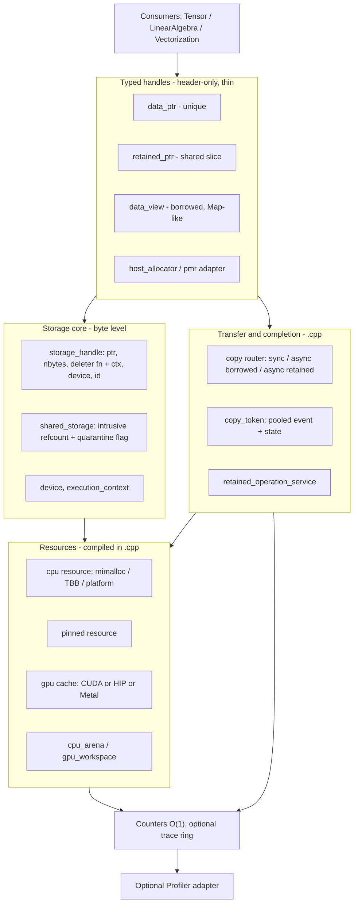
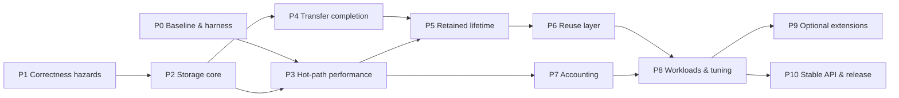

# Memory — design and implementation plan

Updated: 2026-10-04. Source baseline: `5eb1e25` (`main`) plus the uncommitted Phase 3 and Phase 4 working tree (§7). §3 inventory and
problem evidence were taken at `becf3f2`; the status column in §3.3 and §6.1 and
the review findings R1–R7 (§3.5) are at `27e5f38`; R1, R4 and R7 were resolved
afterwards (§3.5, §9.2).

This is the only design document for Memory. It replaces the September plan, the
Phase 0–3 summary, the token/error, copy-completion and storage-identity
specifications, the validation-manifest template, the September design review, the
churn diagnosis report, and the CUDA benchmark analysis. Their substance is merged
here; the evidence they recorded is condensed in the appendices. Earlier text
remains in Git history.

`README.md` is the usage guide and `CLAUDE.md` is repository engineering guidance.
Neither keeps a roadmap or status table. Update this file when design or status
changes.

**Goal.** Fast, predictable CPU/GPU allocation behind a small set of abstractions
that a numerical library (Tensor, LinearAlgebra, Vectorization) can build on
without knowing which backend is compiled in.

Contents: [1 Goals](#1-goals-non-goals-and-design-rules) ·
[2 Reference designs](#2-reference-designs-pytorch-and-eigen) ·
[3 Current design review](#3-review-of-the-current-design) ·
[4 Target architecture](#4-target-architecture) ·
[5 Contracts](#5-contracts) ·
[6 Performance design](#6-performance-design) ·
[7 Phases](#7-implementation-phases) ·
[8 Validation](#8-validation) ·
[9 Status](#9-status-and-evidence) ·
[Appendices](#appendix-a--historical-findings-september-review)

---

## 1. Goals, non-goals and design rules

### 1.1 Goals

1. **Speed on the paths that run millions of times.** The warm GPU allocation
   path does no driver call, no heap allocation and takes one lock. Freeing does
   not search a registry. The CPU path costs one backend call over raw mimalloc/TBB.
2. **A small, layered abstraction.** One byte-level owning handle, typed handles on
   top of it, and a borrowed view. Backend details (CUDA/HIP/Metal headers, stream
   types, driver error codes) stay out of the public headers.
3. **Truthful lifetime and completion.** An API that says "synchronous" returns
   after completion; a retained async copy keeps its endpoints alive even if every
   user handle and token is dropped; unsafe storage is never recycled.
4. **Bounded, cheap observability.** Basic counters cost an atomic increment;
   detailed traces are opt-in and preallocated.

### 1.2 Non-goals (core release)

Tensor shape/strides/expressions, kernels, BLAS dispatch and autograd belong to
consumers. Driver pools (`cudaMallocAsync`), graph-capture pools, growing
virtual-address segments, managed memory, Metal private storage, automatic backend
selection and general C++ object containers are optional extensions (Phase 9),
each with its own capability check and measured justification. Do not reintroduce
the deleted BFC/pool/retry/tracking backends, `process_state`, the virtual
`Allocator` interface, `gpu_memory_*` helpers or `visualization/` without a
measured need.

### 1.3 Design rules

- **Static dispatch on the CPU path.** No virtual call and no Memory-owned lock
  between the caller and mimalloc/TBB/platform malloc.
- **Compile-time GPU backend exclusivity.** CUDA, HIP or Metal is chosen at build
  time (`MEMORY_GPU_BACKEND`). Guard GPU code with `MEMORY_HAS_CUDA`,
  `MEMORY_HAS_HIP`, `MEMORY_HAS_METAL` only.
- **The handle remembers how to free itself.** An owning handle stores a deleter
  function pointer plus context, so free never looks up a registry or switches on
  a device enum (PyTorch `DataPtr` pattern, §2).
- **Bytes inside, elements outside.** Resources and handles work in bytes;
  public typed APIs take element counts and convert with checked multiplication.
- **Reclamation is not ordering.** `record_stream` delays reuse; it never makes a
  consumer wait for a producer. Ordering is an explicit dependency.
- **Destructors never throw.** Failures during free are counted and reported
  through a non-allocating diagnostic channel; unsafe storage is quarantined.
- **Measure before tuning.** Every optimization cites a Phase 0/8 measurement and
  keeps the hot-path invariant tests (§6.1) green.

---

## 2. Reference designs: PyTorch and Eigen

Memory uses PyTorch (c10) and Eigen as design reference points only. No code is
copied. `cuda_caching_allocator` already *behaviorally* ports PyTorch's
`CUDACachingAllocator`; Phase 10 includes a licence/attribution check for that
lineage (PyTorch is BSD-3, Eigen is MPL-2).

| Concern | PyTorch (c10) | Eigen | Memory decision |
|---|---|---|---|
| Owning byte handle | `c10::DataPtr`: pointer + `void*` context + function-pointer deleter + `Device` | Plain object owns its buffer through `aligned_malloc` | **Adopt** the `DataPtr` shape as `storage_handle` (§4.2). Removes registry lookup and device switch on free; makes adopted foreign memory the same type as native memory. |
| Allocator interface | Virtual `c10::Allocator::allocate(n) -> DataPtr`, per device type | `aligned_allocator<T>` (STL), `handmade_aligned_malloc` | **Deviate:** no virtual allocator on the hot path. Backends are free functions or per-device singletons chosen at compile time. The deleter pointer is the only indirect call, as in c10. |
| Shared storage | `StorageImpl`: intrusive refcount around one `DataPtr` + `nbytes` | None (value semantics) | **Adopt** an intrusive `shared_storage` around one `storage_handle`; `retained_ptr<T>` is a typed slice of it. A unique owner can be promoted to shared without reallocation. |
| Borrowed memory | `at::from_blob` (tensor with no-op deleter) | `Eigen::Map<>` — typed view over foreign memory, alignment as a template parameter | **Adopt Map semantics** for `data_view<T>`: span + optional provenance (base, id, device); never extends lifetime. |
| Device + stream identity | `c10::Device {type, index}`, `c10::Stream {device, id}` | n/a | One `device` value type and `execution_context {device, stream}`; drop the duplicate `device_option`. |
| GPU caching | Size-class segment cache, per-stream free pools, `recordStream`, event-deferred reuse, OOM flush + retry, `empty_cache`, memory fraction, snapshots | n/a | **Keep** (already implemented). Close metadata and event-allocation costs (§6.3). |
| Event reuse | Per-device CUDA event pool for `recordStream` and stream sync | n/a | Use the per-device event pool for copy tokens as well (today each async copy creates and destroys an event). |
| Allocator lookup | Per-device allocator array created once and never destroyed (intentional leak avoids exit-order bugs) | n/a | **Adopt:** fixed per-device array with `call_once`, process lifetime, plus an explicit `shutdown()` for orderly teardown. |
| Temporaries | Caching allocator reuse; workspace arguments in kernels | Small temporaries on the stack (`alloca` under a threshold), `EIGEN_MAX_ALIGN_BYTES` | `cpu_arena` for scoped temporaries; `gpu_workspace` for operator scratch; `MEMORY_ALIGNMENT` plays the role of `EIGEN_MAX_ALIGN_BYTES`. |
| Host containers | `c10::Allocator` behind `CPUAllocator` | `aligned_allocator<T>` for `std::vector` | Provide `host_allocator<T>` (STL) and a `std::pmr::memory_resource` adapter; host-only — device memory never enters host-dereferencing containers. |
| Observability | `memory_stats`, `_record_memory_history`, `_snapshot` | n/a | Keep the torch-named API. Basic counters must be O(1) and lock-free (today they lock and scan, §3.3). |

---

## 3. Review of the current design

### 3.1 Component inventory (at `becf3f2`)

| Layer | Component | Files | Assessment |
|---|---|---|---|
| CPU backend | `cpu::memory_allocator` (mimalloc → TBB → platform aligned malloc) | `helper/memory_allocator.{h,cpp}` | Good: free functions, static dispatch, profiler hook is one relaxed load. Problems in §3.3. |
| Pinned host | `cpu::pinned_memory_allocator`, `pinned_buffer<T>` | `helper/pinned_memory_allocator.*`, `common/pinned_buffer.h` | Size-class pool with deferred reuse, quarantine and backing budget. Not integrated with retained copies. |
| GPU backend | `cuda_caching_allocator` (CUDA/HIP), `metal_caching_allocator` | `gpu/*`, `src/gpu/*` | PyTorch-equivalent segment cache; fault shims exist. Hot-path costs in §3.3. |
| Facade | `allocator<T, alignment>` (static members) | `allocator.h` (718 lines) | Too many jobs: allocation, stats, copy routing, retained adoption, retained copy, SIMD alignment helpers. All inline, so every consumer includes CUDA runtime headers. |
| Owners | `data_ptr<T>` (unique), `retained_ptr<T>` (shared), `data_view<T>` (borrowed) | `common/*.h` | Right three roles, but no shared core: each stores device info differently and frees differently. |
| Context | `device_enum`, `device_option`, `execution_context`, `(type, index, stream)` triples | `common/device.h`, `execution_context.h` | Three overlapping identities; `data_view` stores a raw triple. |
| Identity | `allocation_id`, `storage_identity` | `common/storage_identity.h` | Two types for one concept; test-only `reset()` on the production generator. |
| Transfer | `copy_token`, `retained_operation_service` | `common/copy_token.h`, `src/retained_operation_service.cpp` | Per-operation events and token-discard retention exist. Per-copy allocation costs and open contracts in §3.3 and §5. |
| Reuse | `cpu_arena`, `gpu_workspace` | `common/cpu_arena.h`, `gpu/gpu_workspace.h` | Useful; preconditions checked in Debug only. |
| Telemetry | `unified_cache_stats`, `bounded_trace_ring`, snapshots, profiler reporter | `profiler/*` | Preallocated ring is good; basic queries are not O(1). |
| Experimental | `device_handle_cache`, `cuda_malloc_async_allocator`, `gpu_graph_pool`, `cuda_caching_allocator_template`, `memory_containers.h` flat-hash switch | `gpu/*`, `common/memory_containers.h` | Not used by the facade, and the enabling build options (`MEMORY_USE_CUDA_MALLOC_ASYNC`, `MEMORY_USE_FLAT_HASH`) are not wired in CMake. |

### 3.2 What is right and stays

- Three ownership roles (unique / shared / borrowed) with move-only unique owners
  and explicit `clone()`.
- Static CPU dispatch over mimalloc/TBB/platform malloc.
- The PyTorch-style GPU segment cache: size classes (512 B rounding; 2 MiB small
  segments; 20 MiB for 1–10 MiB; 2 MiB-rounded large), per-stream pools, block
  split/coalesce, event-deferred cross-stream reuse, OOM flush-and-retry, memory
  fraction, quarantine on partial event failure, lock dropped around driver malloc.
- `execution_context` as the single argument for where work runs.
- Per-operation completion events on async copies, and a service that owns
  retained operations after the user drops the token.
- Runtime shims (`Testing/CopyRuntime`, `Testing/CudaCachingAllocator`,
  `Testing/PinnedRuntime`) that exercise GPU code paths without hardware.

### 3.3 Problems found

**Abstraction**

| # | Problem | Evidence | Fix (phase) |
|---|---|---|---|
| A1 | No byte-level owning handle; `data_ptr` and `retained_ptr` free through unrelated mechanisms (device switch + registry vs `std::function`). | `data_ptr.h` `release_owned()`; `retained_ptr.h` `control_block::deleter` | `storage_handle` + `shared_storage` (P2) |
| A2 | No way to promote a unique owner to shared storage; no allocator-backed retained factory. README shows `retained_ptr = allocator<float>::allocate(...)`, which does not compile (it returns a raw pointer). | `allocator.h:159`, README "retained_ptr" example | `retained_ptr(data_ptr&&)`, `make_retained<T>` (P2) |
| A3 | `allocator<T>` mixes allocation, stats, copy routing, adoption, retained copy and SIMD helpers (`first_aligned`/`last_aligned`); it is templated on `T`, though the logic is byte-level. | `allocator.h` | Byte-level `src/transfer.cpp`; thin typed wrappers; SIMD helpers move to Vectorization (P2) |
| A4 | Vendor headers leak into every consumer: `allocator.h` includes `gpu_runtime.h`/`device_guard.h`; `stream_t` is `cudaStream_t` or `void*` depending on build. | `allocator.h:50-53, 146-150` | Opaque `stream_handle_t` in public headers; vendor calls in `.cpp` (P2) |
| A5 | Device identity is duplicated (`device_enum` + `device_option` + `execution_context` + triples). | `common/device.h`, `data_view.h` fields | One `device` value type (P2) |
| A6 | Two identity types; moved-from `data_ptr` keeps its ID; production generator has `reset()`. | `storage_identity.h`; `data_ptr::clear_handle()` | Single `allocation_id`, invalidated on move (P1/P2) |
| A7 | `cuda_caching_allocator_template` builds a *private* cache instance — a second pool for the same device. | `cuda_caching_allocator.h:279` | Delete (P2) |
| A8 | `execution_context` says `nullptr` is the *per-thread* default stream; `allocator.h` and the cache treat it as the *legacy* default stream. | `execution_context.h:20,34` vs `allocator.h:341` | Document now; enforce in P4 |

**Performance (hot path)**

| # | Problem | Evidence | Fix (phase) | Status at `27e5f38` |
|---|---|---|---|---|
| H1 | Every GPU allocate, free and `record_stream` takes a global registry mutex and does an `unordered_map` lookup. `device_handle_cache` was written to avoid this but is never called. README claims the opposite. | `cuda_caching_allocator.cpp:1530`; `allocator.h:210,253,362` | Lock-free per-device array; free via handle deleter (P2, P3) | Implemented (3.1): `atomic<cache*>[16]` + `call_once`. `allocator<T>` still calls `caching_allocator_for_device` per op (now lock-free). No lock-count probe (R5) |
| H2 | `record_stream` heap-allocates (`std::set<cudaStream_t>` node per stream use). | `cache_block::stream_uses` | Inline small set (P3) | Implemented (3.2): `inline_stream_set`, 4 inline slots. Not probe-tested (R5) |
| H3 | Block split/merge calls `new`/`delete cache_block`. | `cuda_caching_allocator.cpp:898,1013` | Metadata freelist (P3) | Implemented (3.2): `block_freelist`. Not probe-tested (R5); churn interaction (R6) |
| H4 | Each async copy does `make_shared` (token state) + `cudaEventCreateWithFlags`, and token destruction calls `cudaEventDestroy`; retained copies add another `make_shared` and a global service mutex. | `copy_token.h:57,178,233`; `allocator.h:684` | Pooled events and token state (P3); per-device service shards if measured (P5) | Open (3.4) |
| H5 | `memory_allocated()` etc. call `stats()`, which takes the device lock and scans both pools. | `cuda_caching_allocator.cpp:737` | O(1) lock-free counters (P3) | Implemented (3.5): relaxed atomic loads for allocated/reserved and peaks. Metal parity not verified |
| H6 | With NUMA enabled, every CPU allocation calls `NUMAMove` (an `mbind` syscall that can move pages shared with unrelated allocations). | `memory_allocator.cpp:151` | Explicit NUMA placement resource only (P3) | Open (3.6) |
| H7 | Free is unsized; backends that support sized free cannot use it. | `allocator<T>::free` ignores `count`; `data_ptr` passes 0 | Handle stores `nbytes` (P2/P3) | Partial: `storage_handle` stores and passes `nbytes`; `allocator<T>::free` still passes 0; backend sized free not used (3.6) |
| H8 | Metal free/bind resolves interior pointers by scanning all live blocks. | `metal_caching_allocator.mm:558-560` | Handle carries `(buffer, offset)` (P3) | Open (3.7) |

**Correctness hazards in existing code**

| # | Problem | Evidence | Fix (phase) |
|---|---|---|---|
| C1 | ~~In Release, `deallocate`/`record_stream` on a pointer the cache does not own dereferences `end()`.~~ **Corrected 2026-10-02:** the CUDA/HIP (`cuda_caching_allocator.cpp:552,618`) and Metal (`metal_caching_allocator.mm:240`) ownership checks are `LOGGING_CHECK`, which throws in every build type (present since `807f82c`). **Resolved 2026-10-02:** `logging::exception` is the documented type (R7); Release shim tests added (CUDA/HIP; Metal not run). | `ThirdParty/Logging/include/util/exception.h:323` | Done for CUDA/HIP (1.1); Metal test open |
| C2 | ~~CPU alignment validation is Debug-only.~~ **Corrected 2026-10-02:** `memory_allocator.cpp:134` is a Release `LOGGING_CHECK`. **Resolved 2026-10-02:** documented type decided (R7); Release test `InvalidAlignmentThrowsInRelease`. | `memory_allocator.cpp:129-138` | Done (1.2) |
| C3 | ~~`gpu_workspace::rebind()` precondition is Debug-only; `acquire<T>` multiplies unchecked.~~ **Corrected 2026-10-02:** `rebind()` uses `LOGGING_CHECK`; `acquire<T>` checked overflow but threw `bad_alloc`. **Resolved 2026-10-02:** throws `overflow_error`; Release tests added. | `gpu_workspace.h:117-123,145` | Done (1.2) |
| C4 | `data_ptr` destructor swallows free failures silently, which leaks the buffer with no signal. | `data_ptr.h:124-133` | Done (1.3): counted per source, handler hook |
| C5 | `allocate_adopted` defaults to `delete[]` for any foreign pointer. | `allocator.h:651-654` | Done (1.8) |
| C6 | `clone()` and copying constructors return after *submission*, not completion. | `data_ptr.h:145-148` | Complete-before-return (P4) |
| C7 | Retained-operation service: admission is unlimited by default; `clear_failed()` releases quarantined owners unconditionally; payload release and deleters may run under the service mutex. *(Resolved 2026-10-04 by 5.1–5.4.)* | `retained_operation_service.cpp` | P5 |
| C8 | Churn-crash patch (`33568cf5`) lacks root-cause evidence (Appendix B). | — | Held (1.10): crash still reproduces, cause unknown (Appendix B) |

### 3.4 Stale or wrong claims removed from documentation

- README "thread-local device cache avoids mutex on 90%+ allocations" — the cache
  is unused (H1).
- README `retained_ptr` from `allocator::allocate` and `copy_async(retained, retained)`
  — neither exists; the retained copy is `copy_async_retained()` (A2).
- README FAQ "copying `data_ptr` deep-clones" — copying is deleted; use `clone()`.
- README project layout `include/memory/...` — headers live under `include/`.
- An earlier draft of this plan said CPU alignment and workspace `rebind()` checks
  were still Debug-only (C2, C3). They are Release checks; what is missing is the
  documented exception type and a Release-build test.
- Benchmark analysis "production-ready", "Release 20–30% faster", "robust
  fragmentation handling" — not measured (Appendix C).
- Churn report "closed" — patched, not root-caused (Appendix B).

### 3.5 Review of P2 / P3.1 / P3.2 / P3.5 (at `27e5f38`, 2026-10-02)

The storage core and the first hot-path changes landed before Phase 0 and Phase 1,
against the order in §7. The work is sound in direction; these gaps keep it at
**implemented**, not **tested** or **accepted**.

| # | Finding | Evidence | Fix (task) |
|---|---|---|---|
| R1 | GPU `storage_handle` does not free itself: `deleter_` is null and only `data_ptr`/`retained_ptr` know to call `free_gpu_with_stream`. A GPU handle from the public `allocate_bytes` that is dropped directly leaks its block silently. Contradicts §1.3 "the handle remembers how to free itself". **Resolved 2026-10-02 (`e7a14b1`, `bea5e2c`):** `gpu_free_fn` deleter, shim gate tests pass. | `src/storage.cpp:86-91`; `storage_handle.h` comment | 2.10 |
| R2 | No single storage core for shared ownership: `retained_ptr::release()` chooses among GPU-promotion, CPU raw deleter and the legacy `std::function` adoption deleter; `control_block` is not `shared_storage` around one `storage_handle`. Phase 2 gate "owners share one storage core" not met. | `retained_ptr.h:60-77, 231-262` | 2.4 (remaining) |
| R3 | Zero-size `allocate_bytes` returns an empty handle with a fresh `allocation_id`; §5.1 says empty handles have an invalid id. A test (`TestPhase3Identity`) depends on the current behavior. | `src/storage.cpp:52-57` | 1.9 |
| R4 | `data_ptr<T>` is 56 B (48 B handle + 8 B stream), not 48 B as §4.2 promised. Accepted if R1 moves the stream into the cache (then `data_ptr` returns to 48 B) or recorded as a deliberate size change. **Resolved 2026-10-02:** deliberate 56 B; the stream stays for `stream()`, `record_stream()`, `clone()`, and the free path no longer needs it. | `data_ptr.h:34` | 2.10 |
| R5 | Gate tests check API behavior, not the §6.1 invariants: registry tests check same address / index bounds, not lock counts; no counting `operator new` exists, so "0 heap allocations" (3.2) is asserted, not measured; freelist and stats tests `GTEST_SKIP` without a GPU. No Phase 0 before/after numbers exist for 3.1/3.2/3.5 (§1.3 "measure before tuning"). | `TestPhase3Registry.cpp`; absence of 0.2/0.3 | 0.2, 0.3, then re-close 3.1/3.2/3.5 |
| R6 | `block_freelist` recycles `cache_block` storage — the mechanism of churn hypothesis (B) in Appendix B — while the churn root cause (1.10) is open. The patch path changed without the predeclared stress rerun. | `cuda_caching_allocator.cpp:407-440, 1000, 1116` | 1.10 (now also depends on 3.2). **2026-10-03:** the crash reproduces on the freelist build and on a freelist-free hardware build; a no-Memory control also crashes on this machine, so the freelist is neither shown to be the cause nor cleared (Appendix B, 1.10 findings) |
| R7 | Error types: Release checks throw `logging::Error`; `gpu_workspace::acquire<T>` throws `bad_alloc` on overflow. §5.2 and CLAUDE.md document `invalid_argument` / `logic_error` / `overflow_error`. **Decided 2026-10-02:** `logging::exception` is the documented type for precondition/lifecycle violations (§5.2); no source change. | C1–C3 | 1.1, 1.2 |
| R8 | CPU facade does not scale with threads: for 16 B–4 KiB alloc/free pairs `cpu::memory_allocator::allocate/free` has p50 about 36 ns at 1 thread, 590–790 ns at 8 and 9–11 µs at 32, while raw mimalloc stays at 10–25 ns. **Resolved 2026-10-04 (3.6).** Decomposed by elimination: the raw `mi_aligned_alloc` row (the exact backend call) stays at 4–25 ns, so the cost was in the facade; removing both profiler hooks brought the facade to 19.5 ns at 32 threads; keeping only `profiler::memory_profiling_active()` kept 9.4 µs. Cause: the call goes through `ProfilerStateBase::get()`, which asks the global state manager first, and `GlobalStateManager::get()` takes a **process-wide mutex on every call**. The Profiler is a separate repository (submodule), so the mitigation is on this side (`detail::profiling_gate`); the proper fix, a lock-free `GlobalStateManager::get()`, belongs upstream. A second, smaller serialisation was the shared `allocation_id` counter (`data_ptr` at 32 threads: 366 ns after the first fix), now per-thread blocks. | `Docs/baselines/cpu_baseline.json` (before), `cpu_baseline_p3.json` (after) | 3.6 |

---

## 4. Target architecture

### 4.1 Layers



Public headers in L2/L3 include no vendor GPU headers. Backend code (CUDA/HIP
runtime calls, Objective-C++) lives in `src/`.

### 4.2 Storage core (L2)

```cpp
namespace memory {

struct device {                       // c10::Device analogue; replaces device_option
    device_enum type{device_enum::CPU};
    std::int16_t index{0};
};

struct execution_context {            // where work runs
    device          dev{};
    stream_handle_t stream{};         // opaque in public headers
};

// Free callback: never throws; failures go to the cleanup diagnostic channel.
using deleter_fn = void (*)(void* ctx, void* ptr, std::size_t nbytes) noexcept;

class storage_handle {                // c10::DataPtr analogue; move-only, 48 bytes
public:
    void*         get() const noexcept;
    std::size_t   nbytes() const noexcept;
    device        dev() const noexcept;
    allocation_id id() const noexcept;     // invalid when empty / moved-from
    void*         release() noexcept;      // hand ownership to a raw-pointer API
    ~storage_handle();                     // calls deleter_(ctx_, ptr_, nbytes_)
private:
    void* ptr_; std::size_t nbytes_; deleter_fn deleter_; void* ctx_;
    device dev_; allocation_id id_;
};

class shared_storage;                 // StorageImpl analogue: atomic refcount,
                                      // one storage_handle, quarantine flag

// Resource entry points (L1), byte level:
storage_handle allocate_bytes(std::size_t nbytes, std::size_t alignment,
                              execution_context ctx);
storage_handle adopt_bytes(void* ptr, std::size_t nbytes, device dev,
                           deleter_fn del, void* del_ctx);  // explicit deleter only
}
```

- **CPU**: `deleter_ = cpu_free`, `ctx_ = nullptr`. Sized free when the backend
  supports it.
- **GPU**: `ctx_` = the per-device cache (process lifetime), so free goes straight
  to `cache->deallocate` with no registry lookup. The deleter must be non-null:
  the cache frees on the block's recorded allocation stream (PyTorch frees on
  `block->stream`), so the handle needs no stream argument. Today (`27e5f38`) the
  GPU deleter is null and the owner passes the stream (R1, task 2.10).
- **Metal**: `ctx_` = cache; buffer and offset are recoverable without a scan.
- **Adopted foreign memory**: caller's deleter and context; no `std::function`, no
  inferred `delete[]`. Callers needing captured state allocate their own context.

`sizeof(storage_handle)` is 48 bytes (enforced by `static_assert`). `data_ptr<T>`
was 48 bytes before P2; at `27e5f38` it is 56 bytes because it stores the stream
beside the handle (R4). Task 2.10 restores 48 bytes or records the change.

### 4.3 Typed handles (L3)

| Type | Holds | Semantics |
|---|---|---|
| `data_ptr<T>` | `storage_handle` (count = `nbytes / sizeof(T)`) + allocation stream | Unique, move-only; `clone()` returns a completed copy; `view()` → `data_view` |
| `retained_ptr<T>` | intrusive pointer to `shared_storage` + element offset + count | Shared; copy = refcount increment; `slice()` keeps the whole allocation alive; constructible from `data_ptr<T>&&` without reallocation; `make_retained<T>(n, ctx)` |
| `data_view<T>` | `T*`, count, `storage_ref {base, id, device}`, stream | Borrowed; never extends lifetime; `borrow()` creates a view with invalid id (foreign provenance) |
| `host_allocator<T>`, `memory_resource` adapters | stateless / arena pointer | STL and `std::pmr` integration for host containers only |

Element types: initially uninitialized storage for trivially copyable,
trivially destructible types (as `pinned_buffer` already enforces), with
`alignof(T)` checked against the requested alignment. General object
construction/destruction is out of scope.

`memory::allocate<T>(n, ctx)` (`memory.h`) is the public allocation entry point.
`allocator<T>` remains as a compatibility wrapper over the byte API during
migration; its stats functions forward to `gpu::memory_*`.

### 4.4 Transfer and completion layer

- One non-template byte router in `src/transfer.cpp`:
  `copy_bytes(src, dst, nbytes, src_dev, dst_dev, stream)` with all validation
  done before submission. Typed overloads are inline wrappers.
- Three public forms: `copy_sync` (returns after completion),
  borrowed `copy_async` (caller keeps endpoints alive), retained
  `copy_async(retained_ptr, retained_ptr, ctx)` (endpoints held until completion
  even if all tokens are dropped).
- `copy_token`: small intrusive state from a freelist; event from the per-device
  event pool; terminal result cached once observed.
- `retained_operation_service`: owns retained operations until completion;
  bounded admission; quarantine on uncertain failure; explicit poll/drain/shutdown.

### 4.5 Reuse and placement

`cpu_arena` (scoped bump allocation for temporaries, Eigen-temporary analogue),
`gpu_workspace` (operator scratch slab), pinned staging ring (bounded slots for
pageable↔device transfers), explicit NUMA placement resource (page-owned regions
only). Each exposes the same `storage_handle`/view types.

### 4.6 What moves or goes

| Item | Action |
|---|---|
| `allocator<T>::first_aligned/last_aligned` | Move to Vectorization (SIMD loop peeling is not a memory concern); keep a deprecated forwarder for one release |
| `cuda_caching_allocator_template` | Delete (creates duplicate per-device pools) |
| `device_handle_cache` | Delete (superseded by the lock-free registry; its per-thread invalidation could not cover a destroyed shared allocator) |
| `cuda_malloc_async_allocator.h`, `gpu_graph_pool.h` | Move to `include/experimental/`, not installed, until Phase 9 |
| `device_option`, `storage_identity` | Replace with `device`, `allocation_id` |
| `memory_containers.h` flat-hash switch | Either wire `MEMORY_USE_FLAT_HASH` or delete; P3 decides by measurement |

---

## 5. Contracts

These are target contracts. §9 records what is implemented and accepted. Do not
advertise a contract as supported until its phase gate passes.

### 5.1 Allocation, ownership and adoption

- Zero-size allocation returns empty storage. A zero-count copy is a no-op. For
  positive counts, null endpoints, byte overflow and non-power-of-two alignment
  are rejected before any work starts (`invalid_argument`, `overflow_error`).
- GPU caches guarantee 512-byte block alignment (256-byte driver segment base);
  requests for more are rejected, not silently under-aligned.
- Freeing or recording a pointer the cache does not own is an error in every build
  type, never undefined behavior.
- Adoption takes a base pointer, an asserted byte capacity and an explicit
  deleter. Ownership transfers only when the handle is successfully created;
  on failure the caller still owns the pointer. Non-null zero-capacity adoption and
  empty deleters are rejected. Asserted foreign capacity is not verified capacity.
- One allocation lifetime has one `allocation_id`. Views, slices, operations and
  trace records carry it; address reuse gets a new ID; empty and moved-from
  handles have an invalid ID. One generator per process across shared libraries.
- Handle constness does not make elements immutable or synchronize data access.

### 5.2 Transfer, completion and errors

| Operation | Contract |
|---|---|
| `copy_sync()` | Returns only after this transfer completes; errors propagate. The caller orders the producer. |
| Borrowed `copy_async()` | Returns an operation token. Caller keeps endpoints alive and avoids conflicting access until completion. Cache stream registration protects managed GPU reuse only. |
| Retained `copy_async()` | Acquires both owners and service admission before submission; endpoints live until completion or proven-safe recovery, independent of user tokens. |
| `clone()`, copying constructors | Return a fully copied owner. |
| `clone_async()` (deferred) | Owned result + token; only after the transfer lifecycle is accepted. |

Token rules: copies share one operation state; a moved-from or default token is
complete. `state()`/`ready()` never block or throw; `ready()` is true only for
complete. `wait()` returns on complete, blocks on pending, throws on failed.
Terminal results are stable and visible to all observers; pending is re-queried.
The operation's device is activated and restored around backend calls; activation
failure is a failure, never a successful query on the wrong device.

| Failure point | Required outcome |
|---|---|
| Validation or setup before submission | Throw; nothing submitted; destination untouched; admission and metadata rolled back exactly once. |
| Submission or event record after work may have started | Prove completion on the submitting stream or quarantine; never infer safety from an error code. Destination may be partially written. |
| Event query/wait or device activation | Persist failed state with diagnostic context; keep potentially unsafe owners. |
| Destructor / cleanup | No throw; quarantine unsafe state; increment the cleanup diagnostic. A swallowed exception is not a successful cleanup. |

Exception types (R7 decision, 2026-10-02): `logging::exception` (precondition and
lifecycle violations raised by `LOGGING_CHECK`: foreign pointer, double free, bad
alignment or device; thrown in every build type), `invalid_argument` (bad
caller input validated by the API), `overflow_error` (checked arithmetic),
`bad_alloc` (exhaustion, after flush-and-retry), `runtime_error` (backend
failure, shutdown, queue full). Destructor/deleter paths never throw: they
count in `cleanup_diagnostic`.

Streams: legacy and per-thread default streams have distinct cache identities, or
the unsupported mode is rejected before submission. A null stream is never
"no work". `record_stream` delays reuse only; producer→consumer, destination
reuse, cross-stream and peer copies need an explicit dependency
(`stream_wait(token, stream)`). Peer support is part of the transfer gate.

### 5.3 Retained-operation lifecycle

1. Validate extents, arithmetic and endpoint capabilities.
2. Acquire owners, token state, pooled event and bounded admission before any
   copy can start.
3. Submit and record the completion event; publish state to pollers.
4. Setup failure: cancel the reservation without waiting on unrelated work. After
   possible submission: prove completion or quarantine.
5. Success: release the payload outside the service mutex; tokens stay as
   lightweight observers.
6. Uncertain failure: keep owners and error metadata until an explicit, checked
   recovery proves release safe. Content validity and lifetime safety are separate.

The service is part of the retained-copy guarantee, not an opt-in. Progress comes
from `poll()`, `drain()` and capacity-driven polling; a background worker is
optional and correctness cannot depend on it. Admission limits cover operations
and retained bytes, with try/fail or wait policy. Limits never drop in-flight
storage. Quarantine has its own budget; when exhausted, new admission stops.
`poll()` reports completed and failed separately; drain/shutdown report pending
and quarantined counts separately (zero pending with quarantine is not success).
Shutdown stops admission, resolves admitted work, drains, and reports what remains
before streams and devices are destroyed. Test `reset()` is not a production
escape hatch.

### 5.4 Accounting

For each native segment pool:

`segment backing = live capacity + pending capacity + reusable capacity + quarantined capacity`

Admission counts committed backing plus in-flight driver reservations. Requested
bytes are tracked separately from block capacity. Metal unused heap capacity,
pinned alignment padding and virtual-versus-mapped reservations are separate
layers. Shared host/GPU backing is counted once. CPU RSS is process-wide and is not
allocator backing. Reserved minus allocated is not, by itself, fragmentation.

### 5.5 Threading

Allocation, free, `record_stream`, token queries and service calls are thread
safe. Handles are not internally synchronized (like `std::shared_ptr` instances):
concurrent mutation of one handle object needs external synchronization; distinct
copies of a `retained_ptr` may be used from different threads. Arena and workspace
instances are thread-confined.

---

## 6. Performance design

### 6.1 Hot-path invariants (enforced by tests)

These are the measurable design targets. Phase 0 records today's values; Phase 3
makes the target column true and adds a test per row using the fake runtimes'
driver-call counters and a counting `operator new` in the test binary.

| Operation | Target | Was (`becf3f2`) | Now (2026-10-04, uncommitted) — probe-tested where marked |
|---|---|---|---|
| CPU allocate/free | 1 backend call; 0 Memory locks; 0 syscalls; profiler off = 1 relaxed load | NUMA build adds an `mbind` syscall per allocation (H6) | **Probed: 0 heap allocations. Measured (3.6, 16 B pair, p50): facade 12 / 12 / 28 ns at 1 / 8 / 32 threads against 33 / 590 / 8,786 ns before; `data_ptr` 12 / 13 / 32 ns against 37 / 704 / 9,877 ns; raw mimalloc 14 / 9 / 10–18 ns.** Profiler off costs a thread-local decrement and a relaxed load (stride 256, see `profiling_gate`), not a mutex. NUMA binding is opt-in (`set_numa_placement`), so no syscall by default (not exercised: NUMA is not built here). Memory locks: none on this path (read from source, not probed) |
| GPU warm allocate | 1 per-device lock; 0 heap allocations; 0 driver calls; 0 registry locks | Global registry mutex (H1); `new cache_block` on split (H3) | Lock-free registry load; freelist on split; recycled container nodes (3.8). **Probed: 0 heap allocations per warm alloc/free pair and per steady-state split/merge, 0 driver calls (was 3 and 6–7). Shim p50 126–133 → 76–77 ns per pair (512 B / 4 KiB / 1 MiB), split+merge 268 → 155 ns.** Registry lock count not probed** |
| GPU free | 0 registry lookups; 1 per-device lock; 0 heap allocations; event record only for cross-stream uses | Registry mutex (H1) | `data_ptr`/`retained_ptr`: cache pointer from handle, 0 lookups; `allocator<T>::free`: lock-free lookup. **Probed (3.3): steady-state cross-stream free with up to 4 streams: 0 heap allocations, 0 `cudaGetDevice`, 0 event creates, one record per use (was about 9 / 24 / 44 heap allocations and 2 `cudaGetDevice` at 1 / 4 / 7 streams). Shim p50 per alloc + record_stream + free: 300 → 100 ns (1 stream), 744 → 160 ns (4), 1,340 → 339 ns (7). At 7 streams 5 heap allocations remain: the inline set holds 4 and spills to a `std::set` beyond that.** Registry lookups not probeable |
| `record_stream` (≤ 4 streams) | 0 heap allocations | `std::set` node per stream (H2) | `inline_stream_set` (4 inline); **probed: 0, met** |
| Async copy, steady state | 1 memcpy submission + 1 event record; 0 heap allocations; 0 event create/destroy | `make_shared` + `cudaEventCreate` + `cudaEventDestroy` per copy (H4) | **Probed (3.4, retained copy, shim): 0 heap allocations, 0 event creates, 0 destroys per copy (was 3, 1, 1).** Shim latency is unchanged (151 / 230 ns for 16 / 4,096 floats) because the fake driver's event create costs nothing; the real driver's create/destroy cost was not measured |
| `token.ready()` after terminal | 0 driver calls | Re-queries event every call | **Probed: 0 driver calls, 0 heap allocations — met.** The "re-queries every call" claim was wrong for a token that has reached a terminal state; 1.4 still covers `wait()`/`state()` agreement |
| Basic stats query | 0 locks; O(1) | Device lock + pool scan (H5) | Relaxed atomic loads (CUDA/HIP), now including cached bytes (`bytes_cached_now`, 3.5); Metal parity not done |

Probes exist (Phase 0.3) for the heap-allocation and driver-call parts of these rows, and since 3.2–3.4 they are assertions, not expected-fail records: warm alloc/free, steady-state split/merge, cross-stream free (4 streams), `record_stream` (4 streams), retained copy, `token.ready()` after terminal, and CPU heap all pass. Lock and registry-lookup parts have no probe yet (R5), and the probes run on the fake runtimes, not on a driver.

### 6.2 CPU path

- Keep mimalloc as the default; compare TBB and platform malloc with identical
  alignment and initialization (the 2026-09-29 benchmark fix that forwards
  alignment through the facade must be preserved).
- Small alignments (≤ 16 bytes) use the backend's unaligned fast path; larger use
  the aligned entry point.
- Sized free where the backend supports it (handle stores `nbytes`).
- NUMA placement is an explicit resource over page-owned regions, never an
  implicit per-allocation `mbind`.
- Temporaries with a shared lifetime go through `cpu_arena` (reset, no free).
- Do not build a custom small-object allocator; mimalloc already provides
  per-thread heaps. Revisit only with a trace showing a gap.

### 6.3 GPU cache path

- **Registry:** `std::array<std::atomic<cache*>, kMaxDevices>` with `call_once`
  per device; allocators live for the process; explicit `memory::shutdown()`
  releases cached segments in a defined order.
- **Metadata:** freelist for `cache_block`; inline small stream set (4 inline
  slots, spill beyond); `allocated_blocks_` in an open-addressing map if Phase 0
  shows hashing cost.
- **Events:** one per-device event pool serves both cross-stream reuse and copy
  tokens. Event polling is bounded per call and forced under budget pressure so
  pending frees do not starve.
- **Device guard:** skip `cudaGetDevice`/`cudaSetDevice` when nothing needs
  polling or the current device already matches.
- **Locking:** keep one lock per device and the dropped-lock driver malloc.
  Finer-grained locking only after a contention measurement names it.
- **Stats:** counters maintained at state transitions as atomics; snapshots and
  fragmentation detail stay explicitly expensive.
- Keep same-stream reuse; prefer a bounded set of persistent streams so caches are
  not stranded in many per-stream pools.

### 6.4 Transfers

- Pinned staging ring: a small, configurable number of slots (start with 2);
  busy slots try/fail or wait; an in-flight slot is never overwritten.
- Both endpoints of a pinned transfer are retained through the operation.
- Batch small copies; keep long-lived data resident; measure pageable vs pinned
  and copy/compute overlap separately from allocation throughput.

### 6.5 Metal

Carry `(MTLBuffer, offset)` in the handle to remove the interior-pointer scan.
Reclaim on command-buffer completion, including failed command buffers. Keep
shared-storage `memcpy` copies explicitly synchronous; evaluate private storage
with staging only for GPU-only data and only with measurements.

### 6.6 Observability cost

Telemetry modes: off, counters, sampled trace, diagnostic. Off and counters avoid
stack capture, formatting and pointer tables. The trace ring is preallocated, never
allocates on push, reports loss, and is exported outside allocator locks.
Telemetry failure can never fail a successful allocation or free. Provisional
overhead budgets — counters ≤ 5 %, sampled trace ≤ 10 % on a named workload — are
adopted only after a Phase 8 measurement.

### 6.7 Measurement rules

Separate cold and warm timings; same sizes, alignment and initialization across
backends; explicit warmup; seeds and raw samples recorded; p50/p95/p99 with the
sampling method stated (repeated means are not percentiles). Report driver calls,
lock wait, peak backing, requested-vs-capacity waste, pending/quarantine bytes and
synchronizations. Allocation-byte rate is not transfer bandwidth. Do not
extrapolate Debug to Release, or infer fragmentation resilience from latency.
Compare like with like: raw cache vs raw driver/pool, owning objects vs owning
tensor objects, and a version-pinned PyTorch CUDA allocator where practical.

---

## 7. Implementation phases

Each task is one reviewable change with one exit test. Status moves
**planned → implemented → tested → accepted**; a task needing absent hardware or
tooling is **held**, not failed. A phase is accepted when all its tasks are
accepted (held hardware tasks do not block software tasks that met their own exit).
The "Was" column maps to task IDs used in earlier drafts of this plan.



P0 and P1 can start immediately and in parallel. P2 lands before P4/P5 so that
transfer and retained-lifetime work is built once, on the final storage core.

### Phase 0 — Baseline and measurement harness (no behavior change)

**Why first:** every performance task in P3 and P8 must cite a before/after number,
and the invariants in §6.1 need a recorded starting point.

| ID | Task | Files | Depends | Exit | Was |
|---|---|---|---|---|---|
| 0.1 | CPU microbenchmarks: facade vs raw backend call for mimalloc, TBB, platform; sizes 16 B–64 MiB; 1/2/8/32 threads; cross-thread free | `Testing/Cxx/Phase0CpuBaseline.cpp` | — | JSON + manifest with p50/p95/p99. *Implemented `db730c9`; baseline `Docs/baselines/cpu_baseline.json`. TBB not built in this configuration (held); NUMA off. Rerun pending to add the raw `mi_aligned_alloc` row (R8)* | — |
| 0.2 | GPU host-overhead benchmarks under the fake runtimes: warm alloc/free, split/merge, `record_stream`, async copy + token, retained copy, `memory_allocated()` | `Testing/CudaCachingAllocator`, `Testing/CopyRuntime` | — | Runs on any machine; raw samples recorded. *Implemented `db730c9`: `Phase0GpuShimBench` (warm, split, record_stream, stats) and `Phase0CopyShimBench` (retained copy + token); baselines `shim_gpu_cache_hostoverhead.json`, `shim_copy_hostoverhead.json`. Plain GPU `copy_async` needs the real cache, so it is measured on hardware (0.4), not here* | — |
| 0.3 | Invariant probes: counting `operator new` + fake-runtime driver counters; record §6.1 "today" column as tests marked expected-fail | test support | — | Probe tests report current counts. *Implemented `144c172` for GPU cache heap/driver counts (2 expected-fail: warm alloc/free 3, split 7); copy-token, cross-stream-free and CPU heap probes added `db730c9`. Registry-lookup and lock counts, and CPU syscalls, are not observable without production counters or OS tracing: recorded as not probed, not as passing* | — |
| 0.4 | Audit existing CUDA benchmarks (timing boundary, thread vs stream, unsupported ratios); one cold/warm series writing a full manifest | `BenchmarkCudaCachingAllocator.cpp` | — | Debug-to-Release estimates labelled as unmeasured. *Done `db730c9`: audit in Appendix C; `Phase0CudaColdWarm` writes `cuda_cold_warm.json` (Release, RTX 4060 Ti)* | T50 |
| 0.5 | Churn reproduction protocol: historical and uncapped commands, sizes, repetitions, seeds, stop rule, dump collection | Appendix B, manifest | — | Another developer can run it from text alone. *Protocol in Appendix B, runner `Testing/tools/churn_protocol.py`; one invocation of each configuration was executed to check the text. Full 30-run results: see §9.2* | T31 |
| 0.6 | Support matrix generated from executed manifests only (compile / shim / hardware) | this file §9 | — | No cell without a manifest. *Generator `Testing/tools/support_matrix.py`; matrix in §9.3* | T61 |

**Gate:** baseline artifacts and invariant counts recorded. No conclusions drawn.

### Phase 1 — Close correctness hazards in existing paths

**Why now:** these are small, independent fixes to undefined behavior and silent
failure in code consumers already use.

| ID | Task | Files | Depends | Exit | Was |
|---|---|---|---|---|---|
| 1.1 | Release-mode ownership checks in GPU `deallocate`/`record_stream` (and Metal equivalents); throw the documented exception. *Implemented 2026-10-02: exception type decided (R7), CUDA/HIP shim Release tests pass; Metal equivalent not run (no Apple hardware)* | `src/gpu/*` | — | Shim: foreign pointer throws the documented type in a Release build | new (C1) |
| 1.2 | Release-mode CPU alignment check; `gpu_workspace::rebind` precondition in Release; checked multiply in `acquire<T>`. *Implemented 2026-10-02: `acquire<T>` throws `overflow_error`; Release tests for CPU alignment, `rebind` and overflow pass* | `memory_allocator.cpp`, `gpu_workspace.h` | — | Release tests for each | new (C2, C3) |
| 1.3 | Cleanup diagnostic: non-allocating counter/hook, no allocator lock, defined handler lifetime; wire `data_ptr`/`retained_ptr`/pinned destructor failures to it. *Implemented 2026-10-03 (uncommitted): per-source counters (`cleanup_source`) and an optional `noexcept` function-pointer handler, relaxed atomics only; the handler must stay valid for the process or be cleared (documented in `cleanup_diagnostic.h`); the cache reports after releasing its mutex (`deferred_failure_flush`); the `data_ptr` destructor is defaulted (a deleter is `noexcept` by type; the GPU deleter counts failures); `retained_ptr`, `pinned_buffer` and the Metal deleter count; `data_ptr` move-assign is `noexcept`. Metal code not compiled or run here* | `common/*`, pinned | — | Injected destructor failure increments counter, does not escape. *Tests: `CleanupHandlerSeesFailureOutsideCacheLock`, `BufferDestructorFailureIsCountedNotThrown`, foreign-pointer and double-free counting (CUDA/HIP shim)* | T30 (C4) |
| 1.4 | Token terminal state: cached complete/failed on shared state; `wait()` agrees with `state()`; no unsynchronized public mutation (`mark_complete`/`mark_failed` become internal). *Implemented 2026-10-03 (uncommitted): one atomic terminal word (state, failure kind, driver code), first writer wins; `mark_complete`, `mark_failed` and `set_retained` are private behind `detail::copy_token_access`; `same_operation()` added* | `copy_token.h` | — | Shim: forced failure, cancellation, two copies observe one result while later stream work is pending. *Nine `CopyTokenTest` cases pass on the CUDA and HIP shims* | T01 |
| 1.5 | Pre-submission validation (extents, overflow, null, backend combination) with exact rollback. *Implemented 2026-10-03 (uncommitted): `validate_copy` runs before any reservation; a zero count is a no-op; token-event and service-admission failures submit nothing and restore admission once via `retained_operation_service::cancel`* | `allocator.h` copy path | 1.4 | Injected event-creation failure submits nothing, admission restored once. *`CopyFailureTest` cases pass (shim)* | T03 |
| 1.6 | Post-submission failure: wait on the submitting stream or quarantine; never recycle. *Implemented 2026-10-03 (uncommitted): `copy_impl` reports whether the driver was asked to move data; if not, the reservation is cancelled without waiting; if so, the submitting stream is synchronized or the operation goes to `quarantine()` keeping its owners; safety is never inferred from the error code* | `allocator.h`, service | 1.5 | Injected event-record failure retains the allocation. *Idle-stream and unproven-stream cases pass (shim)* | T04 |
| 1.7 | Native-cache rollback exact across driver malloc, retry, metadata insert, device activation, event allocation; no stale map entries. *Implemented 2026-10-03 (uncommitted, CUDA/HIP): `alloc_found_block_locked` is transactional (map and pool inserts precede list and counter changes; each later failure undoes the earlier steps); a driver-segment registration failure frees the segment; `deallocate` records the cross-stream use before changing state, so a throw leaves the block live and the free retryable; telemetry, trim and event-pool failures are counted, not thrown; `insert_events_locked` activates the device inside its `try`. Metal: not changed* | `cuda_caching_allocator.cpp` | 1.3 | Each injected boundary restores budget once. *Tests: rollback at every allocation boundary of a segment alloc and of a split, OOM retry, non-OOM driver error, each device activation of a retrying alloc, free failing before commit, event-allocation failure on a cross-stream free (CUDA/HIP shim)* | T32 |
| 1.8 | Adoption requires an explicit deleter; failure leaves caller owning the pointer; reject empty deleter and non-null zero capacity. *Implemented 2026-10-03 (uncommitted): `retained_ptr::adopt` rejects an empty deleter, a null base with non-zero capacity, a non-null base with zero capacity (`invalid_argument`) and `capacity * sizeof(T)` overflow (`overflow_error`); a null base with zero capacity is the only empty adoption; `allocate_adopted` requires an explicit deleter* | `allocator.h`, `retained_ptr.h` | — | Adoption failure returns ownership once; deleter runs once. *`RetainedPtr` adoption tests and `AdoptionAllocationFailureLeavesTheCallerOwningThePointer` pass* | T20 (C5) |
| 1.9 | Single `allocation_id`; moved-from and empty (incl. zero-size) handles invalid; remove production `reset()`. *Implemented 2026-10-03 (uncommitted): one exported `next_allocation_id()` in `src/common/allocation_id.cpp` (it was a header-inline counter per binary); the generator class and its `reset()` are gone; zero-size `allocate_bytes` returns an invalid id; `data_ptr::is_aligned()` is true for empty handles* | `storage_identity.h`, `src/storage.cpp`, owners | — | Moved-from and zero-size ids invalid; nested-slice and reuse tests. *`TestPhase3Identity`: zero-size, default and moved-from ids invalid; nested slices keep the owner's id; address reuse gets a new id; one generator across the library boundary* | T22 part (A6, R3) |
| 1.10 | Churn root cause with sanitizer/debugger; regression aimed at that cause; predeclared stress rerun, including with the 3.2 `block_freelist` (R6) | cache, Appendix B | 0.5, 1.7, 3.2 | Manifest records cause and regression, or **held**. ***Held 2026-10-03, blocked on the test machine:** the crash reproduces here, but so does a crash in a control program that contains no Memory code, and the machine has processor machine-check events; the churn crash cannot be attributed to Memory until it is rerun on a healthy machine. See Appendix B, "1.10 findings"* | T33 (C8) |

**Gate:** no undefined behavior on documented error paths in Release; failures
during cleanup are observable; churn has a recorded disposition (accepted or held).

**Status 2026-10-03:** 1.1–1.9 are implemented and shim-tested (1.7 on CUDA/HIP only; Metal parts not run, no Apple hardware). 1.10 is **held**: the churn part of the gate is met only as a recorded *held* disposition, and the affected cache configuration stays held. The blocker is the reproduction environment (Appendix B), not a known defect in Memory.

### Phase 2 — Storage core and abstraction cleanup

**Why now:** it removes the registry lookup from free, unifies the three owners and
hides vendor headers. Doing it before P4/P5 avoids building transfer and retained
lifetime twice.

| ID | Task | Files | Depends | Exit | Was |
|---|---|---|---|---|---|
| 2.1 | `device` value type; `execution_context {device, stream}` with compatibility accessors; remove `device_option`; document legacy vs per-thread null stream (behavior in 4.3) *Implemented 2026-10-03 (uncommitted): `device` (4 B) is the identity; `execution_context {device dev, stream}` with `device_type()`/`device_index()` compatibility accessors and constructors from `device` or `(type, index, stream)`; `device_option` and its `.cpp` are gone (`operator<<` for `device` added); `stream_handle_t` is the opaque `void*` and a null stream is documented as the real default stream of the compile mode (behavior change stays in 4.3). Existing tests moved to the accessors; CPU and shim evidence only* | `common/device.h`, `execution_context.h` | — | Existing tests pass through accessors | new (A5, A8) |
| 2.2 | `storage_handle` + `deleter_fn`; `allocate_bytes`/`adopt_bytes`; CPU, CUDA/HIP and Metal resources return handles. *Implemented `27e5f38` (`common/storage_handle.h`, `src/storage.cpp`) ahead of 1.8/1.9; GPU deleter gap R1* | new `common/storage.h`, `src/*` | 1.8, 1.9 | `sizeof(storage_handle) == 48`; deleter runs exactly once | new (A1) |
| 2.3 | `data_ptr<T>` on `storage_handle`; free via deleter; sized free. *Implemented `27e5f38`; GPU free via `free_gpu_with_stream`, not the deleter (R1); lookup probe pending 0.3* | `data_ptr.h` | 2.2 | Free path: 0 registry lookups (fake-runtime probe) | new (H1, H7) |
| 2.4 | `shared_storage` + `retained_ptr<T>` on it; `retained_ptr(data_ptr&&)`; `make_retained<T>`; fn-pointer deleter replaces `std::function`. *Partial `27e5f38`: promotion ctor only; `shared_storage`, `make_retained`, removal of `std::function` path open (R2)* *Implemented 2026-10-03 (uncommitted), replacing the "Partial" note: `shared_storage` (`common/shared_storage.h`) is an intrusive atomic refcount over one `storage_handle`, so the last release has one free path (the handle deleter); `retained_ptr(data_ptr&&)` and `retained_ptr::from_storage` move the handle in without reallocating; `make_retained<T>(n, ctx)`; `adopt(T*, n, ctx, deleter_fn, void*)` is the function-pointer form; the callable overload remains as a convenience that keeps the `std::function` in a heap thunk owned by the handle (not in the shared state). The block is reserved before the handle is committed, so a `bad_alloc` leaves the caller owning the pointer. Not done: the quarantine flag on `shared_storage` (arrives with 5.x)* | `retained_ptr.h` | 2.2, 2.10 | Promotion keeps the pointer; adoption deleter runs once after last owner; `release()` has one free path | new (A2); resolves old 3.8 |
| 2.5 | `data_view<T>` stores `storage_ref {base, id, device}` + stream; `borrow()` has invalid id *Implemented 2026-10-03 (uncommitted): `storage_ref<T> {base, id, dev}` in `data_view`; slices keep all three, `borrow()` and default views have an invalid id; `base()` is unchanged* | `data_view.h` | 2.3 | Slice of slice keeps base and id | new |
| 2.6 | Byte copy router in `src/transfer.cpp`; public headers stop including vendor runtime headers; `stream_handle_t` opaque *Implemented 2026-10-03 (uncommitted), narrower than the Exit text: GPU byte routing (stream-use registration, peer/host-device copy kinds, driver calls), the token driver operations and the post-failure idle proof live in `src/transfer.cpp` behind `common/transfer.h`; GPU allocate/free/`record_stream_use` and the torch-style stats are out of line in `src/gpu/gpu_dispatch.cpp` behind `gpu/gpu_dispatch.h`; `stream_handle_t`, `allocator<T>::stream_t`, `cuda_caching_allocator::stream_type` and `pinned_memory_allocator::stream_type` are `void*`; `copy_token` holds an opaque event. The typed validation and the three-phase `copy_async_impl` stay inline in `allocator.h` (they are templates over `T`); the CPU memcpy stays inline. The exit is a compile-only target, `MemoryConsumerNoVendorHeaders`, that includes `memory.h` and every public owner/token/workspace/pinned header with `MEMORY_HAS_CUDA=1` or `MEMORY_HAS_HIP=1` and no CUDA/HIP include path. `gpu/cuda_caching_allocator.h` no longer includes the vendor runtime either. Still vendor-including by design: `gpu/gpu_runtime.h`, `gpu/device_guard.h` and `include/experimental/`. One shim test changed: `state()` no longer switches the device before an event is recorded (one fewer `cudaSetDevice`), so the injected-failure index in `SetupFailureAfterAdmissionCancelsReservationWithoutWaiting` moved from call 5 to 3. Metal not compiled here: the Metal path runs through the same dispatch file and was reviewed by hand only* | `allocator.h`, new `src/transfer.cpp` | 1.6 | A consumer TU compiles with no CUDA headers on the include path | new (A3, A4) |
| 2.7 | Remove/relocate per §4.6: SIMD helpers → Vectorization (deprecated forwarder), delete `cuda_caching_allocator_template` and `device_handle_cache`, move experimental headers *Implemented 2026-10-03 (uncommitted), partly: `cuda_caching_allocator_template`, its tests and `device_handle_cache` are deleted; `cuda_malloc_async_allocator.h` and `gpu_graph_pool.h` moved to `include/experimental/` (excluded from the CMake install and the Bazel header glob); `first_aligned`/`last_aligned` carry `[[deprecated]]` but stay in `allocator.h` because the Vectorization library is not in this repository, so nothing could be moved yet. `memory_containers.h` flat-hash switch is left for P3 to decide* | `allocator.h`, `gpu/*` | 2.3 | No production code references removed items | new (A7) |
| 2.8 | `host_allocator<T>` (STL, aligned) and `std::pmr::memory_resource` adapters for CPU and `cpu_arena` *Implemented 2026-10-03 (uncommitted): `host_allocator<T, Align>` (stateless, rebinds, `bad_array_new_length` on overflow, honors `alignof(T)`), `host_memory_resource` and `arena_memory_resource` (`std::pmr`); `TestHostAllocator.cpp` covers `std::vector`, `std::list` and `std::pmr::vector`* | new `common/host_allocator.h` | 2.2 | `std::vector<T, host_allocator<T>>` and `std::pmr::vector` tests | new |
| 2.9 | Typed storage constraint: trivially copyable/destructible element types, `alignof(T)` checked *Implemented 2026-10-03 (uncommitted): `is_storage_element_v<T, Align>` (`common/storage_element.h`) is `static_assert`ed by `data_ptr<T>` (against the allocator alignment) and `retained_ptr<T>` (against 64 B); rejects non-trivially copyable or destructible, cv-qualified and over-aligned types; compile-time checks in `TestStorageElement.cpp`* | owners | 2.3 | Unsupported type fails the documented constraint | T27 |
| 2.10 | GPU `storage_handle` frees itself: non-null GPU deleter with `ctx_` = cache; cache frees on the block's recorded allocation stream; owners stop passing the stream on free; `data_ptr` back to 48 B or size change recorded | `src/storage.cpp`, `cuda_caching_allocator.cpp`, Metal, owners | 2.3 | Dropping a bare GPU handle from `allocate_bytes` returns the block to the cache (shim); free path 0 registry lookups | new (R1, R4) |

**Gate:** all existing tests pass through compatibility wrappers; free never looks
up a registry; owners share one storage core; vendor headers absent from L2/L3.

**Status 2026-10-03:** 2.1–2.10 are implemented (uncommitted at the time of writing), with the limits noted per task: 2.4 lacks the quarantine flag (5.x), 2.6 keeps the typed validation inline, 2.7 keeps the deprecated SIMD forwarders. Evidence is CPU, the CUDA/HIP shims and the CUDA machine's main suite; Metal was not compiled. The registry-lookup-on-free probe (§6.1) and the hardware confirmation remain tied to 0.3/R5. Nothing here is hardware-accepted.

### Phase 3 — Hot-path performance

**Why now:** the storage core gives free a direct path; the remaining costs are
inside the cache and the token. Each task must improve a Phase 0 number beyond
noise and turn its §6.1 probe from expected-fail to pass.

| ID | Task | Files | Depends | Exit | Was |
|---|---|---|---|---|---|
| 3.1 | Lock-free per-device registry (`call_once`, process lifetime) + `memory::shutdown()`. *Implemented `27e5f38` (`memory::gpu::shutdown()`); the registry-lock count is still not probed (R5), so the exit "0 registry locks" is read from source, not measured* | `cuda_caching_allocator.cpp`, Metal | 2.3 | Warm allocate: 0 registry locks | new (H1) |
| 3.2 | `cache_block` freelist; inline small stream set. *Implemented `27e5f38` ahead of 1.7. 2026-10-04: exit probes now pass (warm alloc/free 0 heap allocations, steady-state split/merge 0, `record_stream` ≤ 4 streams 0, see 3.8 and §6.1); the churn rerun (R6) stays held with 1.10* | `cuda_caching_allocator.cpp` | 1.7 | Warm alloc/free and `record_stream` (≤4): 0 heap allocations | new (H2, H3) |
| 3.3 | Event poll fast path: skip device guard when idle/matching; bounded polling with forced progress under pressure | same | 3.2 | Probe: no `cudaGetDevice` on idle warm path; pressure test still reclaims | new. *Implemented 2026-10-04 (uncommitted, CUDA/HIP shim): pending cross-stream events live in one `std::vector` in submission order instead of a per-stream map of deques (no per-event node or chunk; capacity is kept); a poll makes at most 16 driver queries, skips a stream's later events after its first not-ready one, and a cache miss forces an unbounded poll before the driver is asked for memory; `cudaEventQuery` and `cudaEventRecord` of a pooled event take no device guard (an event stays bound to the device that created it), the guard is taken only to create an event; `inline_stream_set` is iterated in place (the temporary `std::set` is gone). Tests: `ProbeGpuCrossStreamFreeHeapAllocations` (0 heap, 0 `cudaGetDevice`, 0 event creates, 40 records per 10 four-stream pairs), `BoundedPollingStillReclaimsUnderPressure`, `NotReadyEventKeepsBlockWithheldUntilComplete`. Limit: device-binding of events is a CUDA/HIP documented property relied on here, not something the fake runtime models; hardware confirmation is 4.8/5.8* |
| 3.4 | Pooled token state + per-device event pool for copy tokens; cache terminal results | `copy_token.h`, `src/transfer.cpp` | 1.4, 2.6 | Steady-state async copy: 0 heap allocations, 0 event create/destroy | new (H4). *Implemented 2026-10-04 (uncommitted, shim): token state and the retained-endpoint holder are `allocate_shared` blocks from a bounded size-class recycler (`detail::recycled_allocator`, 16 classes × 1,024 blocks, process lifetime); `token_event_create/destroy` take and return events through a per-device pool (64 per device, bounded, `release_token_event_pool()` to drop it); the service queue is a `std::vector` with retained capacity. Terminal results were already cached (1.4). Test: `ProbeRetainedCopySteadyStateHeapAndEvents` asserts 0 heap allocations, 0 event creates and 0 destroys per 100 copies. The pool outlives tokens on purpose (static destructors may release tokens), so a leak check must call `release_token_event_pool()` first; the shim tests do. Not measured: the real driver's event create/destroy cost* |
| 3.5 | O(1) lock-free basic stats (allocated, reserved, cached, peaks). *Implemented `27e5f38` for CUDA/HIP allocated/reserved/peaks. 2026-10-04: cached bytes and their peak are `std::atomic` written under the lock (`bytes_cached_now()`, `peak_bytes_cached_now()`), test `CachedBytesTrackFreePoolsWithoutLocking` runs on the shim. Metal parity not done (not compiled here)* | cache, `unified_memory_stats.h` | 1.7 | `memory_allocated()` takes no lock and does not scan (shim test, no GPU required) | T45 (H5) |
| 3.6 | CPU: unaligned fast path for small alignment; sized free; NUMA placement only through an explicit resource | `memory_allocator.cpp`, `numa.cpp` | 2.3 | 0 syscalls per CPU allocate with NUMA enabled; 0.1 numbers within noise or better | new (H6). *Implemented 2026-10-04 (uncommitted). **R8 resolved** (§3.5): `detail::profiling_gate` keeps `profiler::memory_profiling_active()`, which takes the Profiler's global mutex, off the per-allocation path (a thread asks on its first call and then once per 256; while a session is active every call asks, so nothing is skipped). Trade-off: a session that starts is noticed by each thread within 256 allocations, so up to 255 allocation events per thread can be missed at session start; the fix that removes the trade-off is upstream (lock-free `GlobalStateManager::get`). `next_allocation_id()` hands out per-thread blocks of 1,024 ids (unique, ordered per thread, not globally ordered). Small alignment (≤ 16 B) uses `mi_malloc`/`malloc` only when the size is a multiple of the alignment (a first version took it for any size and the new test caught 8-aligned 24-byte blocks); other backends unchanged. NUMA: the implicit per-allocation `mbind` is off by default, `set_numa_placement(true)` restores it (compiled only with NUMA support; that branch was not built or run here). **Sized free: not done**: mimalloc finds a block's page from the pointer, so a size would not shorten the free, and no measurement asked for it. Numbers: `cpu_baseline_p3.json` vs `cpu_baseline.json`, in §6.1. Not changed: TBB (not built) and the MSVC aligned path (its free is `_aligned_free`, so the plain-malloc fast path cannot apply there)* |
| 3.7 | Metal handle carries `(buffer, offset)`; remove interior scan | Metal sources | 2.2 | Free/bind O(1) in a Metal test (hardware for acceptance) | new (H8). ***Held 2026-10-04:** no Apple hardware or Metal toolchain on this machine, and the change touches the Metal allocator's metadata; not attempted blind* |
| 3.8 | Decide `allocated_blocks_` map type and `MEMORY_USE_FLAT_HASH` by measurement; wire or delete | cache, `memory_containers.h` | 0.2 | Decision recorded with numbers | new. *Decided 2026-10-04 (uncommitted). The 3 heap allocations per warm pair came from the two node containers (the live-block map and the free-pool `std::set`; I did not isolate which of the three each one accounts for), and the 6–7 per split from the same nodes plus block metadata. Both containers now draw nodes from a recycling `node_pool`, and all of those allocations are gone in steady state: the probes measure 0. The first use of a given shape still grows the pools once, which is why the split probe warms the shape before counting. `MEMORY_USE_FLAT_HASH` was never defined and `util/flat_hash.h` does not exist in this repository: **deleted**. Map choice by measurement (`Testing/tools/live_map_bench.cpp`, Release, insert + find + erase of one pointer key, best of 7): pooled `std::unordered_map` 8.0 / 7.5 / 9.4 / 10.1 ns against open addressing 2.9 / 5.0 / 2.8 / 3.0 ns at 16 / 256 / 4,096 / 65,536 live blocks. The gain is at most about 7 ns of a 77 ns warm pair, below the cost of the lock and the pool set, so **the pooled `std::unordered_map` stays**; revisit if a Phase 8 trace shows lock-held time dominated by the map. Tests: `ProbeGpuWarmAllocFreeHeapAndDriverCalls`, `ProbeGpuSplitHeapAllocations` now assert 0; `RollbackIsExactAtEveryAllocationBoundaryOfASplit` now needs ≥ 1 injection point instead of ≥ 2 because node allocations no longer happen on a warmed cache (the node-failure boundaries stay covered by the cold-segment case)* |

**Gate:** every §6.1 row passes as a test; each change shows a recorded
improvement; all correctness tests still pass.

**Status 2026-10-04:** 3.2, 3.3, 3.4, 3.6 and 3.8 are implemented and tested on the shims and CPU, with before/after numbers in §6.1 and `Docs/baselines/*_p3.json`; 3.5 gained the cached counters (CUDA/HIP); 3.1's lock count is still unprobed; 3.7 and Metal parity of 3.5 are **held** (no Apple hardware). The gate's "every §6.1 row passes as a test" is met for the heap, driver-call and device-call parts; lock counts and registry lookups have no probe, so the gate is **not fully met**. Nothing here is hardware-accepted: the GPU numbers come from the fake runtimes (host cost only, driver latency excluded). The full main suite passes on the RTX 4060 Ti with these changes, but it does not measure them. The churn configuration stays held (1.10).

### Phase 4 — Transfer completion and context semantics

| ID | Task | Depends | Exit | Was |
|---|---|---|---|---|
| 4.1 | Device activation failure → failed token / documented exception; previous device restored | 1.4 | Shim: activation failure never reports complete | T02. *Implemented 2026-10-04 (uncommitted, shim): `device_guard`'s non-throwing form reports `active()` and `error()`; the token's query, synchronize and stream-query/synchronize return an error (not a result) when the device could not be made current, so the token publishes `failed` and `wait()` throws; submission-side activation failures still throw `std::runtime_error` before anything is submitted. The caller's device is untouched on failure and restored on success. Before this, a failed switch fell through and answered from the wrong device, which on the shim reports a complete event as complete and in general cannot be trusted. Tests: `ActivationFailureDuringQueryFailsTheTokenAndKeepsTheDevice`, `…DuringWait…`, `SuccessfulCrossDeviceQueryRestoresThePreviousDevice`. Limit: a transient `cudaSetDevice` failure now permanently fails the token (published once); that is the conservative reading of "failed token"* |
| 4.2 | `copy_sync()` returns after its own completion; explicit device and stream; no reliance on null stream or pageable staging | 4.1, 1.6 | Delayed-work shim: returns after the copy, while later unrelated work is pending | T05. *Implemented 2026-10-04 (uncommitted): `copy_sync` takes an explicit `stream` (a null stream keeps its meaning, the caller's default stream, and goes through the 4.3 validation) and waits on the copy's own event, never on the stream or the device. The device comes from the endpoints, as before. Honest scope: the previous body already waited on its event; what changed is the explicit stream, the contract text, 4.3 validation, and tests for the failure cases. Tests: shim `CopySyncWaitsOnItsOwnEventOnTheGivenStream` (1 event sync, 0 stream syncs, 0 device syncs, unrelated stream untouched), `CopySyncNeverReportsCompletionForAFailedCopyOrWait`; hardware `CopySyncOnAnExplicitStreamWaitsForItsOwnCopy` (a held stream makes the wait observable). Pageable staging is covered only in that the wait is on the event; the real driver's staging behavior was not separately exercised* |
| 4.3 | Legacy vs per-thread default stream: distinct cache identity or explicit rejection | 4.1 | Ambiguous null stream rejected; supported modes kept distinct | T06. *Implemented 2026-10-04 (uncommitted) as **explicit rejection**, not distinct identities: `std::invalid_argument` before anything is acquired for (a) a null stream when the caller's compile mode (`CUDA_API_PER_THREAD_DEFAULT_STREAM` / HIP equivalent, seen by the header-inline code) differs from the library's, (b) a null stream when the library itself is per-thread, because one cache identity cannot name a different physical stream on every thread, and (c) an explicit `cudaStreamPerThread`. Checked in `allocator<T>::allocate`, `record_stream`, copy validation, `data_ptr(size, ctx)` and `make_retained`. Legacy null and explicit streams are supported; the legacy sentinel and null stay separate cache keys (safe: an extra event, not a missed one). Tests (shim): `AmbiguousNullStreamIsRejectedBeforeAnySubmission`, `StreamHandleValidationMatrix`; hardware `DefaultStreamModesAreExplicit`. **Limits:** the library is only built in legacy mode, so the per-thread library mode is simulated with a test hook (`set_library_default_stream_mode_for_testing`) and never ran for real; the `cudaStreamPerThread` branch compiles only against a real runtime header; the detection relies on the consumer defining the vendor macro the documented way* |
| 4.4 | Explicit ordering API (`stream_wait(token, stream)`); `record_stream` documented as reuse-only | 4.3 | Consumer observes incomplete producer work when only `record_stream` is used | T07. *Implemented 2026-10-04 (uncommitted): `copy_token::stream_wait(consumer)` issues `cudaStreamWaitEvent` on the operation's recorded event (a complete token needs none, a failed one throws, an unsubmitted one throws); `record_stream` is documented in the header and README as reuse-only. Tests: shim `RecordStreamAloneDoesNotOrderAConsumerButStreamWaitDoes`, `StreamWaitFailureAndFailedTokensThrow`; hardware `StreamWaitOrdersAConsumerThatRecordStreamAloneDoesNot`, where a held producer stream makes it deterministic: with only `record_stream` the consumer reads 0, with `stream_wait` it reads 7* |
| 4.5 | Unsupported peer copies rejected before submission; peer permission separate from ordering | 4.4 | Unsupported peer: nothing submitted | T08. *Implemented 2026-10-04 (uncommitted, shim): `detail::validate_route` runs in copy validation (before any reservation, event, stream-use record or driver call) and rejects a GPU-to-GPU copy across devices when `cudaDeviceCanAccessPeer(to, from)` is false or cannot be answered (out-of-range index), and any endpoint this build cannot perform, with `std::invalid_argument`. The copy only checks peer access; it never calls `cudaDeviceEnablePeerAccess`, so permission stays separate from ordering (4.4). Same-device copies make no peer query. Test: `UnsupportedPeerCopyIsRejectedBeforeAnySubmission` (0 copies, 0 peer copies, 0 events, 0 stream-use records). No multi-GPU hardware here: real peer behavior is untested (4.8)* |
| 4.6 | `clone()` and copying constructors return completed copies (record compatibility note first) | 4.2, 2.3 | GPU clone complete on return | T24 (C6). ***Compatibility note:** before this change a GPU `clone()` only enqueued its copy on the owner's stream and returned, so a consumer on another stream could read a half-written clone; now it blocks until the copy is complete (one event round trip per clone). Code that relied on overlap must call `copy_async` and keep the token.* *Implemented 2026-10-04 (uncommitted): the copying constructors (and so `clone()` and `data_ptr(data_view)`) use `copy_sync`; the README says so. Hardware test `CloneIsCompleteOnReturn` holds the stream, requires `clone()` to wait for the copy behind the hold and the stream to be idle on return; **it fails (both checks) when the constructor is changed back to the old `copy`, verified**. CPU clones are unchanged. Not changed: `retained_ptr` has no copying constructor, and pinned transfers stay asynchronous by design* |
| 4.7 | Borrowed/raw copies: reject interior or foreign GPU pointers before submission using `storage_ref` | 2.5, 1.5 | Unsupported pointer throws, nothing submitted | T26. *Implemented 2026-10-04 (uncommitted): raw-pointer copies with stream tracking check every GPU endpoint with `gpu::owns_live_allocation` (new, takes the cache lock) before recording a use on either or submitting, and throw `std::invalid_argument` (it used to throw `logging::exception` from `record_stream` partway, after the first endpoint was recorded); `data_ptr(data_view)` rejects a borrowed GPU view (invalid id) and an interior slice using `storage_ref` before it allocates. Whole-allocation views and prefixes at the base are accepted. Tests: shim `InteriorOrForeignGpuPointerIsRejectedBeforeSubmission` (nothing recorded, nothing submitted, even for the valid endpoint); hardware `InteriorAndBorrowedGpuPointersAreRejected`. Not done: copying an interior slice by recording the use on its base (rejected instead, as the task says). Cost: one extra locked lookup per GPU endpoint per tracked copy. Metal: not applicable (shared-storage copies are `memcpy` with no stream tracking)* |
| 4.8 | Hardware confirmation on CUDA and HIP, both stream modes, multi-device where peer is advertised | 4.1–4.7 | Hardware manifest per backend, or **held** | T09. ***Partly run, rest held 2026-10-04:** the five `Phase4Hardware` tests (4.2, 4.3 legacy and explicit, 4.4, 4.6, 4.7) pass on CUDA 13.2, RTX 4060 Ti, one device, legacy default stream. Not run: HIP (no AMD hardware), per-thread default-stream mode (the library is not built that way), multi-device peer copies (one GPU), activation failure on a real driver (4.1), Metal. The manifest `Docs/baselines/hw_tests_main_cuda_p3.json` records the whole main suite on the device (331 passed, including those five); there is no per-task 4.8 manifest, and the shim manifests are `*_p3.json` beside the older `fd1deb1` ones* |

**Gate:** sync copies keep their promise; tokens identify one operation, report
errors and address the right device; unsupported combinations fail early.

**Status 2026-10-04:** 4.1–4.7 are implemented (uncommitted at the time of writing). Evidence: deterministic shim tests for all seven (CopyCuda 48 passed, CopyHip 28), and real-device tests for 4.2, 4.4, 4.6 and 4.7 on one CUDA device. 4.3 is rejection, not distinct identities, and its per-thread mode never ran for real. **The gate is not met:** HIP, per-thread mode, multi-device peer and real-driver activation failure are unconfirmed, and 4.8 stays held. Two behavior changes callers can see: GPU `clone()` and copying constructors now block until complete (4.6), and ambiguous or per-thread null/sentinel streams, interior/foreign GPU copy endpoints and unsupported peers now throw `std::invalid_argument` where they previously failed later or not at all (4.3, 4.5, 4.7).

### Phase 5 — Retained async lifetime on `shared_storage`

| ID | Task | Depends | Exit | Was |
|---|---|---|---|---|
| 5.1 | Finite default admission; retained-copy API exposes try/fail and wait; shutdown and limit changes wake waiters | 2.4, 1.6 | N+1st admission waits or throws as asked; shutdown unblocks | T10. *Implemented 2026-10-04 (uncommitted at the time of writing): admission is finite by default (`retained_operation_service::default_max_pending` = 4096; `set_max_pending(0)` is the explicit unlimited). `copy_async_retained(from, to, stream, wait_for_admission)`: true waits (the caller polls for its own capacity, there is still no background poller), false throws `std::runtime_error` before anything is reserved or submitted. `shutdown()`, `reset()`, `set_max_pending()` and `set_max_quarantined()` `notify_all`, so blocked enqueuers wake (after a shutdown they throw). Tests (shim): `FullQueueFailsFastWhenAskedAndSubmitsNothing`, `BlockedAdmissionIsWokenByShutdownAndByALimitChange`, `AdmissionIsFiniteByDefault`. **Behavior changes:** the default limit was unlimited, now 4,096; `enqueue`'s second parameter is now `bytes` (it was a `priority` nothing read). Waiters still wake on a 1 ms timer as well as on notification: a completion is only noticed by polling* |
| 5.2 | Account preparing/pending/quarantined operations and bytes; quarantine budget stops admission; limits never drop owners | 5.1 | Over-budget quarantine keeps owner, refuses admission | T11. *Implemented 2026-10-04 (uncommitted at the time of writing): `stats()` returns pending and quarantined operations and bytes; `set_max_quarantined(ops, bytes)` refuses admission (throws, both modes) while the quarantine is at or above the budget (defaults: 1,024 operations, bytes unlimited); lowering a limit never releases an owner. Bytes are the size the submitter declared (one endpoint's `size * sizeof(T)`, not both endpoints). Not done: a limit on pending bytes (they are counted, not capped). Tests (shim): `StatsCountPendingAndQuarantinedOperationsAndBytes`, `QuarantineBudgetRefusesAdmissionButNeverDropsAnOwner`* |
| 5.3 | Payload release and custom deleters run outside the service mutex | 5.1 | Re-entrant deleter calling `poll()` does not deadlock | T12. *Implemented 2026-10-04 (uncommitted at the time of writing): `poll()`, `cancel()`, `reset()` and the recovery calls move released tokens out under the mutex (at most 8 per pass, in a fixed local array, so there is no allocation) and destroy them after it is dropped; payload release and custom deleters therefore never run under the service mutex. Test (shim): `PayloadDeleterRunsOutsideTheServiceLock` (the deleter calls `poll()` and `stats()`; under the mutex this deadlocks)* |
| 5.4 | Failure path keeps the owner even if bookkeeping cannot allocate; `reset()` never drops it; replace `clear_failed()` with checked recovery | 5.2 | Injected allocation failure on failure path retains owner | T13 (C7). *Implemented 2026-10-04 (uncommitted at the time of writing): quarantine is a flag on the operation's existing entry (one vector holds pending and quarantined entries), so the failure path in `poll()`, `quarantine()` and `reset()` allocates nothing and cannot lose an owner to `bad_alloc` (the earlier version pushed to a second container and could throw out of `poll()`). `reset()` waits for each pending operation in place and quarantines one whose wait fails. `clear_failed()` is gone: `recover_quarantined()` releases an operation's owners only if its stream synchronizes (proven idle) and leaves the rest; `abandon_quarantined()` is the explicit unchecked release. Tests (shim): `FailurePathAllocatesNothingAndKeepsTheOwner` (an armed `operator new` failure is never consumed by `poll()`), `ResetWaitsForPendingWorkAndQuarantinesAFailureInsteadOfDroppingIt`. Limit: `recover_quarantined()` blocks on the driver while holding the service mutex; it is a rare, explicit call* |
| 5.5 | Shutdown and runtime teardown order (streams, tokens, service, caches, devices); separate pending/quarantined counts; `poll()` reports completed vs failed | 5.3, 5.4, 3.1 | Shutdown before/during submission matches counts; pending op retained until drain | T14, T34. *Implemented 2026-10-04 (uncommitted at the time of writing): `poll()` returns `retained_poll_result {completed, failed}`; `stats()` separates pending from quarantined; `memory::shutdown_runtime(timeout)` (`src/runtime_shutdown.cpp`) orders teardown: stop admission and drain the service, and only if nothing remains drop the token event pool and flush the GPU caches (`gpu::shutdown()`); it returns the number still pending and tears nothing else down while any remain, because their owners may hold cache blocks. Streams and devices stay the caller's. Test (hardware): `ShutdownRuntimeWaitsForRetainedWorkBeforeTearingDownCaches` (held stream: reports 1 and closes admission; after release returns 0). Not done: shutdown racing a concurrent submission is covered only by the blocked-enqueuer shim test; a fault-injection matrix of teardown orders was not written* |
| 5.6 | Lifetime proof per endpoint kind: managed GPU, pinned, pageable host, adopted foreign; slices retain the originating storage | 5.3 | Delayed retained copy with all user handles dropped; foreign deleter runs once, after completion | T25. *Tested 2026-10-04 (uncommitted at the time of writing): adopted foreign endpoints (deleters run once, only after completion) and a pageable host source with an adopted device destination (`LifetimeHoldsPageableHostAndAdoptedDeviceEndpointsUntilCompletion`), slices (`SlicesKeepTheOriginatingStorageAliveThroughAnInFlightCopy`: base handles and slices dropped, storage freed once after completion) on the shim; managed GPU storage (`RetainedManagedGpuCopySurvivesDroppedHandlesUntilCompletion`, held stream, real cache accounting) and pinned (6.3) on the RTX 4060 Ti* |
| 5.7 | Service contention: measure; shard per device only if contention is shown | 5.5, 0.2 | Decision recorded with numbers | new. ***Held 2026-10-04 (no decision):** the fake runtime is not thread-safe, so a multi-thread contention run on the shim would measure races, not the mutex. Single-thread cost of the rewritten service is unchanged within noise (`shim_copy_hostoverhead_p5.json` vs `_p3.json`, `retained_copy_plus_poll`, p50: 152 ns vs 152 ns at 16 elements, 221 vs 230 ns at 4,096, 91.8 vs 101.3 µs at 1 MiB; heap allocations per op unchanged). Contention needs the real runtime with 1–32 threads (8.1/8.2); until then the single mutex stays and sharding is neither justified nor ruled out* |
| 5.8 | Hardware confirmation (discarded tokens, shutdown with pending work, admission under pressure) | 5.1–5.6 | Hardware manifest, or **held** | T15. ***Partly run, rest held 2026-10-04:** on the RTX 4060 Ti, one device: managed GPU and pinned copies survive dropped handles under a held stream (discarded tokens), and `shutdown_runtime` with pending work reports then completes. Not run: admission under pressure on hardware, HIP, multi-device, per-thread default stream. No per-task manifest; the main suite is recorded in `hw_tests_main_cuda_p6.json` (346 passed)* |

**Gate:** retained copies pass end-to-end lifetime tests; queue and quarantine are
bounded and accounted; no double free, premature reuse or leaked owner on a normal
submission failure.

**Status 2026-10-04:** 5.1–5.6 are implemented and tested (shim for the service rules, the RTX 4060 Ti for managed GPU and pinned lifetimes and for ordered shutdown); 5.7 is **held** (no valid contention measurement possible on the shim) and 5.8 is partly run, rest held. The gate's behavior is met on the shim and on one CUDA device; it is **not hardware-accepted**: HIP, multi-device, per-thread default stream and admission under pressure on a real device were not run. Behavior changes callers can see: admission is finite by default (4,096), `clear_failed()` is replaced by `recover_quarantined()` / `abandon_quarantined()`, `poll()` returns a result struct, `enqueue`'s second argument is `bytes`.

### Phase 6 — Reuse layer

| ID | Task | Depends | Exit | Was |
|---|---|---|---|---|
| 6.1 | `cpu_arena`: alignment relative to the backing address, growth and capacity limits, reset invalidation, exhaustion, lazy init, thread confinement; pmr adapter | 2.8 | Alignment/overflow tests; reset invalidates sub-allocations | T40. *Implemented 2026-10-04 (uncommitted at the time of writing): alignment is now a property of the returned address (the old code aligned the offset, so a request above the 64-byte backing alignment was wrong in memory); alignment must be a power of two up to 4,096 (`invalid_argument`), `default_align` at least `sizeof(void*)`; `max_capacity` (0 = fixed) lets the arena grow by chunks, never by moving memory; sizes are overflow-checked and a refused request leaves the arena unchanged; `reset()` bumps `generation()`, returns extra chunks and, in Debug builds, poisons the first chunk with 0xDD; moved-from arenas are empty and reusable; lazy init takes the larger of 64 KiB and the first request. Tests (CPU): nine new `CpuArena` cases including over-aligned types and growth limits. The `std::pmr` adapter is unchanged and inherits the fix. Not done: thread confinement is documented only (a check costs a thread-id read per allocation); the Debug poison is under `NDEBUG` and the suite ran in Release, so that assertion did not execute; failure of the OS allocator while growing was not injected* |
| 6.2 | `gpu_workspace`: declare single vs multiple live slices; Release preconditions; reset ≠ cross-stream reuse (needs dependency or quiescence) | 4.4 | Rebind/reset fail closed on premature reuse | T41. *Implemented 2026-10-04 (uncommitted at the time of writing): the contract is stated (several live slices, all ended together by `release()`; same-stream reuse is stream-ordered). `reset()` throws `logging::exception` while slices are live. `rebind()` to another stream on the same device keeps the slab, so it fails closed: a non-blocking `cudaStreamQuery` of the previous stream must report idle or it throws `std::runtime_error` and the workspace is unchanged; another device frees the slab on the original device; the same stream needs no proof. Test (hardware): `WorkspaceFailsClosedOnLiveSlicesAndOnABusyPreviousStream` (held stream). Limits: a CUDA/HIP check only; Metal builds throw for any stream change (no proof available, 6.5 held); one device and legacy default stream* |
| 6.3 | Pinned transfers retain both endpoints; live/pending/reusable/quarantined pinned bytes; backing limit, padding, trim, shrink | 5.2, 5.6 | Delayed pinned copy survives dropped handles; shrink never frees in-flight bytes | T42. *Implemented in part 2026-10-04 (uncommitted at the time of writing): `pinned_buffer::into_retained()` hands pinned storage to a `retained_ptr` whose last owner returns it to its pool, so `copy_async_retained` keeps a pinned endpoint alive until its transfer completes (test, hardware: `RetainedPinnedCopySurvivesDroppedHandlesUntilCompletion`, live pinned bytes stay up while held, return to baseline after); `pinned_memory_stats` gains `bytes_quarantined` and `bytes_padding` (computed by a scan: not for a hot path; live = `bytes_allocated`, reusable = `bytes_cached`, pending includes quarantined as before) and the identity `reserved = allocated + pending + cached + padding` is tested; `shrink(target)` is a non-blocking trim of reusable blocks only, largest first (shim: `ShrinkNeverFreesInFlightBytes`, `ShrinkStopsAtTheTarget`, `StatsSeparateLivePendingReusableQuarantinedAndPadding`). Not done: the pool's own `copy_to_device_async` still leaves the device endpoint's lifetime to the caller (as documented); no live/pending split for quarantined bytes that are still live* |
| 6.4 | Pinned staging ring with configurable slots and try/fail or wait | 6.3 | Slot reused only after its completion | T43. *Implemented 2026-10-04 (uncommitted at the time of writing): `pinned_staging_ring<T>` (`common/pinned_staging_ring.h`): fixed slots; `try_acquire()` fails fast, `acquire(timeout)` polls and throws on timeout or at once when every slot is quarantined; `submit(slot, token)` keeps the slot in flight until that token reports complete; a failed token quarantines its slot for good; the destructor waits for in-flight transfers and leaks (never recycles) a slot whose transfer cannot be proven complete. Tests (hardware, held stream): `StagingRingReusesASlotOnlyAfterItsTransferCompletes`, `StagingRingQuarantinesTheSlotOfAFailedTransfer` (token failed through the internal hook, not by a driver fault). No shim test: a token needs the copy runtime, which the pinned shim does not link. The ring does not issue the transfers itself* |
| 6.5 | Metal command-buffer completion: reclaim after every consumer, including failed buffers; heap reuse, standalone fallback, trim, budget | 4.4, 5.5 | Hardware manifest; bookkeeping alone is not acceptance | T44. ***Held 2026-10-04:** no Apple hardware or Metal toolchain on this machine; bookkeeping without a command-buffer completion is not acceptance* |

**Gate:** warmed fixed-shape workloads stop calling the driver; no reset/rebind
enables premature reuse; slot and backing limits hold under delayed completion.

**Status 2026-10-04:** 6.1–6.4 are implemented and tested (CPU for the arena, the pinned shim for stats and shrink, the RTX 4060 Ti with held streams for the workspace, retained pinned endpoints and the staging ring); 6.5 is **held** (no Apple hardware). The gate is **not met**: "warmed fixed-shape workloads stop calling the driver" is a Phase 8 measurement (8.3) that was not made, and a pinned transfer issued through the pool's own `copy_to_device_async` still leaves the device endpoint to the caller. Behavior changes: `cpu_arena` alignment now holds for the address (it was wrong above the backing alignment) and invalid alignments throw; `gpu_workspace::reset()` throws while slices are live and `rebind()` to another stream throws unless the old one is idle; `pinned_buffer` has `into_retained()`.

### Phase 7 — Accounting and diagnostics

| ID | Task | Depends | Exit | Was |
|---|---|---|---|---|
| 7.1 | Enforce the §5.4 backing equation; separate Metal heap, pinned padding and VM layers | 3.5, 5.2 | Fault-injection replay reconciles the equation | T46 |
| 7.2 | Real allocation IDs and requested sizes through free, coalesce, quarantine and reuse; remove zero-filling history overload | 1.9, 3.5 | Replay keeps one ID until reuse | T47 |
| 7.3 | Explicit telemetry modes; ring loss published; preallocated OOM evidence; telemetry cannot fail allocate/free or hold the allocator lock during export | 7.2 | Full ring reports loss; injected telemetry failure still returns the allocation | T48 |
| 7.4 | Define internal waste, inactive split bytes, largest reusable block, hit/miss denominators (zero-size, failed requests) | 7.1 | Fixture with known waste matches the formula | T49 |

**Gate:** counters reconcile after faults; trace identity survives reuse; loss is
explicit.

### Phase 8 — Representative workloads, comparisons and tuning

| ID | Task | Depends | Exit | Was |
|---|---|---|---|---|
| 8.1 | Host contention (1–32 threads) and seeded mixed-lifetime replay with lock wait and driver counts | 0.1, 3.5 | Raw artifact; no fragmentation claim from latency | T51 |
| 8.2 | Multi-stream with real delayed consumers; policy-cap and driver-failure runs | 0.4, 5.5 | Pending/trim/quarantine counters in artifact | T52 |
| 8.3 | Workspace steady state; pageable vs pinned with staging overlap and total backing | 6.4 | Allocation rate and bandwidth reported separately | T53 |
| 8.4 | Telemetry modes on one named workload; adopt or revise the 5 %/10 % budgets | 7.3 | Overhead and loss published | T54 |
| 8.5 | Programmatic configuration (budgets, admission, polling, profiling, alignment, arena size): precedence, init-only vs live, reject invalid/NaN, effective values in manifests | 5.1, 3.5 | Invalid limit rejected; manifest shows effective value | T55 |
| 8.6 | Comparisons: raw driver vs Memory cache vs PyTorch CUDA allocator (version pinned); CPU expression-temporary workload via arena vs malloc (Eigen-style temporaries) | 8.1–8.3 | Comparison report from raw data | new |
| 8.7 | One tuning change per measured cost (lock granularity, metadata, polling); repeat per cost | named 8.x result | Improvement beyond noise; correctness tests pass | T56 |

### Phase 9 — Optional extensions (experimental until each passes its own gate)

| ID | Task | Depends | Exit | Was |
|---|---|---|---|---|
| 9.1 | Build option and init-time backend selection for `cudaMallocAsync`; free through originating backend | 4.8, 8.7 | Unavailable backend fails at init | T70 |
| 9.2 | Driver-pool policy and separate statistics (no fabricated parity counters) | 9.1 | Separate stat fields | T71 |
| 9.3 | Pool ordering across streams; peer permission separate; HIP validated independently | 9.2, 4.5 | Ordering and async-free failures use 1.3 diagnostics | T72 |
| 9.4 | Graph capture/replay, address stability, pool ownership, destruction; reject unsupported capture modes | 9.3 | Capture and replay pass on hardware | T73 |
| 9.5 | Compare against native cache on 8.1–8.3 workloads | 9.4 | No benefit → stays unintegrated | T74 |
| 9.6 | Growing virtual-address segments only if 8.1/8.2 show an unmet need | 8.2 | Trace-backed justification | — |

### Phase 10 — Stable API, packaging and release

| ID | Task | Depends | Exit | Was |
|---|---|---|---|---|
| 10.1 | README examples use the real API (move-only owner, `clone()`, borrowed vs retained copy) and compile in CI | 4.6, 5.6 | Example target builds | T60 |
| 10.2 | Namespaced install layout (`memory/...`), CMake exported target and Bazel; static and shared; second DSO in one process sees one registry and one ID generator | 10.1, 1.9, 3.1 | Downstream target links and allocates via installed package | T62, T23 |
| 10.3 | Downstream audit: Tensor, LinearAlgebra, Vectorization, Profiler/Logging adapters — inspected or not, with commit | 10.2 | Record per project | T63 |
| 10.4 | Licence/attribution check for PyTorch-derived cache behavior and any Eigen-inspired code | — | Notice file reviewed | new |
| 10.5 | Publish the final support matrix (compile / shim / hardware per configuration) | all gates | Matrix matches manifests | T61 |

**Core release gate:** Phases 0–8 accepted for each advertised configuration;
churn has an evidence-backed disposition; no documented ownership promise is
unsupported; package and consumer checks pass; hardware artifacts back each
backend claim. Phase 9 features ship disabled or experimental.

### Next actions

P2.2–2.4 and P3.1/3.2/3.5 landed (`27e5f38`) before P0 and P1; the evidence has since caught up (§3.5).

Done since the review (Phase 5 and 6 on 2026-10-04: **5.1–5.6, 6.1–6.4**; **5.7, 5.8, 6.5 held or partly run**): **2.10**, **1.1/1.2**, **Phase 0** (0.1–0.6 implemented), **1.3–1.9**, **2.1, 2.4–2.9**, and on 2026-10-04 (uncommitted at the time of writing) **3.2, 3.3, 3.4, 3.6, 3.8, the cached counters of 3.5, and 4.1–4.7**. **1.10 and 3.7 are held.** Phase 0 is not accepted until the full churn run (0.5) and the CPU rerun (0.1) are recorded (the CPU rerun now exists as `cpu_baseline_p3.json`, run after the changes, so it is a post-3.6 measurement, not the pre-change baseline). Remaining:

1. **Commit the Phase 3/4 tree** (manifests say `dirty`); run the Phase 0 harness on the hardware for the GPU rows (the §6.1 GPU numbers are shim host cost only) and write a per-task 4.8 manifest.
2. **Upstream (Profiler repository):** make `GlobalStateManager::get()` lock-free, then delete `detail::profiling_gate` and its 255-event start-up gap (3.6).
3. **Lock and registry probes (R5):** count lock acquisitions and registry lookups so §6.1's remaining rows and 3.1's exit can be tested rather than read from source.
4. **Phases 5 and 6 are implemented** (2026-10-04, see their status paragraphs): still open are 5.7 (contention, needs the real runtime with threads), 5.8 and 4.8 (hardware beyond one CUDA device), 6.5 (Metal), and the Phase 8 measurements the Phase 6 gate names. Run clang-tidy, cppcheck and IWYU over the new files (`pinned_staging_ring.h`, `runtime_shutdown.cpp`, the rewritten service and arena) before treating them as clean; that pipeline was not run in this session.
5. **Hardware for what the shim cannot show:** HIP, per-thread default stream, multi-device peer, activation failure on a real driver (4.8); Metal items 1.1, 1.7, 1.3 diagnostic path, 3.5 parity, 3.7.
6. **1.10 (held)**: rerun the protocol on a different, healthy machine first. On the 2026-10-03 test machine a
   control with no Memory code crashes in 41 of 150 runs and hangs in 15, clang-tidy crashes at random on
   untouched files, and the Windows event log holds processor machine-check events (WHEA-Logger,
   including one fatal on 2026-09-29). This session saw the same instability again: the `Memory.dll` linker and the clang frontend crashed intermittently during builds (retried), a `benchmark_memory_cudacachingallocator` run hung until killed, and `benchmark_memory_cpumemoryallocators` segfaulted or exited 0xc0000374 in 4 of about 13 `ctest` runs and in the first 3 runs of an ad-hoc loop started while a build was running, while passing 20 of 20 isolated runs at the end. If the churn crash survives on healthy hardware, bisect `becf3f2`
   against `27e5f38` on the fake-runtime shim, which needs no GPU; the shim's block metadata and node pools changed again in 3.8, so rerun the protocol with this tree as well.

Parallel starts: 0.1, 0.5, 1.3, 1.8. No dates are assigned.

---

## 8. Validation

### 8.1 Evidence levels

Source review, compile, deterministic runtime shim, CPU execution, real backend
execution, sanitizer and performance runs are separate kinds of evidence. A
passing shim or a skipped self-hosted job does not establish GPU support. Each
advertised backend needs its own completion, lifetime, pressure, error and shutdown
evidence.

### 8.2 Required matrix

| Configuration | Required before advertising support |
|---|---|
| CPU-only (mimalloc, TBB, platform) | Ownership, adoption, views, arithmetic/alignment, arena, identity, telemetry; ASan/UBSan; concurrency |
| CUDA/HIP runtime shims | Submission order, failure injection, retention, admission/quarantine, pinned and cache rollback, §6.1 invariants; both variants |
| Real CUDA and real HIP | Delayed H2D/D2H/D2D, later same-stream work, cross-stream dependencies, token discard, pressure/churn, device activation, each supported default-stream mode |
| Multi-device | Device mismatch/restore, peer access vs ordering, cross-thread token use, per-device teardown |
| Metal hardware | Heap reuse/budget, command-buffer completion/failure, registration races (shared-buffer `memcpy` is not async GPU validation) |
| Packaging/consumers | CMake install/export, Bazel, static/shared, example compilation, real downstream builds |
| Performance | §6.7 rules, raw data |

Hardware unavailability is a held validation, not a pass and not a regression.

### 8.3 Validation manifest template

Fill before execution; attach exact commands and raw output.

```text
Run ID / date / operator:
Task IDs and intended contracts:
Source commit / branch / dirty diff:
OS / kernel / CPU / RAM / NUMA topology:
Compiler and version / CMake or Bazel version / C++ standard:
Build type / sanitizer / options / static or shared:
CPU allocator selected / effective configuration:
GPU backend / device(s) / driver and runtime versions:
Default-stream mode / peer capabilities / hardware limits:
Exact configure, build, test and benchmark commands:
Raw artifacts (logs, dumps, sanitizer output, benchmark JSON):

Category                     Executed  Passed  Skipped  Failed  Notes
Ownership/adoption/views:
Copy/clone/completion:
Service/retention/shutdown:
Allocation/cache/pinned:
Arena/workspace/Metal:
Identity/accounting/trace:
Hot-path invariants (§6.1):
Consumers/packages/examples:

Benchmark workload / seed / sizes / alignment / threads / streams:
Warmup / repetitions / stopping rule / timing and sampling boundaries:
Latency distribution / throughput / peak backing / driver calls / loss:
Comparison baseline:

Known limitations and unexecuted configurations:
Failure diagnosis / disposition / linked regression:
Migration impact:
Gate decision per task and configuration: accepted / held / failed
Reviewer / date / next required evidence:
```

---

## 9. Status and evidence

### 9.1 Status by area (at `main` plus the uncommitted tree, 2026-10-04)

"Implemented" means present in source; it is not acceptance.

| Area | Implemented | Open (task) |
|---|---|---|
| Unique/borrowed owners | Move-only `data_ptr<T>` (P2: backed by `storage_handle`, 56 B), `clone()`, `data_view` with `storage_ref {base, id, device}` (2.5); element-type constraint (2.9) | Clone is complete on return (4.6, hardware-tested on CUDA). `data_ptr` is 56 B by decision (R4). Moved-from and zero-size ids are invalid (1.9, tested); ids are per-thread blocks (3.6) |
| Storage core | `storage_handle` (48 B, P2.2), `deleter_fn`, `allocate_bytes`/`adopt_bytes`; GPU handle carries `gpu_free_fn` + cache pointer; dropping a bare GPU handle returns block to pool (task 2.10, shim-tested) | `data_ptr` is 56 B (deliberate: stream kept for user-facing API, §3.5 R4) |
| Shared owner/adoption | `retained_ptr<T>` over `shared_storage` (2.4: one free path, `make_retained`, `from_storage`, function-pointer `adopt`); `allocate_adopted()` and `retained_ptr::adopt` require an explicit deleter and reject invalid arguments with the caller keeping the pointer (1.8, tested) | Quarantine flag on `shared_storage` (5.x) |
| Sync/async copy | `copy_sync()` waits on its own event and takes an explicit stream (4.2); per-operation CUDA/HIP events, pooled with their token state (3.4); one shared, stable terminal result per token (1.4); pre-submission validation and exact rollback (1.5); submit-then-prove-or-quarantine (1.6); failed device activation fails the token (4.1); null/per-thread stream ambiguity, unsupported peers and interior/foreign GPU endpoints rejected before submission (4.3, 4.5, 4.7); `stream_wait` ordering (4.4); shim-tested, and 4.2/4.4/4.6/4.7 also on one CUDA device | HIP, per-thread mode, multi-device peer and real-driver activation failure (4.8, held) |
| Retained copy + service | Owners prepared and registered before submission; failed tokens retained; blocking admission polls; `shutdown()`; `clear_failed()` (unchecked) | 5.1–5.6 |
| GPU caches | Segment cache, budgets, deferred free, quarantine, fault shims, churn patch; lock-free per-device registry + `memory::gpu::shutdown()` (P3.1); `inline_stream_set` + `block_freelist` (P3.2); O(1) lock-free basic stats (P3.5); Release ownership checks (throw `logging::exception`, tested on the CUDA/HIP shim); transactional allocate/free rollback with counted, non-throwing cleanup (1.3, 1.7; CUDA/HIP shim) | Metal Release test (1.1) and rollback (1.7); **churn cause (1.10, held)**; hot path: 3.2/3.3/3.8 implemented (recycled container nodes, vector event queue, bounded poll; 0 heap allocations on the warm, split and ≤ 4-stream cross-stream paths), `cached` stat atomic (3.5); lock/registry probes (R5), Metal 3.5 parity and 3.7 |
| CPU path | mimalloc/TBB/platform dispatch, profiler hook behind `profiling_gate`, Release alignment check, small-alignment fast path, opt-in NUMA binding (3.6; facade within noise of raw mimalloc at 1/8/32 threads) | Sized free (not done, no measured gain); upstream lock-free profiler query; NUMA branch not built here |
| Arenas/pinned/workspace | Implementations exist | 1.2, 6.1–6.4 |
| Metal | Shared buffers, heap accounting, completion bookkeeping; lock-free registry + `shutdown()` (P3.1) | 3.7, 6.5 (hardware) |
| Telemetry | Trace ring, extended schema, torch-named stats (basic queries, now including cached bytes, O(1) on CUDA/HIP) | Metal parity of 3.5, 7.1–7.4 |
| Experimental | Async-pool wrapper and graph-pool skeleton in `include/experimental/` (not installed); handle cache and the template wrapper deleted (2.7) | Phase 9 |
| Host integration | `host_allocator<T>`, `host_memory_resource`, `arena_memory_resource` (2.8) | — |
| Docs/CI | This plan; CPU, shim, sanitizer, coverage, Bazel jobs; GPU jobs skip without runners; `MemoryConsumerNoVendorHeaders` compile-only gate (2.6) | 10.1, 10.5 |

### 9.2 Evidence ledger

| Baseline | Evidence | Result and limits |
|---|---|---|
| `33568cf5` (2026-09-30) | Windows RTX 4060 Ti churn run + main tests | Reported 10 repetitions × 6 sizes clean, 255 tests passed; not rerun; root cause open (Appendix B) |
| `b581cf5` (2026-10-01) | Debug/Metal build; five shim suites + main suite | Shims passed; main suite 224 passed, 7 skipped, 24 failed due to Metal device access in that session |
| `becf3f2` (2026-10-01) | `setup.py config.build.test.benchmark.clangtidy.cppcheck.spell.iwyu.coverage.tbb.metal.vv` on macOS/Metal/TBB, clang 22 | 9/9 CTest suites passed; clang-tidy (warnings as errors) clean; line coverage 81.1 %, function 90.0 %; cppcheck step not executed by the script; no GPU hardware |
| `becf3f2` (2026-10-01) | CUDA/HIP copy-runtime shim targets rebuilt and rerun | Both passed (18 cases each); deterministic runtimes, no vendor GPU |
| P2+P3.1 (2026-10-02) | Windows build (clang); `MemoryCxxTests`, `MemoryCopyCudaRuntimeTests`, `MemoryCopyHipRuntimeTests` | 285 + 18 + 15 = 318 tests passed; P3.1: lock-free registry (9 gate tests), P2: storage core + promotion (20 gate tests); no GPU hardware |
| P3.2+P3.5 (2026-10-02) | Windows build (clang + CUDA device); `MemoryCxxTests` | 291 tests passed (285 base + 4 P3.2 freelist/stream-set tests + 2 P3.5 lock-free stat tests); `inline_stream_set` (4-slot inline + overflow), `block_freelist` (placement-new recycling), O(1) stat reads; GPU hardware present (freelist+stream-set hardware tests ran). Reported by the commit, not rerun; tests check API behavior, not §6.1 counts (R5); no churn rerun (R6) |
| `27e5f38` (2026-10-02) | Source review of P2/P3 against §4–§6 | Findings R1–R7 (§3.5); C1–C3 found already Release-checked (corrected in §3.3). No build or test executed |
| Phase 0 (2026-10-02, `fd1deb1` clean, Release, clang, Windows, 32 hardware threads, RTX 4060 Ti) | `Docs/baselines/`: `cpu_baseline.json` (0.1), `shim_gpu_cache_hostoverhead.json` and `shim_copy_hostoverhead.json` (0.2/0.3), `cuda_cold_warm.json` (0.4) | CPU: facade vs raw backends, 12 sizes, 1/2/8/32 threads, cross-thread free; mimalloc present, TBB and NUMA not built. Shim: warm alloc/free p50 about 130 ns and 3 heap allocations per pair; retained copy 150–230 ns with 3 heap allocations and 1 event create/destroy; `bytes_allocated_now` 1.3 ns. Hardware: Release series in Appendix C. Percentiles are over batch means (timer resolution 100 ns), not single-op tails. Reported by the tools, not independently rerun; no conclusions beyond R8 and the §6.1 probe notes |
| 1.3–1.9 (2026-10-03, `fd1deb1` + uncommitted working tree, Release, clang, Windows, RTX 4060 Ti) | Full rebuild; `MemoryCxxTests`, `MemoryCopyCudaRuntimeTests`, `MemoryCopyHipRuntimeTests`, `MemoryCudaCachingAllocatorRuntimeTests`, `MemoryPinnedCudaRuntimeTests`, `MemoryPinnedHipRuntimeTests` | 303 + 36 + 25 + 17 + 18 + 18 passed, 0 failed. New cases cover tokens (1.4), copy validation and failure paths (1.5, 1.6), cache rollback boundaries (1.7), cleanup counting (1.3), adoption (1.8) and ids (1.9). Shim and CPU evidence, plus the real GPU only where the main suite runs on it; Metal not built |
| Pipeline (2026-10-03, same tree) | `python Scripts/setup.py NATIVE.build.test.cuda.clangtidy.cppcheck.iwyu.spell.tbb.coverage.config`, Debug + coverage, clang 22, Windows, CUDA 13.2 | Build, spell, IWYU and cppcheck clean; 9/9 CTest suites passed in four of six runs. Fixed along the way: a shim test calling the stream-tracking `copy_async` (needs the real cache, linked only at -O3); `retained_operation_service::cancel` (clang-tidy `bugprone-exception-escape`); the `AdoptionAllocationFailure` test aborting deterministically in Debug under `EXPECT_THROW` (rewritten with `try`/`catch`; the abort's cause was not determined); the cppcheck helper scanning only headers (cppcheck found no files, so it had never run); the IWYU configure detector pointed at a missing `Library/`; `pending_op::priority` uninitialised; a reducible-scope variable; a `memleak` false positive. clang-tidy: `bugprone-stringview-nullptr` disabled because clang-tidy 22.1.2 crashes in it on `magic_enum.hpp`. Not fixed: clang-tidy and cppcheck also crash at random on this machine (see Appendix B), one `MemoryCxxTests` run in 15 segfaulted and one `benchmark_memory_cpumemoryallocators` run hung for 344 s; none reproduced deterministically. Coverage 73.0 % lines / 87.1 % functions (the script labels anything under 80 % "ERROR"; it does not fail the run); the new Phase 1 paths are covered by the shim suites, which the coverage run does not include |
| 1.10 (2026-10-03, same tree) | `Testing/tools/churn_protocol.py` `warm_stress` (`Docs/baselines/churn_protocol_1_10_worktree.json`); repeated hardware loops; shim loops; ASan builds | **Held, environment-blocked.** See Appendix B, 1.10 findings. Hardware `warm_stress` crashed at invocation 19 of 30 on this tree (and at 6 on `fd1deb1`) and the shim crashes at about 2 %, but a no-Memory control crashed in 41 of 150 runs on the same machine; ASan is clean |
| 2.1, 2.4–2.9 (2026-10-03, `948365d` + uncommitted working tree, Release, clang 22, Windows, RTX 4060 Ti) | Full rebuild; `ctest` (9 suites); `MemoryConsumerNoVendorHeaders` | `MemoryCxxTests` 318, CopyCuda 36 (+1 skipped probe), CopyHip 25, CudaCachingAllocatorRuntime 17 (+3 skipped probes), PinnedCuda 18, PinnedHip 18 passed, 0 failed; the two cache-bench suites passed. New cases: `TestHostAllocator` (11), `TestStorageElement` (1 + compile-time checks), `TestDevice` (5, replacing the `device_option` ones), data-view identity (3), retained-ptr 2.4 (5). Consumer compile gate passes for CUDA and HIP selections with no vendor include path. **`benchmark_memory_cpumemoryallocators` is unstable on this machine:** it exited 0xc0000374 or segfaulted in 7 of 11 runs, at different benchmark cases including pure `malloc`/aligned-malloc ones that contain no Memory code, consistent with the machine fault already recorded in Appendix B (1.10); it was not investigated further and is not attributed to this change. Metal not compiled; Metal dispatch reviewed by hand |
| 3.2–3.4, 3.5 cached, 3.6, 3.8 and 4.1–4.7 (2026-10-04, `5eb1e25` + uncommitted working tree, Release, clang 22, Windows, CUDA 13.2, RTX 4060 Ti) | Full rebuild; `ctest`; filtered and unfiltered runs of the shim suites and `Phase4Hardware`; baselines rerun: `Docs/baselines/shim_gpu_cache_hostoverhead_p3.json`, `shim_copy_hostoverhead_p3.json`, `cpu_baseline_p3.json` (all manifests say `5eb1e25` and `dirty`) | `MemoryCxxTests` 331 (including 5 `Phase4Hardware`, 5 `ProfilingGate`, the thread-disjoint id test and 2 CPU allocator tests), CopyCuda 48, CopyHip 28, CudaCachingAllocatorRuntime 23, PinnedCuda 18, PinnedHip 18 passed, 0 failed, 0 skipped probes (the expected-fail probes are now assertions). Numbers are in §6.1 and the 3.x/4.x rows; all GPU timings are fake-runtime host cost. The decision evidence for 3.8 is `Testing/tools/live_map_bench.cpp` (output in the 3.8 row). **Environment:** the machine is unstable as already recorded (Appendix B): the `Memory.dll` linker and the clang frontend crashed intermittently (a retry succeeded each time), one `benchmark_memory_cudacachingallocator` run hung and was killed, and `benchmark_memory_cpumemoryallocators` segfaulted or exited 0xc0000374 in 4 of about 13 `ctest` runs (and in the first 3 runs of an ad-hoc loop started while a build was running) but passed 20 of 20 isolated runs with the final tree; none of these touch code changed here except that the CPU benchmark exercises the CPU facade, so the possibility that 3.6 contributes was not excluded by an A/B against the old tree. Bazel and other-platform builds were not run (Bazel globs pick up the new files, but no Bazel build was executed); Metal and HIP-on-hardware not run |
| 5.1–5.6, 6.1–6.4 (2026-10-04, `9803264` for Phase 5 + uncommitted Phase 6 tree, Release, clang 22, Windows, CUDA 13.2, RTX 4060 Ti) | Full rebuild; `ctest`; `MemoryCxxTests` (hardware), `MemoryCopyCudaRuntimeTests`, `MemoryCopyHipRuntimeTests`, `MemoryPinnedCudaRuntimeTests`, `MemoryPinnedHipRuntimeTests`; manifests `Docs/baselines/*_p6.json`; `shim_copy_hostoverhead_p5.json` | `MemoryCxxTests` 346 (including `Phase4Hardware` 7 and `Phase6Hardware` 4, and 9 new `CpuArena` cases), CopyCuda 58, CopyHip 28, PinnedCuda 21, PinnedHip 21 passed, 0 failed, 0 skipped. The service rewrite is within noise on the shim (5.7 row). **Environment:** `benchmark_memory_cpumemoryallocators` segfaulted in 2 of 4 `ctest` runs in this session, as recorded before (it contains no Phase 5/6 code path: `cpu_arena` is not used by it); the compiler frontend crashed intermittently and was retried. One of my new shim tests initially crashed because its deleter captured a local that the test had already left (fixed in the test; the service was correct). Not run: HIP/Metal hardware, multi-device, Debug (so the arena's poison assertion), a clang-tidy/cppcheck/IWYU pass over the new files, Bazel |
| 1.2 (2026-10-02) | Release build (clang, RTX present): `MemoryPortTest.InvalidAlignmentThrowsInRelease`, `GpuWorkspace.rebind_while_acquired_throws` (Debug-only guard removed), `GpuWorkspace.acquire_count_overflow_throws_overflow_error` | 20/20 passed in the filtered run; `acquire<T>` overflow now `std::overflow_error` as §5.2 documents |
| 1.1 (2026-10-02) | Release-build shim tests (NDEBUG): foreign pointer `deallocate`/`record_stream` and double free throw `logging::exception`; `deallocate_with_stream_lookup` on a foreign pointer does not throw and increments `cleanup_diagnostic` | Passed on CUDA/HIP shim; Metal equivalent not run (no Apple hardware this session) |
| `bea5e2c` (2026-10-02) | Task 0.3 probes (`Probe*` in `Testing/CudaCachingAllocator`; counting `operator new` + fake-runtime driver counters), Windows/clang Release | Warm GPU alloc/free: 0 driver calls (pass) but **3 heap allocations per pair** (target 0; expected-fail, owner 3.8 + free-pool `std::set` node); block split: **7** heap allocations (target 0; expected-fail); `record_stream` ≤ 4 streams: 0 (pass). Lock/registry-lookup counts not yet probed. §6.1 "Now" claims for warm allocate/free were wrong (R5 confirmed) |
| `e7a14b1` + cleanup (2026-10-02) | Task 2.10 (R1): GPU self-freeing handle; dead code removal; `cleanup_diagnostic` missing include fixed | `DeallocateWithStreamLookupReturnsBlockToPool` + `BareStorageHandleFreesViaDeleter` passed (shim, no GPU hardware). R4: `data_ptr` stays 56 B — deliberate, stream required for user API. Stale `free_gpu_with_stream` declaration/stub removed from `storage_handle.h`, `retained_ptr.h`, `storage.cpp`, `Testing/CopyRuntime`. All 6 `MemoryCudaCachingAllocatorRuntimeTests` passed. |

### 9.3 Support matrix (generated, task 0.6)

Generated by `Testing/tools/support_matrix.py render` from manifests in `Docs/baselines/`;
never edited by hand. A cell without a manifest says so. Nothing is inferred from source,
CMake options or CI configuration. Dirty-tree manifests are marked.

<!-- support-matrix:begin -->
| Backend | Compile | Deterministic shim | Hardware |
|---|---|---|---|
| cpu | no manifest | no manifest | cpu_baseline @fd1deb1 dirty: 301/302 cases ran (`cpu_baseline.json`) <br> cpu_baseline @5eb1e25 dirty: 301/302 cases ran (`cpu_baseline_p3.json`) |
| cuda | memory_library_cuda @fd1deb1 dirty: built (`compile_memory_cuda.json`) | copy_shim_host_overhead @fd1deb1: 4/4 cases ran (`shim_copy_hostoverhead.json`) <br> copy_shim_host_overhead @5eb1e25 dirty: 4/4 cases ran (`shim_copy_hostoverhead_p3.json`) <br> copy_shim_host_overhead @1f697fb dirty: 4/4 cases ran (`shim_copy_hostoverhead_p5.json`) <br> copy_runtime_cuda @fd1deb1 dirty: 19/20 passed, 1 skipped (`shim_tests_copy_cuda.json`) <br> copy_runtime_cuda @5eb1e25 dirty: 48/48 passed (`shim_tests_copy_cuda_p3.json`) <br> copy_runtime_cuda @9803264 dirty: 58/58 passed (`shim_tests_copy_cuda_p6.json`) <br> pinned_runtime_cuda @fd1deb1 dirty: 17/18 passed, 1 FAILED (`shim_tests_pinned_cuda.json`) <br> pinned_runtime_cuda @5eb1e25 dirty: 18/18 passed (`shim_tests_pinned_cuda_p3.json`) <br> pinned_runtime_cuda @9803264 dirty: 21/21 passed (`shim_tests_pinned_cuda_p6.json`) | churn_protocol @fd1deb1: 0/0 cases ran (`churn_protocol.json`) <br> churn_protocol @fd1deb1 dirty: 0/0 cases ran (`churn_protocol_1_10_worktree.json`) <br> cuda_cold_warm @fd1deb1: 25/25 cases ran (`cuda_cold_warm.json`) <br> main_suite_cpu_and_gpu_tests @fd1deb1 dirty: 293/293 passed (`hw_tests_main_cuda.json`) <br> main_suite_cpu_and_gpu_tests @5eb1e25 dirty: 331/331 passed (`hw_tests_main_cuda_p3.json`) <br> main_suite_cpu_and_gpu_tests @9803264 dirty: 346/346 passed (`hw_tests_main_cuda_p6.json`) |
| hip | hip_labelled_shim_build @fd1deb1 dirty: built (`compile_hip_labels.json`) | gpu_cache_shim_host_overhead @fd1deb1: 8/8 cases ran (`shim_gpu_cache_hostoverhead.json`) <br> gpu_cache_shim_host_overhead @5eb1e25 dirty: 8/8 cases ran (`shim_gpu_cache_hostoverhead_p3.json`) <br> cache_runtime_hip_labels @fd1deb1 dirty: 10/13 passed, 3 skipped (`shim_tests_cache_hip.json`) <br> cache_runtime_hip_labels @5eb1e25 dirty: 23/23 passed (`shim_tests_cache_hip_p3.json`) <br> copy_runtime_hip @fd1deb1 dirty: 15/15 passed (`shim_tests_copy_hip.json`) <br> copy_runtime_hip @5eb1e25 dirty: 28/28 passed (`shim_tests_copy_hip_p3.json`) <br> copy_runtime_hip @9803264 dirty: 28/28 passed (`shim_tests_copy_hip_p6.json`) <br> pinned_runtime_hip @fd1deb1 dirty: 17/18 passed, 1 FAILED (`shim_tests_pinned_hip.json`) <br> pinned_runtime_hip @5eb1e25 dirty: 18/18 passed (`shim_tests_pinned_hip_p3.json`) <br> pinned_runtime_hip @9803264 dirty: 21/21 passed (`shim_tests_pinned_hip_p6.json`) | no manifest |
| metal | no manifest | no manifest | no manifest |
<!-- support-matrix:end -->

---

## Appendix A — Historical findings (September review)

Condensed from the 2026-09-28 review and its follow-ups. "Fixed" means a source fix
and regression test landed; acceptance follows §7/§8.

| # | Finding | Severity | Outcome |
|---|---|---|---|
| 1 | Pinned `deallocate` read freed metadata after `trim()` could erase its map entry | P0 | Fixed 2026-09-28: re-lookup by key after trim; early return on exception. Tests `ZeroCacheLimitWith*DoesNotReadFreedBlock` (`Testing/PinnedRuntime`). An ASan probe against the shim had reproduced `heap-use-after-free` in `Impl::deallocate`. |
| 2 | First GPU event-record failure allowed unsafe reuse | P0 | Fixed 2026-09-28: any recorded stream without a proven event quarantines the block; also fixed an orphaned event on `cudaEventRecord` failure. Tests in `Testing/CudaCachingAllocator`. |
| 3 | GPU budget not a complete transaction | P1 | Fixed 2026-09-28: retry rechecks budget; RAII rollback of pending reservation (including throwing `device_guard`); saturating add/round; `set_memory_fraction` rejects NaN. |
| 4 | Copy lifetime protection followed submission | P1 | Ordering fixed 2026-09-29: `record_stream` on both GPU endpoints before submission; null stream tracked as legacy default. Interior/foreign raw pointers still open (4.7). |
| 5 | Metal budgets omitted retained heap capacity | P1 | Fixed 2026-09-29 (heap capacity accounted; pre-flight uses heap cost). No Apple hardware validation. |
| 6 | Workspace reset/reuse had no completion guard | P1 | Contract documented 2026-09-29; precondition check is Debug-only (C3, task 1.2). |
| 7 | Backend/alignment validation | P1 | `is_active_gpu_device` checks only the compiled backend; GPU alignment > 512 rejected. CPU alignment Release check claimed but not present (C2, task 1.2). |
| 8 | Heap corruption under allocate/free churn | P0 | Patched 2026-09-30 (`33568cf5`); root cause open — Appendix B, task 1.10. |
| 9 | Avoidable work on frequent operations (registry mutex, stats scans, unbounded event polling, allocating trace deque under lock) | P2 | Trace moved to a preallocated ring; the rest is H1, H5, task 3.3. |

The review's delivery orders 0–6 (baseline, P0 fixes, budgets, identity/retained
views/contexts/copy API, counters/trace/Metal accounting, arenas/workspaces/staging,
handle cache/driver-pool/graph interfaces) correspond to implemented source, not
accepted phases; their remaining work is folded into §7.

## Appendix B — Churn-crash record

**Symptom.** A benchmark cycling many `cuda_caching_allocator` instances through
thousands of allocate/free round trips segfaulted in 30–40 % of full-suite runs
(Windows, RTX 4060 Ti). Pre- and post-September-fix builds crashed at similar rates.

**Reproduction (historical).**
`bin\benchmark_memory_cudacachingallocatorchurn.exe --benchmark_min_time=0.05s --benchmark_repetitions=10`
(`Testing/Cxx/BenchmarkCudaCachingAllocatorChurn.cpp`, `BM_Churn_WarmAllocFree`,
uncapped). The original benchmark bounds iterations (`->Iterations(200)` cold,
`5000` warm) as a mitigation, not a fix.

**Protocol (task 0.5).** Run from a clean tree and record the SHA. Do not run other GPU
or heavy CPU work at the same time. Runner:
`python Testing/tools/churn_protocol.py --bin <bin>/benchmark_memory_cudacachingallocatorchurn.exe --bench-bin <bin>/benchmark_memory_cudacachingallocator.exe --repo <source> --out Docs/baselines/churn_protocol.json --runs 30`.

| Config | Binary and flags | Purpose |
|---|---|---|
| `bounded` | capped benchmark, `--benchmark_repetitions=10` | the mitigated state |
| `uncapped` | churn binary, `--benchmark_min_time=0.05s --benchmark_repetitions=10` | the historical reproduction |
| `warm_stress` | churn binary, `--benchmark_filter=BM_Churn_WarmAllocFree --benchmark_min_time=2000000x --benchmark_repetitions=5` | the path in the captured stack |
| `control` | churn binary, `--benchmark_filter=BM_Churn_DirectMalloc` | driver only, no Memory code |

- **Sizes:** 4096, 32768, 262144, 2097152, 4194304 bytes (the benchmark's `Range(4096, 1<<22)`; five sizes, not six).
- **Seeds:** none. The benchmark has no random input; the unknown is thread and driver timing.
- **Unit of observation:** one full process invocation. Historical rate 30–40 % per full-suite run.
- **Stop rule (predeclared):** stop a config at its first nonzero exit code, or after 30 clean invocations. 30 clean invocations bound the per-invocation crash rate below about 10 % at 95 % confidence (3/30); this does not prove absence.
- **Dump collection:** the binary writes `churn_crash.dmp` and `churn_crash_report.txt` in its working directory and overwrites them on the next crash. The runner moves any existing pair aside first and moves each new pair to `Docs/baselines/churn_dumps_<sha>/<config>_<n>_*`. A stale pair from 2026-09-30 (361 MB dump, same stack as below) existed in the author's build directory; it is moved aside, never deleted.
- **Cost:** about 90 s for one invocation of all four configs, so 30 invocations take roughly 45 minutes. The first benchmark in a fresh process absorbs CUDA context start-up and, under `--benchmark_min_time=0.05s`, can finish in a single iteration; the fixed-iteration `warm_stress` config avoids that, so check iteration counts before reading them.
- **Builds to compare (1.10):** `becf3f2` (new/delete `cache_block`) and `27e5f38` or later (freelist), same flags.
- **Manifest fields:** SHA and tree state, host, OS, GPU and driver, binary path and mtime, flags per config, every invocation's exit code and duration, dump paths.

**Captured crash.** Access violation reading `0xffffffffffffffff` in
`std::_Tree_val<...CUstream_st*>::_Erase_tree`, called from
`cuda_caching_allocator::Impl::get_free_block_locked` (destructor of a stack-local
`cache_block` search key whose `stream_uses` set head node was heap-allocated),
called from `allocate`.

**Hypotheses recorded.** (A) use-after-free through block `prev`/`next` links during
`try_merge_locked` → `delete src`; (B) recycled `cache_block` storage whose
`registration_counter` default `-1` matches the poison value. Neither was
demonstrated as the invalid write.

**Patch (`33568cf5`).** Transparent comparator with a `block_search_key`, so no
`cache_block` (and no `std::set` node) is built on lookup — also removes a heap
allocation per warm allocate; and `src->prev/next` nulled before `delete src`.

**Reported validation.** 10 repetitions × 6 sizes clean; 255/255 tests passed;
no new crash report.

**Disposition.** Removing an allocation from the crash path and nulling fields
before delete do not prove stale accesses are gone. Task 1.10 requires a sanitizer
or debugger run that identifies the cause, a targeted regression and the
predeclared stress run. Until then the affected cache configuration is held.
P3.2 (`27e5f38`) replaced `new`/`delete cache_block` with `block_freelist`
recycling — the storage-reuse mechanism behind hypothesis (B) — so the stress
run must cover the freelist build (R6). **Update 2026-10-03:** that run was made; the crash persists; see "1.10 findings" below.

### 1.10 findings (2026-10-03): crash reproduced, not attributable to Memory on this machine, disposition **held**

Tree: `fd1deb1` plus the uncommitted 1.3–1.9 changes. Release, clang, Windows,
RTX 4060 Ti, one host thread. The first `warm_stress` run on `fd1deb1` is in
`Docs/baselines/churn_protocol.json` (crash at invocation 6; dump and report in
`Docs/baselines/churn_dumps_fd1deb1/`); the run on the working tree is in
`Docs/baselines/churn_protocol_1_10_worktree.json`.

| Observation | Result |
|---|---|
| `warm_stress`, `fd1deb1` | 5 clean invocations, crash at 6 (access violation inside the allocator destructor, fault address `0xffffffffffffffff`) |
| `warm_stress`, working tree (with 1.7 rollback changes) | 18 clean, crash at 19 (no dump written, 1.6 s in) |
| Direct loops of the same command | crashes at run 5, 4, 6 and 8 on four builds; the stack on one run was `Impl::deallocate` → `free_block_locked`, reading `0x8018`; the crash site is not constant (destructor, free path, mid-loop) |
| Profiler compiled out (`MEMORY_ENABLE_PROFILER=OFF`) | still crashes: the profiler hook is not the cause |
| `block_freelist` replaced by `new`/`delete` (temporary local switch, reverted) | still crashed on hardware (runs 6 and 8); the freelist is **not** shown to be the cause, and not excluded |
| Fake-runtime shim (`MemoryGpuShimChurn`, no GPU, no driver), `warm` scenario, 2M iterations | crashed at runs 16, 17, 31 and 7 of four loops (about 2 % per run); 80 further runs clean. The crash needs no GPU, but see the control below |
| Shim `cycle` scenario (1M allocator lifecycles per run) | 100 runs, no crash |
| ASan (clang, RelWithDebInfo): hardware benchmark at 200k–500k iterations per size (not the full 2M), and the shim, all four scenarios at 300k iterations, with released freelist blocks poisoned to expose stale use and double release | clean |
| `control` (driver only, 30 runs) | clean |
| **No-Memory control** (`ctrl.cpp`, scratch only: a `std::set` of block structs plus `std::unordered_map` plus `new`/`delete`, the same split/merge pattern, single thread, 2M iterations x 5 rounds, about 0.9 s per run) | **41 segmentation faults and 15 hangs in 150 runs** (27 % and 10 %), higher than the allocator shim; ran clean when first built at 100k iterations |
| clang-tidy 22.1.2 on `storage.cpp`, `retained_operation_service.cpp`, `allocator.cpp`, one check, 10 runs each | 2, 7 and 2 access violations (`allocator.cpp` is unmodified in the working tree) |
| Windows event log, WHEA-Logger | corrected machine-check errors on the processor core (2026-09-26, 09-30, 10-01) and a fatal hardware error (2026-09-29); the churn crash was first reported on 2026-09-30 |

**Conclusion.** A program with no Memory code crashes and hangs on this machine more often
than the allocator does, other programs (clang-tidy) crash at random, and the event log
shows processor machine checks. The churn crash therefore cannot be attributed to
Memory, and neither can it be cleared: ASan found nothing, but the ASan runs were
shorter and about 30 times slower than the failing configuration. Earlier statements that
the shim crash proves a host-side bug in the cache were premature and are withdrawn.

No regression test was added: none can fail deterministically, and a test that does not
fail before a fix is evidence of nothing. Task 1.10 stays **held**. Next step: rerun the
`Testing/tools/churn_protocol.py` configurations and the shim loop
(`MemoryGpuShimChurn --iterations 2000000 --scenarios warm`) on a different machine with
healthy hardware, after running the no-Memory control there to establish that it is
clean (it must show 0 crashes in at least 100 runs before a Memory crash means anything).
Only if the allocator still crashes there: bisect `becf3f2` against `27e5f38` on the shim,
add the regression and rerun the predeclared `warm_stress` stop rule.

## Appendix C — Historical CUDA benchmark results (2026-09-29)

Debug build, Windows host "TOMAHOOK" (32 cores), CUDA 13.2, 5 repetitions,
iteration-bounded workloads. Raw data: `Docs/cuda_baseline_2026-09-28.json`.

| Measurement | Result |
|---|---|
| Direct `cudaMalloc`/`cudaFree`, 4 KB–4 MB | ~189–234 µs median, size-independent below 4 MB |
| Cache cold path (`empty_cache` each iteration) | ≈ direct for ≤ 256 KB; ~700 µs at 2–4 MB (20 MiB segment class) |
| Cache warm hit, 4 KB–4 MB | ~2.2–2.5 µs median (≈ 76–94× faster than cold) |
| Mixed sizes (4 KB → 8 MB cycle) | ~2.2 µs |
| Round-robin over 1 / 4 / 16 streams | 2.22 / 2.40 / 2.61 µs (API-level round robin, not concurrent consumers) |

Limits: Debug only; no Release measurement (superseded for the cache call itself by the Release series below); multi-stream cases do not model delayed
consumers; the "fragmentation" case is a short alternating pattern; claims of
production readiness and Release speedups were not measured. These numbers are
context for Phase 0, not acceptance evidence.

### Phase 0.4 audit of `BenchmarkCudaCachingAllocator.cpp`, and the Release series

Findings from reading the benchmark (the benchmark itself is unchanged):

1. **Cold timing boundary.** `empty_cache()` sits inside the timed region, so the "cold" figure is `cudaFree` (inside `empty_cache`) plus `cudaMalloc` (inside `allocate`). The new series times them separately.
2. **Aggregates are not percentiles.** The recorded JSON has mean, median, stddev and cv over 5 repetitions. §6.7 requires percentiles with the sampling method stated.
3. **Allocation-byte rate presented as bandwidth.** `SetBytesProcessed` on alloc/free loops reports values such as 13.7 TiB/s for a 2 MiB warm hit. It is a call rate times a size, not a transfer rate.
4. **Fragmentation case frees with random sizes.** `deallocate(ptr, rand() % 4 == 0 ? large : small)` passes a size unrelated to the allocation, and `rand()` is unseeded global state.
5. **Few iterations around `PauseTiming`.** `SequentialAllocReserved`, `Fragmentation`, `ConcurrentAllocActive` and `AllocationThroughput` run 5–10 iterations with `PauseTiming`, whose cost is comparable to the measurement.
6. **Multi-stream is API-level only.** One host thread and idle streams: events complete immediately, so deferred cross-stream reuse and lock contention are not exercised.
7. **`library_build_type: release` in the JSON describes the benchmark library, not the code under test**; the code under test was Debug.

Release series (`Docs/baselines/cuda_cold_warm.json`, `fd1deb1` clean, clang, RTX 4060 Ti, CUDA runtime 13.1, one host thread, null stream, 100 cold and 500 warm samples per size; p50):

| Measurement | Release | Debug (table above) |
|---|---|---|
| Direct `cudaMalloc`+`cudaFree`, 4 KB–1 MB | 179–184 µs (p99 205–230) | 189–234 µs median |
| Direct pair, 4 MB / 32 MB | 236 µs / 1356 µs | — |
| Cold `empty_cache` (the `cudaFree`), 4 KB–1 MB | 151–159 µs | inside "cold" |
| Cold `allocate` (the `cudaMalloc`), 4 KB–1 MB | about 29 µs | inside "cold" |
| Cold `deallocate` | 0.2 µs | — |
| Warm hit, 4 KB–4 MB (32 MB) | 0.15 µs (0.24 µs) | 2.2–2.5 µs |

The Debug warm figure is about 15 times the Release figure, so the "76–94× faster than cold" ratio above, which compared Debug with Debug, does not carry over. In Release a warm hit is about 1200 times faster than a raw driver pair. These are host-side timings on one machine; GPU and CPU clocks were not controlled.

## Appendix D — Document map

| Former document | Merged into |
|---|---|
| `cpu_gpu_memory_plan.md` | §1, §4, §6 |
| `phase0_1_2_3_summary.md` | §7, §9 |
| `phase1_2_token_error_spec.md` | §5.2, §5.3 |
| `phase2_copy_completion_spec.md` | §5.2, Phase 4 |
| `phase3_storage_identity_spec.md` | §4.2, §5.1, §5.3 |
| `validation_manifest_template.md` | §8 |
| `cpu_gpu_memory_review.md` | §3, Appendix A |
| `phase1_churn_diagnosis.md` | Appendix B |
| `cuda_benchmark_analysis.md` | Appendix C |
